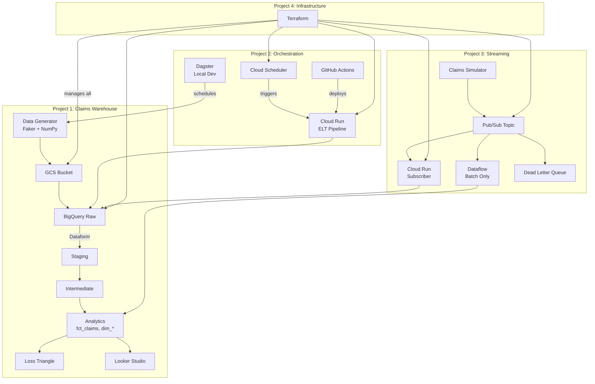
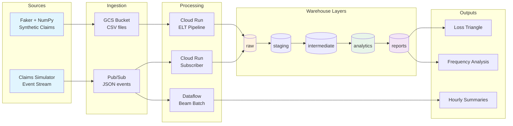

# Data Engineering Portfolio & Knowledge Base

[](https://github.com/GonorAndres/data-engineer-path/actions/workflows/ci-cd.yml)

A complete data engineering platform built around insurance claims data, demonstrating end-to-end skills from dimensional modeling to infrastructure-as-code. Built by an actuarial sciences graduate targeting DE roles in Mexico's fintech and insurance sector.

## Platform Architecture



### Data Lineage

How data flows through the platform, from generation to analytics:



## Projects

| # | Project | What It Demonstrates | Stack |
|---|---------|---------------------|-------|
| 1 | [Insurance Claims Warehouse](projects/01-claims-warehouse/) | Star schema, loss triangles, ELT, data quality | DuckDB, BigQuery, Dataform |
| 2 | [Orchestrated ELT](projects/02-orchestrated-elt/) | Orchestration patterns, CI/CD, containerization | Dagster, Airflow, Cloud Run, GitHub Actions |
| 3 | [Streaming Claims Intake](projects/03-streaming-claims-intake/) | Event-driven architecture, messaging, Beam | Pub/Sub, Cloud Run, Apache Beam |
| 4 | [Data Platform Terraform](projects/04-data-platform-terraform/) | Infrastructure as Code, modules, state management | Terraform, GCP |
| 5 | [Streaming Claims Pipeline](projects/05-streaming-claims-pipeline/) | Streaming semantics, watermarks, triggers, exactly-once | Pub/Sub, Apache Beam, Dataflow |
| 6 | [Pricing ML Feature Pipeline](projects/06-pricing-ml-pipeline/) | Feature engineering, GLM pricing, actuarial modeling | DuckDB, statsmodels, BigQuery ML |

These are not 6 isolated projects -- they form one integrated insurance data platform where each project builds on the previous ones.

## Knowledge Base

The `docs/` folder is an Obsidian vault with decision-oriented documentation:

- **Fundamentals**: Data modeling, SQL patterns, ETL/ELT, orchestration, loss triangles
- **Tools**: BigQuery, Dataform, DuckDB, Dagster, Pub/Sub, Dataflow, GCS
- **Decisions**: When to use batch vs stream, warehouse selection, orchestrator selection
- **Architecture**: Cost-effective orchestration, event-driven patterns, reference architecture

Open `docs/` in Obsidian to explore the knowledge graph, or start at [docs/INDEX.md](docs/INDEX.md).

## Quick Start

```bash
# Project 1: Run the claims warehouse locally ($0)
cd projects/01-claims-warehouse
python3 -m venv .venv && source .venv/bin/activate
pip install duckdb faker numpy polars pyarrow pytest
cd src && python3 main.py

# Project 2: Start Dagster UI ($0)
cd projects/02-orchestrated-elt
python3 -m venv .venv && source .venv/bin/activate
pip install dagster dagster-webserver duckdb faker numpy
dagster dev
```

## Cost Summary

The entire platform was built for ~$75-135 on GCP trial credits:

| Component | Monthly Cost | Alternative Cost |
|-----------|-------------|-----------------|
| Cloud Scheduler + Cloud Run | ~$0.10/month | Cloud Composer: ~$400/month |
| BigQuery (on-demand) | ~$5/month | Already included |
| Dataflow (batch only, 2-3 runs) | ~$5-20 total | Streaming: $1-2k/month |
| Terraform | Free | Free |

## Tech Stack

- **Languages**: Python 3.12, SQL (BigQuery dialect), HCL (Terraform)
- **Local**: DuckDB, Dagster, Apache Beam Direct Runner, Pub/Sub Emulator
- **GCP**: BigQuery, Dataform, GCS, Pub/Sub, Cloud Run, Cloud Scheduler, Eventarc
- **CI/CD**: GitHub Actions, Docker, Artifact Registry
- **ML/Stats**: statsmodels (GLM), scikit-learn (evaluation)
- **Testing**: pytest (185+ tests across all projects)

## Test Summary

| Project | Framework | Tests | Coverage Areas |
|---------|-----------|-------|----------------|
| 01 Claims Warehouse | pytest | 52 | Data generator distributions, SQL transform correctness, schema validation |
| 02 Orchestrated ELT | pytest | 16 | Dagster asset materialization, pipeline orchestration |
| 03 Streaming Intake | pytest | 45 | Simulator generation, subscriber validation, Beam windowing |
| 05 Streaming Pipeline | pytest | 42 | Streaming transforms, windowing, triggers, late data, deduplication |
| 06 Pricing ML Pipeline | pytest | 30 | Feature engineering, GLM training, evaluation metrics, pricing adequacy |
| **Total** | | **185** | |

```bash
# Run all tests
cd projects/01-claims-warehouse && python -m pytest tests/ -v
cd projects/02-orchestrated-elt && python -m pytest tests/ -v
cd projects/03-streaming-claims-intake && python -m pytest tests/ -v
cd projects/05-streaming-claims-pipeline && python -m pytest tests/ -v
cd projects/06-pricing-ml-pipeline && python -m pytest tests/ -v
```
