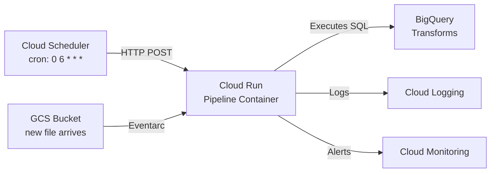

# Cost-Effective Orchestration: Cloud Scheduler + Cloud Run

## The Problem

Cloud Composer (managed Airflow) costs ~$400/month minimum. For a daily batch ELT pipeline that runs for 2 minutes, you're paying $400/month for 2 minutes/day of actual compute. That's $13/minute of pipeline execution.

## The Solution

| Component | Cost | Purpose |
|-----------|------|---------|
| Cloud Scheduler | ~$0.10/month | Cron trigger (daily at 06:00 UTC) |
| Cloud Run | ~$0.01/run | Execute pipeline in container (pay per invocation) |
| Eventarc | Free | Trigger on GCS file arrival |
| **Total** | **~$0.10/month** | **vs $400/month for Composer** |

## When This Works

- Daily or hourly batch pipelines
- Single-job pipelines (no complex DAG with 50+ tasks)
- Team of 1-3 engineers
- No need for Airflow's task-level retry UI

## When You Need Composer Instead

- Complex DAGs with many parallel branches and dependencies
- Multiple teams contributing DAGs independently
- Need for the Airflow UI for operations monitoring
- Regulatory requirement for managed orchestration with SLA
- Budget allows >$400/month for orchestration

## Architecture in This Project

[[projects/02-orchestrated-elt]] implements this pattern:

1. **Local dev**: Dagster orchestrates the pipeline ($0)
2. **Cloud deployment**: Cloud Scheduler triggers Cloud Run ($0.10/month)
3. **Interview reference**: Airflow DAG demonstrates Composer knowledge ($0)

This shows cost-conscious engineering judgment -- a key differentiator for fintech/insurance roles in Mexico where cloud budgets are scrutinized.

## Further Reading

- [[dagster-local-guide]] -- Local orchestration with Dagster
- [[cloud-composer-guide]] -- When Composer IS the right choice
- [[orchestrator-selection]] -- Decision framework for picking an orchestrator
