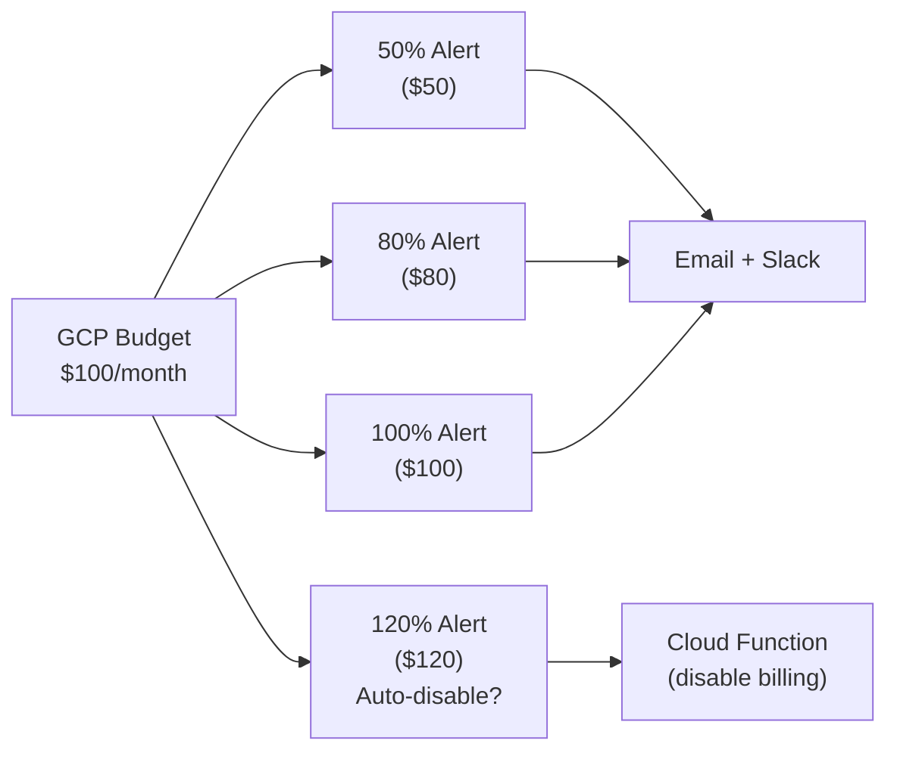

---
tags:
  - architecture
  - cost-optimization
  - gcp
  - bigquery
  - serverless
status: draft
created: 2026-03-15
updated: 2026-03-15
---

# Cost Optimization for Data Platforms

Cloud data platforms charge for storage, compute, and network. Without deliberate cost management, a data platform can grow from $50/month to $5,000/month with no change in business value. This document covers GCP-specific cost levers, organized by service, plus cross-cutting strategies.

Related: [[bigquery-guide]] | [[cost-effective-orchestration]] | [[infrastructure-as-code]]

---

## Cost Optimization by Service

### BigQuery

BigQuery is typically the largest cost center in a GCP data platform. The pricing model has two independent dimensions: storage and compute.

| Cost Lever | Impact | How to Implement |
|---|---|---|
| **Partition tables by date** | Reduces bytes scanned by 10-100x for time-filtered queries | `PARTITION BY DATE(event_date)` |
| **Cluster by filter columns** | Further reduces bytes scanned within partitions | `CLUSTER BY line_of_business, state` |
| **Avoid SELECT *** | Columnar storage means unused columns still cost money to scan | List only needed columns explicitly |
| **Use --dry_run** | Preview query cost before execution | `bq query --dry_run` or BigQuery Console cost estimate |
| **Set max bytes billed** | Hard limit per query prevents runaway costs | `maximumBytesBilled` in job config or project-level quota |
| **Long-term storage** | Data untouched for 90 days drops to $0.01/GB/mo (50% savings) | Automatic -- no action needed |
| **Materialized views** | Avoid re-scanning for repeated aggregations | Enterprise edition; single-table aggregations only |
| **BI Engine** | Cache hot datasets in RAM for dashboard queries | Reserve GB of memory per project |
| **Batch loads (free)** | Batch loads from GCS cost $0; streaming inserts cost $0.05/GB | Prefer batch loads for non-real-time data |
| **On-demand vs Editions** | On-demand ($6.25/TB) vs slot reservations ($0.04-0.10/slot-hr) | On-demand below ~$10K/month; Editions above |

**Insurance example**: A `fct_claims` table partitioned by `loss_date` and clustered by `line_of_business, state, claim_status` reduces a "2025 auto claims in Texas" query from scanning 500 GB ($3.12) to 2 GB ($0.01).

### GCS

| Cost Lever | Impact | How to Implement |
|---|---|---|
| **Lifecycle rules** | Auto-transition to cheaper storage classes | JSON lifecycle policy on each bucket (see [[gcs-as-data-lake]]) |
| **Autoclass** | Automatic class transitions based on access patterns | Enable per-bucket when access patterns are unpredictable |
| **Regional vs multi-region** | Multi-region is ~2x cost of single region | Use regional for analytics data co-located with BigQuery |
| **Avoid small files** | Thousands of tiny files inflate Class B operation costs | Compact to 256 MB-1 GB files |
| **Delete old data** | Storage costs accumulate silently | Lifecycle delete rules for data past retention period |

### Compute (Cloud Run, Dataflow, Dataproc)

| Cost Lever | Impact | How to Implement |
|---|---|---|
| **Scale-to-zero** | Zero cost when idle | Cloud Run (default), Dataflow batch (terminates after job) |
| **Batch over streaming** | Streaming Dataflow ~$1K/month; batch ~$1/month | See [[batch-vs-stream]] -- default to batch |
| **FlexRS for Dataflow** | Up to 40% savings on batch jobs | `--flexRSGoal=COST_OPTIMIZED` flag |
| **Spot/preemptible VMs** | 60-91% savings on Dataproc clusters | `--preemptible-worker-count` flag |
| **Right-size workers** | Over-provisioned workers waste money | Start with `n1-standard-4`, monitor CPU/memory utilization |
| **Avoid Composer for simple pipelines** | Composer minimum ~$400/month | Cloud Scheduler + Cloud Run for simple cron triggers |

### Pub/Sub

| Cost Lever | Impact | How to Implement |
|---|---|---|
| **Batch message publishing** | Fewer API calls, lower overhead | Set batch size in client library (default: up to 1,000 messages or 10 MB) |
| **Subscription filters** | Avoid delivering unwanted messages | Server-side attribute filters on subscriptions |
| **Monitor backlog** | Growing backlog = wasted retention storage | Alert on `subscription/num_undelivered_messages` |
| **Limit retention** | Default 7 days; reduce if replay is unnecessary | Set retention to minimum needed |

### Network (Egress)

| Cost Lever | Impact | How to Implement |
|---|---|---|
| **Co-locate resources** | Inter-region egress costs $0.01/GB+ | Keep BigQuery, GCS, Dataflow in same region |
| **Avoid internet egress** | $0.12/GB for first TB to internet | Use Private Google Access, VPC Service Controls |
| **BigQuery Storage API** | $1.10/TB read (cheaper than scanning) | Use for bulk data export to external tools |

---

## Cross-Cutting Strategies

### Budget Alerts

Set budget alerts at multiple thresholds to catch cost overruns before they compound.

**Implementation**: Create budgets in the GCP Console or via Terraform. Link to Cloud Monitoring notification channels. For hard caps, use a Cloud Function triggered by budget notifications to disable billing (use with extreme caution in production).

### Committed Use Discounts (CUDs)

| Commitment | Discount | Best For |
|---|---|---|
| 1-year CUD | ~25% savings | Predictable production workloads |
| 3-year CUD | ~50-60% savings | Stable, long-running environments |

CUDs apply to BigQuery Editions slots, Compute Engine VMs, and Cloud SQL instances. Only commit after establishing a stable baseline -- premature commitment locks in costs for unused capacity.

### Labeling and Cost Attribution

Tag every resource with labels for cost attribution:

| Label | Example | Purpose |
|---|---|---|
| `project` | `claims-warehouse` | Which portfolio project |
| `environment` | `dev`, `staging`, `prod` | Environment separation |
| `team` | `actuarial`, `engineering` | Team ownership |
| `cost-center` | `analytics` | Budget allocation |

Labels flow into billing exports, enabling per-project and per-team cost analysis in BigQuery.

---

## This Portfolio's Cost Profile

This portfolio demonstrates that a production-grade data platform can run for under $15/month by choosing the right cost levers.

| Component | Monthly Cost | Cost Lever Applied |
|---|---|---|
| BigQuery storage | $0 | Free tier (10 GB) |
| BigQuery queries | $0 | Free tier (1 TB/month) |
| GCS storage | $0.01-0.05 | Small dataset, Standard class |
| Cloud Run (orchestrator) | $0-2 | Scale-to-zero, per-request billing |
| Cloud Scheduler | $0.30 | 3 jobs x $0.10/job/month |
| Pub/Sub | $0.01-0.05 | Low volume, free tier covers most |
| Dataflow batch | $0.50-1.00 | Batch mode, hourly runs, FlexRS |
| Terraform state (GCS) | $0.01 | Single small state file |
| **Total** | **$1-5/month** | |

Compare to an enterprise setup using Composer ($400), streaming Dataflow ($1,000), and BigQuery Editions ($500+): easily $2,000+/month for the same functional pipeline. The engineering patterns are identical -- only the cost profile differs.

---

## Common Cost Mistakes

| Mistake | Impact | Prevention |
|---|---|---|
| No partition/clustering on large tables | 10-100x query cost | Partition every table with a date column |
| Leaving dev/staging Composer environments running | $400+/month per idle environment | Destroy after use; use environment snapshots |
| Streaming Dataflow for hourly-tolerance data | $1K/month vs $1/month for batch | Default to batch; see [[batch-vs-stream]] |
| No budget alerts | Surprise bills | Set alerts at 50%, 80%, 100%, 120% |
| Multi-region when single-region suffices | ~2x storage cost + egress charges | Co-locate everything in one region |
| Not using free tiers | Paying for capacity covered by free tier | Check free tier limits before provisioning |

---

## Further Reading

- [[bigquery-guide]] -- BigQuery pricing model, partitioning, and cost controls
- [[cost-effective-orchestration]] -- Cloud Scheduler + Cloud Run as a Composer alternative
- [[gcs-as-data-lake]] -- GCS storage classes and lifecycle rules
- [[infrastructure-as-code]] -- Terraform for consistent, labeled, cost-tracked infrastructure
- [[batch-vs-stream]] -- The single biggest cost decision in pipeline design
- [[event-driven-claims-intake]] -- Cost analysis of batch vs streaming Dataflow
