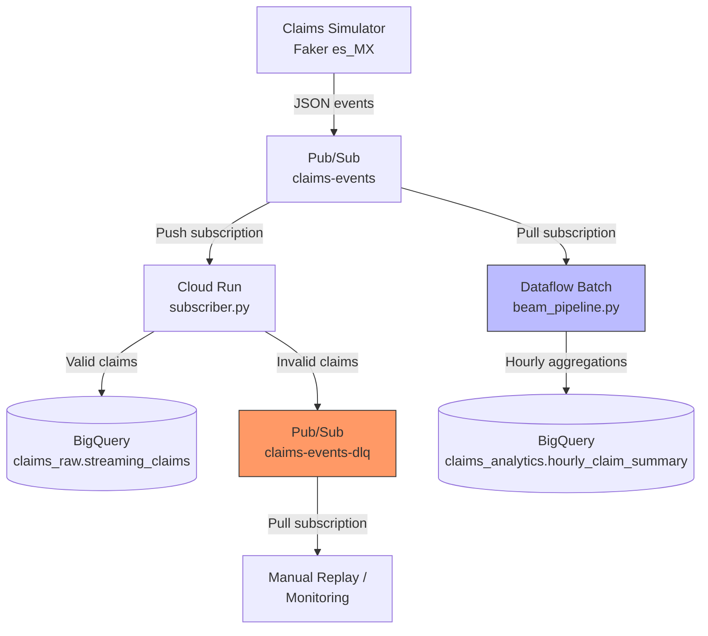

# Event-Driven Claims Intake: Architecture Decision Record

## Context

Insurance claims arrive in bursts. A hailstorm in Guadalajara produces hundreds of auto claims within hours, while a quiet Tuesday might see five. We need a pipeline that handles this bursty, unpredictable ingest pattern.

This is [[../../../projects/03-streaming-claims-intake/README|Project 3]] in the data engineering portfolio.

## Architecture

## Key Design Decisions

### 1. Push Subscriber (Cloud Run) Instead of Pull Consumer

**Decision**: Use Pub/Sub push delivery to a Cloud Run service for real-time claim validation.

**Why**:
- Cloud Run scales to zero when no claims arrive ($0 idle cost)
- Push model means no long-running consumer process to manage
- Sub-second latency for individual claim validation
- Native integration with Cloud Logging for structured JSON logs

**Trade-off**: Push delivery retries on HTTP 5xx, but the subscriber must be idempotent (claim_id deduplication in BigQuery handles this).

### 2. Batch Beam Instead of Streaming Dataflow

**Decision**: Run the Beam aggregation pipeline in batch mode only.

**Why**: Cost. A streaming Dataflow job requires a minimum of 1 worker running 24/7.

| Mode | Monthly Cost | Latency | Beam Code |
|------|-------------|---------|-----------|
| Batch (scheduled hourly) | $0.50-1.00 | 1 hour | Identical |
| Streaming (always-on) | $1,000-2,000 | Seconds | Identical |

The Beam pipeline uses `FixedWindows(3600)` with event-time timestamps in both modes. The windowing logic, watermarks, and aggregation transforms are the same. The only difference is whether the runner processes a bounded or unbounded PCollection.

For a portfolio project, the batch execution proves:
- You can write Beam transforms (ParseClaim, ExtractCoverageKey, ComputeHourlySummary)
- You understand windowing and event-time semantics
- You know how to handle dead-letter branches

...without spending $1k/month to keep a streaming job running.

### 3. Dead-Letter Pattern

**Decision**: Invalid messages go to a separate `claims-events-dlq` topic instead of being dropped or logged.

**Why**:
- No data loss: every message is preserved, even malformed ones
- Operations team can inspect DLQ messages and fix upstream issues
- DLQ messages can be replayed after fixing the schema/parser
- Clear separation between "system errors" (retry via NACK) and "data errors" (route to DLQ)

**Implementation**:
- Cloud Run subscriber validates schema -> invalid -> publishes to DLQ topic
- Beam pipeline catches parse errors -> dead-letter tagged output -> writes to BigQuery DLQ table

### 4. Two-Consumer Fan-Out

**Decision**: Pub/Sub topic has two subscriptions -- push (for Cloud Run) and pull (for Beam batch).

**Why**:
- Each subscription gets its own copy of every message (fan-out)
- Cloud Run handles real-time validation and enrichment
- Beam handles periodic aggregation from accumulated backlog
- Either consumer can fail independently without affecting the other
- Adding a third consumer (e.g., fraud detection) requires only a new subscription

## Cost Analysis

### Budget Edition (This Project)

| Component | Monthly Cost | Notes |
|-----------|-------------|-------|
| Pub/Sub | $0.04/GB | ~10k events/day = ~1 MB/day = pennies |
| Cloud Run | $0-2 | Pay per request, scales to zero |
| Dataflow batch | $0.50-1.00 | 24 runs/day x ~$0.01/run |
| BigQuery storage | $0 | First 10 GB free |
| BigQuery queries | $0 | First 1 TB/month free |
| **Total** | **$1-5/month** | |

### Enterprise Streaming (What We Avoided)

| Component | Monthly Cost | Notes |
|-----------|-------------|-------|
| Pub/Sub | $0.04/GB | Same |
| Streaming Dataflow | $1,000-2,000 | Min 1 worker x 24/7 |
| BigQuery | $0-50 | Same |
| **Total** | **$1,000-2,050/month** | |

The streaming architecture is justified when:
- Sub-second latency is a business requirement (fraud detection, real-time dashboards)
- Volume exceeds what Cloud Run can handle per-message (~10k+ events/second sustained)
- Budget allows $1k+/month for infrastructure

For a learning portfolio, batch Beam proves the same engineering skills at 0.1% of the cost.

## When to Revisit

- **If latency SLA drops below 5 minutes**: Consider streaming Dataflow
- **If volume exceeds 100k events/hour**: Cloud Run per-message processing may become expensive; consider streaming Dataflow with autoscaling
- **If multiple teams need independent aggregations**: Add more Pub/Sub subscriptions (the fan-out pattern scales well)
- **If Dataflow Flex Templates become cheaper**: Reassess the batch vs streaming cost equation

## Related Docs

- [[cost-effective-orchestration]] -- Same cost-conscious approach for orchestration (Project 2)
- [[../../projects/01-claims-warehouse/README|Project 1]] -- The BigQuery warehouse these claims feed into
- [[../tools/pubsub-guide|Pub/Sub Guide]] -- Deep dive on Pub/Sub patterns
- [[../tools/dataflow-guide|Dataflow Guide]] -- When streaming IS the right choice
