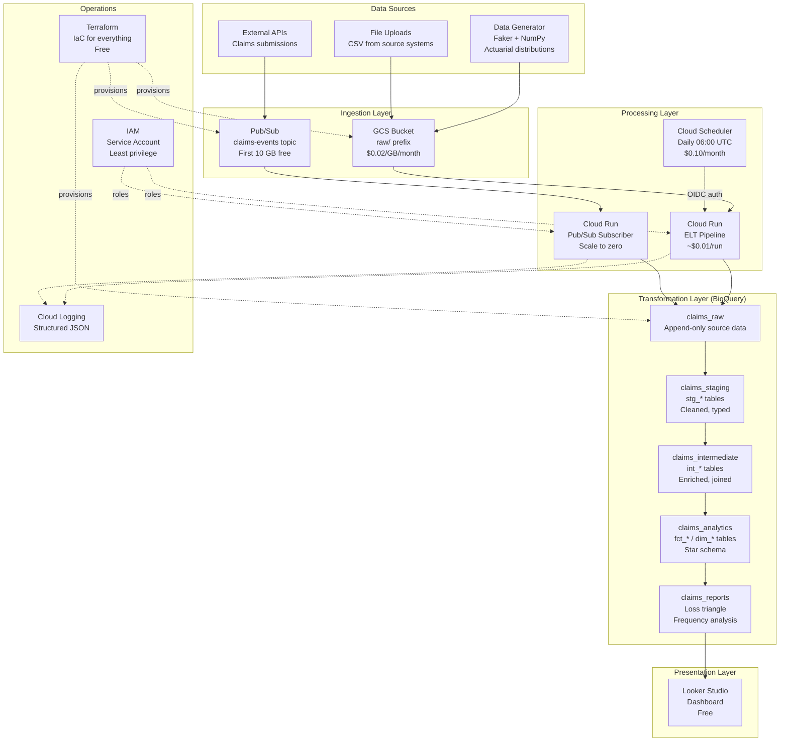
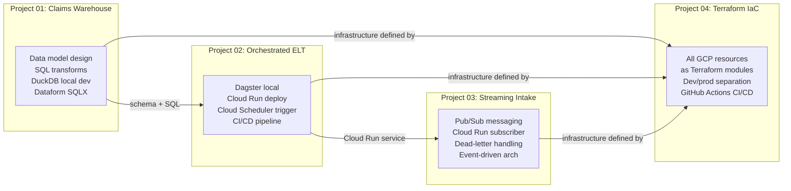
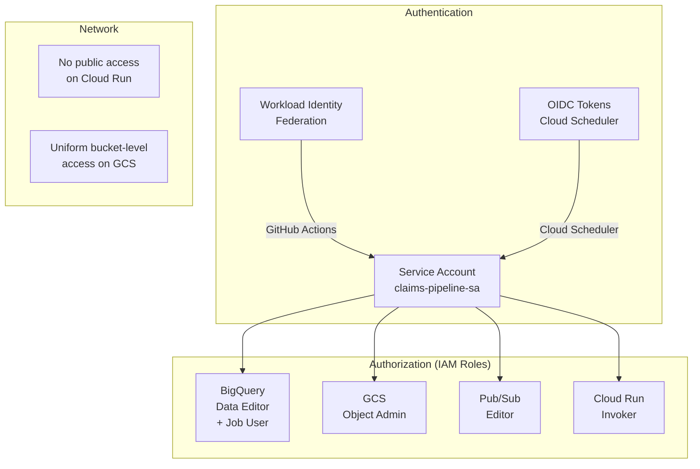

# Platform Reference Architecture: Insurance Claims Data Platform

## Overview

This document describes the complete architecture of the insurance claims data platform, showing how all four portfolio projects connect into a unified system. Every resource in this architecture is defined as Terraform IaC in [[04-data-platform-terraform]].

## Full Platform Architecture



## How the Projects Connect



| Project | What It Builds | Key Skill Demonstrated |
|---------|---------------|----------------------|
| 01 - Claims Warehouse | Data model, SQL transforms, DuckDB + BigQuery | Dimensional modeling, actuarial domain |
| 02 - Orchestrated ELT | Pipeline orchestration (Dagster, Cloud Run, Airflow ref) | Orchestration trade-offs, cost optimization |
| 03 - Streaming Intake | Real-time claims ingestion via Pub/Sub | Event-driven architecture, streaming |
| 04 - Terraform IaC | Infrastructure for all of the above | IaC, CI/CD, security, environment mgmt |

## Data Flow: Source to Dashboard

### Batch Path (Daily)

```
1. Cloud Scheduler fires at 06:00 UTC
2. HTTP POST with OIDC token -> Cloud Run (ELT pipeline)
3. Pipeline reads from GCS raw/ -> loads to BigQuery claims_raw
4. SQL transforms: raw -> staging -> intermediate -> analytics -> reports
5. Looker Studio dashboard refreshes from claims_reports
```

**Latency**: T+1 day (data available by 06:15 UTC)
**Cost per run**: ~$0.01 (Cloud Run) + ~$0.005 (BigQuery queries on small data)

### Streaming Path (Real-time)

```
1. External system publishes claim event to Pub/Sub topic
2. Push subscription delivers to Cloud Run subscriber
3. Subscriber validates and writes to BigQuery claims_raw
4. (Optional) Triggers incremental transform of new records
5. Failed messages -> dead-letter topic -> manual review subscription
```

**Latency**: seconds (near real-time)
**Cost per message**: < $0.000001 at low volume (free tier covers ~10 million messages/month)

## Cost Breakdown

### Monthly Cost at Minimal Load (personal project)

| Component | Service | Cost |
|-----------|---------|------|
| Compute | Cloud Run (scale to zero) | $0.00 |
| Scheduling | Cloud Scheduler (1 job) | $0.10 |
| Storage | GCS (< 1 GB) | $0.02 |
| Storage | BigQuery (< 1 GB) | $0.00 (free tier) |
| Messaging | Pub/Sub (< 10 GB) | $0.00 (free tier) |
| Analytics | BigQuery queries (< 1 TB) | $0.00 (free tier) |
| Dashboard | Looker Studio | $0.00 (free) |
| IaC | Terraform | $0.00 (free) |
| CI/CD | GitHub Actions | $0.00 (free for public repos) |
| **Total** | | **~$0.12/month** |

### Monthly Cost at Production Load (~10K claims/day)

| Component | Service | Cost |
|-----------|---------|------|
| Compute | Cloud Run (~30 invocations/day) | ~$5 |
| Scheduling | Cloud Scheduler (1 job) | $0.10 |
| Storage | GCS (~10 GB) | $0.20 |
| Storage | BigQuery (~50 GB) | $1.00 |
| Messaging | Pub/Sub (~300K messages) | $0.00 (free tier) |
| Analytics | BigQuery queries (~500 GB/month) | $2.50 |
| Dashboard | Looker Studio | $0.00 |
| IaC | Terraform | $0.00 |
| CI/CD | GitHub Actions | $0.00 |
| **Total** | | **~$9/month** |

### Cost Comparison: This Architecture vs. Enterprise

| Architecture | Monthly Cost | When to Use |
|-------------|-------------|-------------|
| **This platform** (Cloud Run + Scheduler) | ~$10 | Solo/small team, < 50K claims/day |
| Cloud Composer + Dataflow | ~$500 | Complex DAGs, team of 5+, regulatory requirements |
| Self-managed Airflow + Spark | ~$200 | Need full control, experienced ops team |
| Fully managed (Fivetran + dbt Cloud + Snowflake) | ~$2,000+ | Enterprise, fast time-to-value, large team |

## Security Architecture



Key security decisions:
- **No long-lived keys**: GitHub Actions uses Workload Identity Federation (OIDC), not JSON key files
- **Least privilege**: Pipeline SA gets exactly the roles it needs, nothing more
- **No public endpoints**: Cloud Run services reject unauthenticated requests
- **Uniform access**: GCS buckets use bucket-level IAM, not per-object ACLs
- **Environment isolation**: Dev and prod use separate service accounts

## Technology Selection Rationale

| Decision | Choice | Alternatives Considered | Why |
|----------|--------|------------------------|-----|
| IaC tool | Terraform | Pulumi, CDK for Terraform | Industry standard, HCL is readable, largest GCP provider |
| Cloud provider | GCP | AWS, Azure | BigQuery is best-in-class for analytics; Dataform is free |
| Warehouse | BigQuery | Snowflake, Redshift | Serverless, no cluster management, free tier |
| Orchestration | Cloud Run + Scheduler | Composer, Dagster Cloud | 4000x cheaper for simple linear DAGs |
| Streaming | Pub/Sub | Kafka, Kinesis | GCP-native, serverless, generous free tier |
| CI/CD | GitHub Actions | Cloud Build, Jenkins | Free, native GCP auth via WIF, familiar |
| Dashboard | Looker Studio | Metabase, Superset | Free, connects directly to BigQuery |

## Related Docs

- [[terraform-gcp-guide]] -- Terraform fundamentals for data engineers
- [[bigquery-guide]] -- BigQuery design patterns
- [[gcs-as-data-lake]] -- GCS bucket architecture
- [[pubsub-guide]] -- Pub/Sub messaging patterns
- [[cost-effective-orchestration]] -- Cloud Run vs. Composer analysis
- [[cloud-composer-guide]] -- When Composer IS the right choice
