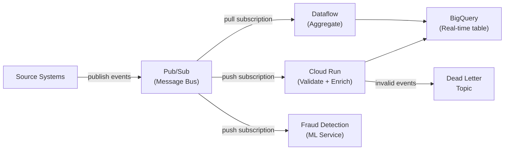
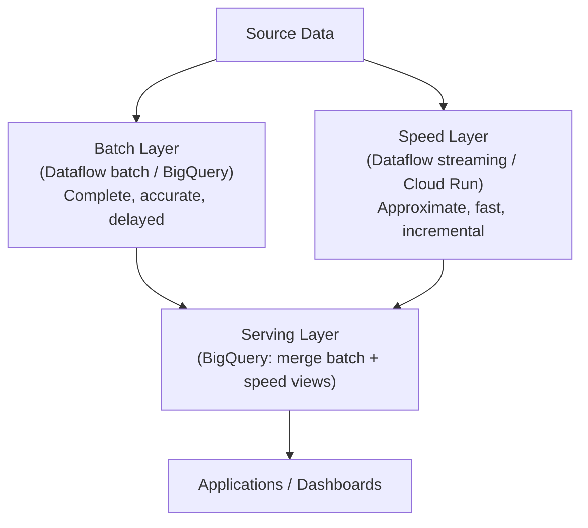
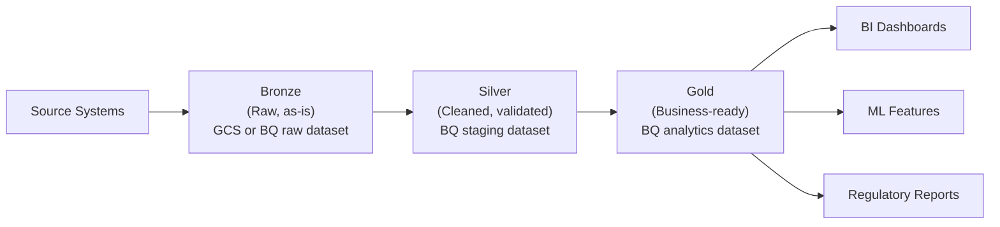

---
tags:
  - architecture
  - gcp
  - patterns
  - batch
  - streaming
  - medallion
status: draft
created: 2026-03-15
updated: 2026-03-15
---

# Reference Architectures for Data Engineering

Reference architectures are battle-tested patterns for assembling data platform components. Knowing which pattern fits your requirements prevents both over-engineering (streaming everything) and under-engineering (no separation of concerns). This document covers the four most common patterns, with GCP implementations and insurance examples.

Related: [[platform-reference-architecture]] | [[cost-effective-orchestration]] | [[batch-vs-stream]] | [[event-driven-claims-intake]]

---

## 1. Batch ELT (The Workhorse)

The most common pattern in modern data engineering. Extract data from sources, load it into a warehouse, then transform it inside the warehouse using SQL.

```mermaid
graph LR
    SRC["Source Systems<br/>(APIs, DBs, Files)"] -->|extract + load| GCS["GCS<br/>(Raw Landing)"]
    GCS -->|batch load| BQ_STG["BigQuery<br/>Staging (stg_)"]
    BQ_STG -->|SQL transforms<br/>(Dataform / dbt)| BQ_INT["BigQuery<br/>Intermediate (int_)"]
    BQ_INT -->|SQL transforms| BQ_MART["BigQuery<br/>Marts (fct_, dim_)"]
    BQ_MART --> BI["BI / Dashboards"]
    BQ_MART --> ML["ML Models"]

    ORCH["Orchestrator<br/>(Scheduler + Cloud Run<br/>or Composer)"] -.->|triggers| SRC
    ORCH -.->|triggers| GCS
    ORCH -.->|triggers| BQ_STG
```

| Component | GCP Implementation | Role |
|---|---|---|
| **Extract + Load** | Cloud Run job or custom script | Pull from source APIs/DBs, write to GCS |
| **Raw storage** | [[gcs-as-data-lake\|GCS]] | Immutable landing zone |
| **Staging** | [[bigquery-guide\|BigQuery]] | Raw data loaded with minimal transformation |
| **Transform** | [[dataform-guide\|Dataform]] | SQL-based transforms with dependency management |
| **Orchestrator** | Cloud Scheduler + Cloud Run or [[cloud-composer-guide\|Composer]] | Schedule and monitor pipeline runs |

**When to use**: The default for most analytics workloads. Use this when data freshness requirements are hourly or longer, and transformations are expressible in SQL.

**Portfolio implementation**: Projects 1 and 2 use this pattern -- Claims Warehouse (P01) loads and transforms claims data in BigQuery; Orchestrated ELT (P02) automates the pipeline with Cloud Scheduler + Cloud Run.

---

## 2. Event-Driven (Real-Time Intake)

Data flows as events through a message bus. Consumers process events independently, enabling real-time analytics and fan-out to multiple downstream systems.



| Component | GCP Implementation | Role |
|---|---|---|
| **Message bus** | [[pubsub-guide\|Pub/Sub]] | Decouple producers from consumers |
| **Real-time consumer** | Cloud Run (push subscriber) | Validate, enrich, write to BigQuery |
| **Aggregation** | [[dataflow-guide\|Dataflow]] (batch or streaming) | Windowed aggregations |
| **Dead letter** | Pub/Sub DLQ topic | Capture failed messages |

**When to use**: When events need to be processed as they arrive -- fraud detection, real-time dashboards, operational alerting. But challenge the "real-time" requirement first (see [[batch-vs-stream]]).

**Portfolio implementation**: Project 3 (Streaming Claims Intake) uses this pattern with a cost-conscious twist: Cloud Run for real-time validation + Dataflow in batch mode for aggregation. See [[event-driven-claims-intake]] for the full architecture decision record.

---

## 3. Lambda Architecture (Batch + Stream)

Processes data through two parallel paths: a batch layer for accuracy and a speed layer for low latency. A serving layer merges both views.



| Layer | Purpose | Trade-off |
|---|---|---|
| **Batch** | Reprocesses all data periodically for accuracy | High latency, complete results |
| **Speed** | Processes real-time events for freshness | Low latency, possibly approximate |
| **Serving** | Merges batch and speed views | Complexity of maintaining two code paths |

**When to use**: When you need both real-time freshness AND guaranteed completeness. Common in finance and insurance where dashboards need near-real-time updates but regulatory reports require batch-verified accuracy.

**Caution**: Lambda architecture is complex -- you maintain two processing codebases (batch and stream) that must produce consistent results. Apache Beam's unified model helps (same code, different runners) but does not eliminate all complexity. Consider whether the Kappa architecture (stream-only with reprocessing capability) is simpler for your use case.

---

## 4. Medallion Architecture (Bronze / Silver / Gold)

A data quality layering pattern that organizes data by level of refinement. Originally popularized by Databricks, the pattern is tool-agnostic.



| Layer | Data State | GCP Location | Quality Level |
|---|---|---|---|
| **Bronze** | Raw, unmodified copy of source | GCS bucket or BigQuery raw dataset | No validation -- exact replica |
| **Silver** | Cleaned, deduplicated, typed, validated | BigQuery staging/intermediate | Schema enforced, nulls handled, duplicates removed |
| **Gold** | Business-ready, aggregated, joined, documented | BigQuery analytics/marts | Business rules applied, conformed dimensions, tested |

**When to use**: Always. This is not an alternative to the patterns above -- it is a complementary data quality framework. Apply it within any architecture (batch ELT, event-driven, lambda).

**Insurance implementation**: Raw claim JSON (bronze) in GCS. `stg_claims` (silver) in BigQuery with schema validation. `fct_claims` joined with `dim_policy` and `dim_claimant` (gold) for actuarial analytics.

---

## Pattern Selection Guide

| Requirement | Recommended Pattern |
|---|---|
| Standard analytics/BI, hourly+ freshness | Batch ELT |
| Real-time event processing, fan-out consumers | Event-driven |
| Real-time dashboards + batch-accurate reports | Lambda (or batch ELT with streaming supplement) |
| Progressive data quality improvement | Medallion (layer on top of any pattern) |
| Multi-team data platform with governance | Medallion + batch ELT (most common enterprise choice) |

### How This Portfolio Maps

| Project | Pattern | Why |
|---|---|---|
| P01: Claims Warehouse | Batch ELT + Medallion | Foundation -- load, transform, serve |
| P02: Orchestrated ELT | Batch ELT (automated) | Same pattern with production orchestration |
| P03: Streaming Claims Intake | Event-driven | Real-time ingestion with cost-conscious design |
| P04: Data Platform Terraform | IaC for all patterns | Infrastructure that supports all of the above |

---

## Further Reading

- [[platform-reference-architecture]] -- The specific architecture of this portfolio's platform
- [[cost-effective-orchestration]] -- Cost-conscious orchestration for batch ELT
- [[event-driven-claims-intake]] -- Event-driven architecture decision record
- [[batch-vs-stream]] -- When to use batch vs streaming processing
- [[data-warehouse-concepts]] -- Warehouse design that sits at the center of these architectures
- [[gcs-as-data-lake]] -- GCS as the storage layer in these architectures
