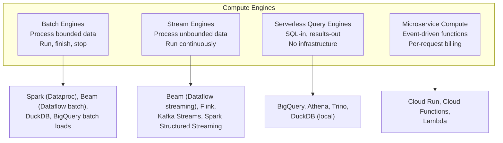

---
tags:
  - fundamentals
  - compute
  - batch
  - streaming
  - serverless
status: draft
created: 2026-03-15
updated: 2026-03-15
---

# The Compute Layer

The compute layer answers: **how does data get processed?** Choosing the right compute engine for each stage of your pipeline is one of the highest-impact decisions in data engineering. Pick wrong and you overpay by 10-100x or add unnecessary operational complexity.

Related: [[dataflow-guide]] | [[batch-vs-stream]] | [[orchestration]] | [[duckdb-local-dev]]

---

## Compute Categories



---

## Batch Compute Engines

Batch engines process a known, bounded dataset, produce output, and terminate. They are simpler, cheaper, and easier to debug than streaming engines.

| Engine | GCP Service | Best For | Cost Model |
|---|---|---|---|
| **Apache Spark** | Dataproc | Large-scale ETL, ML pipelines, existing Spark codebases | Cluster-hours (VMs) |
| **Apache Beam** | [[dataflow-guide\|Dataflow]] batch | GCP-native batch transforms, unified batch+stream codebase | vCPU-hours + GB processed |
| **DuckDB** | None (local) | Local dev, small-to-medium datasets (<100 GB), testing | Free |
| **BigQuery** | [[bigquery-guide\|BigQuery]] | SQL-expressible transforms, no infrastructure | Per TB scanned or slot-hours |
| **Python scripts** | Cloud Run, GCE | Simple transforms, API-driven workflows, <1 GB | Per request or VM-hours |

### Decision Framework for Batch

```
Is the transformation expressible in SQL?
  |
  +-- YES: Is data already in BigQuery?
  |   |
  |   +-- YES: Use BigQuery SQL (via Dataform)
  |   +-- NO: Load to BigQuery first, then SQL
  |       (batch loads are free)
  |
  +-- NO (needs Python/Java logic):
      |
      +-- Data < 10 GB?
      |   +-- YES: Cloud Run + DuckDB or Python
      |   +-- NO: Data < 100 GB?
      |       +-- YES: Dataflow batch (autoscaled)
      |       +-- NO: Dataproc (Spark) or Dataflow
```

**Insurance example**: Daily claims transformation from raw JSON to dimensional model -- expressible in SQL, data in BigQuery, so use [[dataform-guide\|Dataform]]. Claim PDF parsing that requires Python OCR -- not SQL, so use Cloud Run with a Python container.

---

## Stream Compute Engines

Stream engines process unbounded data continuously. They are fundamentally more complex than batch because of ordering, late data, state management, and exactly-once semantics.

| Engine | GCP Service | Key Strength | When to Use |
|---|---|---|---|
| **Apache Beam** | [[dataflow-guide\|Dataflow]] streaming | Unified batch+stream model, exactly-once, GCP-native | New streaming pipelines on GCP |
| **Apache Flink** | Dataproc or GKE | Advanced stateful processing, low latency, mature ecosystem | Complex event processing, existing Flink teams |
| **Kafka Streams** | GKE | Tightly coupled with Kafka, no separate cluster needed | Already using Kafka, simple stream transforms |
| **Spark Structured Streaming** | Dataproc | Existing Spark teams, micro-batch semantics | Teams with Spark expertise migrating to streaming |

### Stream Engine Comparison

| Criterion | Dataflow (Beam) | Flink | Kafka Streams |
|---|---|---|---|
| **Managed on GCP** | Fully managed | Self-managed (Dataproc/GKE) | Self-managed (GKE) |
| **Exactly-once** | Built-in | Built-in | Built-in (with Kafka transactions) |
| **Windowing** | Flexible (fixed, sliding, session, global) | Flexible | Limited (requires manual implementation) |
| **State management** | Managed by Dataflow | RocksDB (self-managed) | RocksDB (self-managed) |
| **Autoscaling** | Automatic | Manual or custom | N/A (runs within app) |
| **Latency** | ~100ms-seconds | ~10-100ms | ~1-10ms |
| **Ops burden** | None | Significant | Low (but Kafka cluster required) |

See [[dataflow-guide]] for a deep dive on Beam/Dataflow and [[batch-vs-stream]] for deciding whether you need streaming at all.

---

## Serverless Compute

Serverless engines remove all infrastructure management. You submit work; the platform handles scaling, concurrency, and shutdown.

| Service | Type | Billing | Scale-to-Zero | Best For |
|---|---|---|---|---|
| **BigQuery** | SQL queries | Per TB scanned | Yes | Analytical queries, scheduled transforms |
| **Cloud Run** | Containers | Per request + vCPU-seconds | Yes | API endpoints, event-driven processing, small batch jobs |
| **Cloud Functions** | Functions | Per invocation + vCPU-seconds | Yes | Simple event handlers, glue code |
| **Dataflow** | Beam pipelines | Per vCPU-hour + GB | No (streaming) / Yes (batch) | Data transforms at scale |

**Why serverless matters for cost**: A Cloud Run container that validates claims costs $0 when no claims arrive. A streaming Dataflow job costs ~$1,000/month even when idle. See [[cost-effective-orchestration]] for how this portfolio uses serverless to stay under $15/month.

---

## Compute-Storage Separation

Modern data platforms separate compute from storage (see [[storage-layer]]). This has direct implications for compute engine selection:

| Benefit | Explanation |
|---|---|
| **Engine portability** | Same data in GCS can be processed by Dataflow today, Spark tomorrow |
| **Independent scaling** | Scale compute up for a backfill, scale down after |
| **Cost optimization** | Pay for compute only when processing; storage is always-on but cheap |
| **Multi-engine architecture** | BigQuery for SQL analytics, Dataflow for streaming, DuckDB for local dev -- all on the same data |

---

## Insurance Pipeline Compute Choices

| Pipeline Stage | Engine | Why This Engine |
|---|---|---|
| Raw file landing | N/A (just storage) | Data lands in GCS via API or file transfer |
| Schema validation | Cloud Run (Python) | Per-request billing, scale-to-zero, simple validation logic |
| SQL transforms (stg -> fct) | [[bigquery-guide\|BigQuery]] via [[dataform-guide\|Dataform]] | SQL-expressible, zero infrastructure, free scheduling |
| Streaming claim ingestion | [[dataflow-guide\|Dataflow]] batch (hourly) | Beam transforms with windowing, cost-effective batch mode |
| Loss triangle computation | BigQuery SQL | Complex window functions, fully SQL-expressible |
| Local development | [[duckdb-local-dev\|DuckDB]] | Free, fast, compatible SQL dialect |
| PDF/image claim processing | Cloud Run (Python + OCR) | Custom logic, per-request billing, containerized |

---

## Anti-Patterns

| Anti-Pattern | Problem | Better Approach |
|---|---|---|
| Spark for < 1 GB datasets | Cluster startup overhead exceeds processing time | DuckDB or Cloud Run with Python |
| Streaming when batch suffices | 100x cost for latency nobody asked for | Batch with shorter intervals (see [[batch-vs-stream]]) |
| BigQuery for OLTP workloads | High latency for point lookups, poor write concurrency | Cloud SQL or AlloyDB |
| Cloud Functions for heavy processing | 9-minute timeout, limited memory (32 GB max) | Cloud Run (60-minute timeout, 32 GB RAM) |
| Self-managed Spark on GKE | Operational burden for commodity batch processing | Dataproc (managed) or BigQuery (serverless) |

---

## Further Reading

- [[dataflow-guide]] -- Deep dive on Beam/Dataflow for batch and streaming
- [[batch-vs-stream]] -- Decision framework for batch vs streaming processing
- [[orchestration]] -- How compute jobs get scheduled and monitored
- [[duckdb-local-dev]] -- DuckDB as a local compute engine for development
- [[bigquery-guide]] -- BigQuery as a serverless compute and storage engine
- [[storage-layer]] -- The storage layer that compute engines read from and write to
- [[cost-effective-orchestration]] -- Using serverless compute to minimize platform cost
