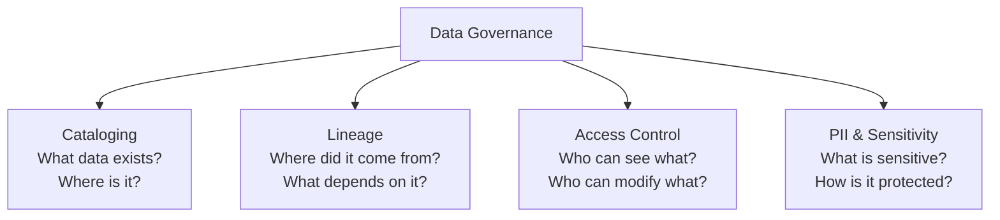
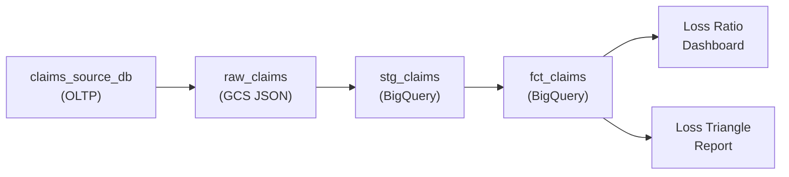

---
tags:
  - fundamentals
  - governance
  - lineage
  - access-control
  - pii
status: draft
created: 2026-03-15
updated: 2026-03-15
---

# Data Governance

Data governance is the discipline of knowing **what data exists, where it came from, who can access it, and whether it can be trusted**. It is not a compliance checkbox -- it is what makes pipelines debuggable, audits survivable, and data trustworthy. Without governance, every question about a dashboard number turns into a multi-day investigation.

Related: [[monitoring-observability]] | [[data-quality]] | [[bigquery-guide]]

---

## Four Pillars of Data Governance



### 1. Cataloging (Discovery)

A data catalog answers: "Does this data exist? Where is it? What does it contain?" Without a catalog, data engineers and analysts spend hours searching for tables, guessing column meanings, and duplicating datasets they cannot find.

| Capability | What It Provides |
|---|---|
| **Search** | Find tables/columns by name, description, or tag |
| **Metadata** | Column types, descriptions, owners, update frequency |
| **Business context** | What the table means in business terms, not just technical schema |
| **Usage metrics** | Which tables are queried often vs. never (stale data candidates) |

### 2. Lineage (Provenance)

Lineage traces data from source to destination. When a dashboard number looks wrong, lineage tells you every transformation and table that contributed to it.



Without lineage, a bug in `stg_claims` requires manually tracing downstream impacts. With lineage, you immediately see that `fct_claims`, the dashboard, and the triangle report are all affected.

### 3. Access Control

Access control determines who can read, write, or administer data. In regulated industries like insurance, this is not optional -- it is a legal requirement.

| Principle | Implementation |
|---|---|
| **Least privilege** | Grant minimum permissions needed for each role |
| **Role-based access (RBAC)** | Define roles (analyst, engineer, admin) with fixed permissions |
| **Column-level security** | Mask or restrict sensitive columns (SSN, DOB) while allowing access to the rest |
| **Row-level security** | Filter rows based on user attributes (e.g., adjusters see only their region's claims) |
| **Audit logging** | Record who accessed what data and when |

### 4. PII and Data Sensitivity

Personally identifiable information requires special handling. Insurance data is rich with PII: names, addresses, SSNs, medical records, financial details.

| PII Category | Examples in Insurance | Protection Strategy |
|---|---|---|
| **Direct identifiers** | Name, SSN, policy number | Encrypt at rest, mask in queries, column-level access |
| **Quasi-identifiers** | ZIP code, DOB, gender | Generalize (ZIP to state), restrict combinations |
| **Sensitive attributes** | Medical diagnoses, claim details | Row-level security, audit logging |
| **Financial data** | Claim amounts, premiums, bank accounts | Encrypt, restrict to finance/actuarial roles |

---

## Tool Comparison

| Tool | Type | Strengths | Limitations | GCP Integration |
|---|---|---|---|---|
| **Google Dataplex** | Managed governance (GCP-native) | Auto-discovery, data quality scans, BigQuery-native, IAM integration | GCP-only, newer product (less mature) | Native |
| **Google Data Catalog** | Metadata catalog (GCP-native) | Free for GCP resources, auto-tags BigQuery/GCS/Pub/Sub | Limited to GCP, basic lineage | Native |
| **DataHub** | Open-source catalog + lineage | Multi-platform, rich lineage, active community, extensible | Requires self-hosting, operational overhead | Via connectors |
| **OpenLineage** | Open standard for lineage | Vendor-neutral, integrates with Airflow/Spark/dbt, growing ecosystem | Standard only (needs a backend like Marquez) | Via Dataflow/Composer plugins |
| **Amundsen** | Open-source catalog | Good search/discovery, Lyft-proven | Smaller community than DataHub, limited lineage | Via connectors |
| **Atlan / Alation** | Commercial catalog | Best-in-class UX, AI-powered, enterprise features | Expensive ($$$), vendor lock-in | Via connectors |

### Decision Framework

```
Are you 100% on GCP?
  |
  +-- YES: Start with Data Catalog (free) + Dataplex (quality scans)
  |        Add OpenLineage via Composer/Dataform for lineage
  |
  +-- NO (multi-cloud or hybrid):
      |
      +-- Budget for commercial tool? --> Atlan or Alation
      +-- Open source preferred? --> DataHub (most active community)
```

---

## Governance in BigQuery

BigQuery provides several built-in governance features that reduce the need for external tools:

| Feature | Governance Pillar | How to Use |
|---|---|---|
| **INFORMATION_SCHEMA** | Cataloging | Query table/column metadata, job history, access logs |
| **Column-level security (policy tags)** | Access control | Tag columns as PII, restrict access via IAM |
| **Row-level security (row access policies)** | Access control | Filter rows based on user's IAM identity |
| **Data masking** | PII protection | Apply masking rules to sensitive columns (show hash, NULL, or partial) |
| **Audit logs (Cloud Logging)** | Audit trail | Every query logged with user, SQL, bytes scanned, tables accessed |
| **Data lineage (preview)** | Lineage | Auto-tracked lineage for BigQuery jobs and Dataform |
| **Dataset-level IAM** | Access control | Grant read/write per dataset, not per project |

See [[bigquery-guide]] for implementation details.

---

## Insurance Example: Claims Data Governance

An insurance company's claims data platform must satisfy regulators, actuaries, adjusters, and executives -- each with different access needs and governance requirements.

| Role | Sees | Cannot See | Why |
|---|---|---|---|
| **Claims adjuster** | Claims in their region, policyholder contact info | Claims outside their region, financial reserves | Need-to-know, regional boundaries |
| **Actuary** | All claims (anonymized), payment history, reserves | Policyholder names, SSNs, medical records | Needs aggregates, not individuals |
| **Fraud analyst** | All claims with identifiers, cross-claim patterns | Financial reserves, pricing models | Needs to identify individuals for investigation |
| **Executive** | Aggregated dashboards, loss ratios, combined ratios | Individual claim details, PII | Strategic view only |
| **External auditor** | Read-only access to specified datasets, full lineage | Write access, production credentials | Regulatory requirement with strict scope |

**Lineage requirement**: When a regulator asks "how was this reserve number calculated?", governance must provide a complete chain: source system record -> raw landing -> staging transform -> fact table -> reserve calculation -> report. This is not optional in insurance.

---

## Governance as a DE Skill

Data governance is not "someone else's job." As a data engineer, governance affects your daily work:

| Situation | Governance Impact |
|---|---|
| Pipeline debugging | Lineage tells you what broke downstream |
| Schema changes | Catalog shows who consumes the table you want to modify |
| New data source | Catalog registration makes it discoverable, not hidden |
| Access requests | RBAC policies handle permissions without custom code |
| Incident response | Audit logs show exactly what data was accessed and by whom |

---

## Further Reading

- [[monitoring-observability]] -- Observability complements governance (monitoring the "is it working" side)
- [[data-quality]] -- Quality checks are a governance enforcement mechanism
- [[bigquery-guide]] -- BigQuery's built-in governance features
- [[schema-evolution]] -- Schema changes require governance (who approved the change? what breaks?)
- [[infrastructure-as-code]] -- IaC ensures governance policies are version-controlled, not ad-hoc
