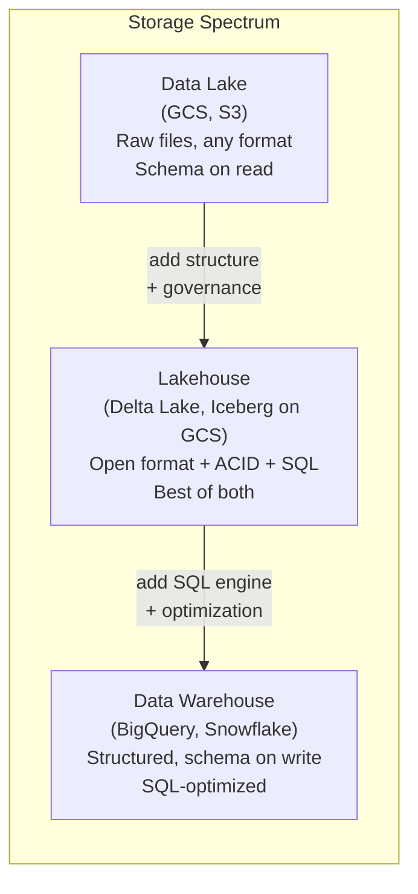
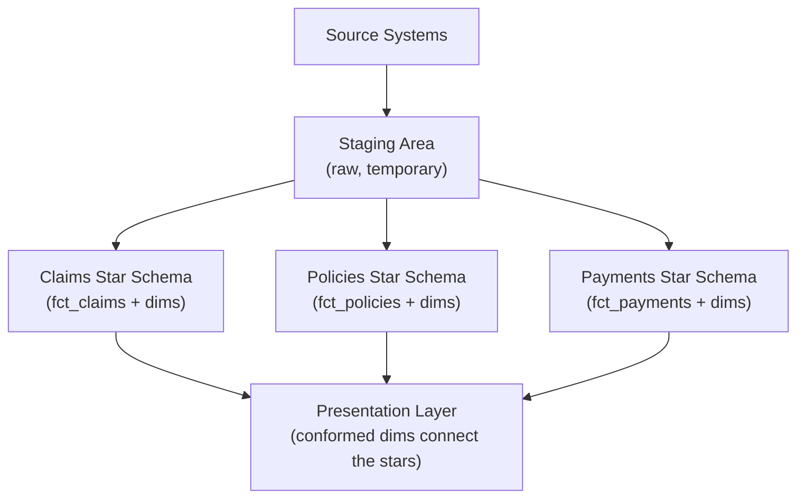
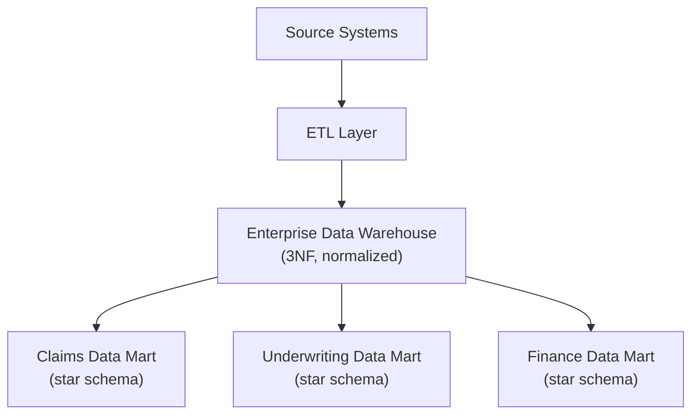

---
tags:
  - fundamentals
  - data-warehouse
  - modeling
  - architecture
status: draft
created: 2026-03-15
updated: 2026-03-15
---

# Data Warehouse Concepts

A data warehouse is a system optimized for analytical queries over historical data. It exists because operational databases (OLTP) are optimized for transactional throughput -- fast single-row inserts and updates -- not for scanning millions of rows to answer "what was our loss ratio by state over the last five years?" Understanding where a warehouse fits relative to data lakes, lakehouses, and OLTP databases is essential for designing any data platform.

Related: [[data-modeling-overview]] | [[bigquery-guide]] | [[etl-vs-elt]]

---

## Why a Warehouse Exists

Operational databases serve applications. Analytical databases serve decision-makers. Mixing the two creates problems in both directions:

| Problem | What Happens |
|---|---|
| Analytics on OLTP | Long-running queries lock transactional tables, slowing the application |
| Transactions on OLAP | Row-level writes are inefficient on columnar storage; concurrency controls are weak |
| No warehouse at all | Analysts query production replicas, dashboards break under load, no historical snapshots |

A warehouse solves this by separating analytical workloads into a purpose-built system with columnar storage, pre-aggregation, and schema designed for human questions rather than application logic.

**Insurance example**: A claims management system (OLTP) handles individual claim creation, status updates, and payment processing. The claims warehouse (OLAP) aggregates those transactions for loss triangles, reserve estimation, regulatory reporting, and trend analysis. Trying to run loss triangle queries on the production claims database would degrade adjuster workflow performance and produce slow, unreliable results.

---

## OLTP vs OLAP

| Criterion | OLTP | OLAP (Warehouse) |
|---|---|---|
| **Purpose** | Run the business | Analyze the business |
| **Queries** | Simple lookups, inserts, updates | Complex aggregations, joins, scans |
| **Schema** | Normalized (3NF) | Denormalized (star/snowflake) |
| **Data volume per query** | Rows to thousands | Millions to billions |
| **Latency target** | Milliseconds | Seconds to minutes |
| **Users** | Applications, microservices | Analysts, dashboards, ML models |
| **Storage format** | Row-oriented | Column-oriented |
| **Write pattern** | Many small writes | Bulk loads, append-only |
| **GCP examples** | Cloud SQL, AlloyDB, Spanner | [[bigquery-guide\|BigQuery]], Spanner (HTAP mode) |

---

## Data Warehouse vs Data Lake vs Lakehouse

| Criterion | Data Lake | Data Warehouse | Lakehouse |
|---|---|---|---|
| **Storage** | Object storage (GCS, S3) | Proprietary/managed columnar | Object storage + open table format |
| **Schema** | Schema-on-read | Schema-on-write | Schema-on-write with evolution |
| **Data types** | Any (JSON, CSV, Parquet, images, logs) | Structured/semi-structured | Structured/semi-structured |
| **Query engine** | External (Spark, Presto, Dataflow) | Built-in (SQL) | Built-in or external |
| **ACID transactions** | No (without table format) | Yes | Yes (Delta, Iceberg, Hudi) |
| **Governance** | Manual (requires catalog) | Built-in | Improving (Delta Unity Catalog, Iceberg REST catalog) |
| **Cost** | Cheap storage, pay for compute | Storage + compute (can be expensive) | Cheap storage + pay for compute |
| **GCP implementation** | [[gcs-as-data-lake\|GCS]] + Dataproc/Dataflow | [[bigquery-guide\|BigQuery]] | BigLake + Iceberg on GCS |

**When to use each**:
- **Data lake**: You have diverse data types (logs, images, raw feeds) and need cheap, durable storage before processing
- **Data warehouse**: Your primary consumers are SQL analysts and BI tools, and data is structured
- **Lakehouse**: You want the openness and cost of a lake with the governance and SQL performance of a warehouse

For this portfolio, the pattern is: GCS data lake (raw landing) into BigQuery warehouse (analytics), following the [[etl-vs-elt]] pattern.

---

## Kimball vs Inmon

The two dominant warehouse design philosophies. Both produce working warehouses; they differ in how data flows from source to analytics.

### Kimball (Bottom-Up)

Build **dimensional models** (star schemas) per business process. Each business process gets its own fact table surrounded by dimension tables. The warehouse is the union of these dimensional models connected by **conformed dimensions** (shared dimensions like `dim_date`, `dim_customer`).

### Inmon (Top-Down)

Build a **normalized enterprise data warehouse** (3NF) first. Then derive dimensional data marts from the EDW for specific business units. The EDW is the single source of truth; data marts are dependent.

### Decision Table

| Criterion | Kimball | Inmon |
|---|---|---|
| **Time to first value** | Fast (build one star schema) | Slow (build entire EDW first) |
| **Upfront design effort** | Lower per process | Higher (enterprise model) |
| **Redundancy** | Some (denormalized facts) | Minimal (normalized EDW) |
| **Query performance** | Excellent (star joins are simple) | Requires data marts for performance |
| **Flexibility for new requirements** | Add new star schemas | Modify EDW, rebuild dependent marts |
| **Best for** | Agile teams, specific analytics needs | Large enterprises with stable requirements |
| **Modern usage** | Dominant in cloud warehouses (BigQuery, Snowflake) | Less common; elements survive in large enterprises |

**Recommendation**: Kimball is the default for modern cloud data warehouses. BigQuery's columnar storage and automatic optimization are designed for the denormalized star schemas that Kimball prescribes. The Inmon approach adds complexity that modern engines do not require. See [[data-modeling-overview]] for implementation details.

---

## Insurance Example: Why Claims Data Needs a Warehouse

An insurance company stores claims in a transactional system optimized for adjusters processing individual claims. But actuaries, underwriters, and executives need to:

| Need | Why OLTP Fails | Warehouse Solution |
|---|---|---|
| Build loss triangles | Requires scanning years of claims with window functions | Partitioned by accident year, pre-aggregated development |
| Calculate loss ratios by LOB and state | Full-table aggregation across millions of claims | Clustered by `line_of_business`, `state` for fast group-by |
| Produce regulatory filings | Need point-in-time snapshots | Slowly changing dimensions, historical fact tables |
| Detect fraud patterns | Cross-claim correlation queries | Denormalized fact tables with all relevant attributes |
| Monitor claim severity trends | Multi-year trend analysis | Historical data retained and queryable without impacting production |

This is exactly what [[../projects/01-claims-warehouse]] builds: a BigQuery warehouse with `fct_claims`, `dim_policy`, `dim_claimant`, and `dim_date` serving actuarial analytics.

---

## Further Reading

- [[data-modeling-overview]] -- Star schema design, fact/dimension tables, and naming conventions
- [[bigquery-guide]] -- The warehouse engine used in this portfolio
- [[etl-vs-elt]] -- How data flows into the warehouse
- [[storage-layer]] -- Where data lives before and alongside the warehouse
- [[gcs-as-data-lake]] -- The data lake that feeds the warehouse
- [[loss-triangle-construction]] -- The actuarial analytics that justify a warehouse
