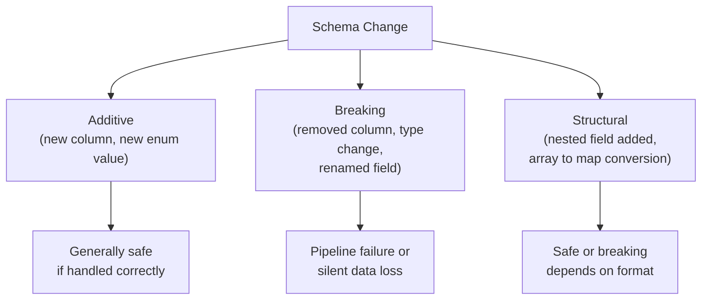
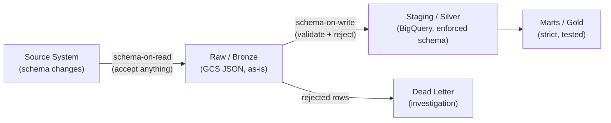

---
tags:
  - fundamentals
  - schema-evolution
  - data-quality
  - governance
  - pipelines
status: draft
created: 2026-03-15
updated: 2026-03-15
---

# Schema Evolution in Data Pipelines

Upstream schemas change. Source systems add columns, rename fields, change types, or restructure payloads -- often without warning. Schema evolution is the discipline of handling these changes without pipeline failures or silent data corruption. It is one of the most common sources of production incidents in data engineering.

Related: [[data-quality]] | [[data-governance]] | [[monitoring-observability]]

---

## Types of Schema Changes



| Change Type | Example | Impact on Pipeline |
|---|---|---|
| **New column** | Source adds `coverage_subtype` | Safe if pipeline ignores unknown columns; data loss if pipeline drops the column |
| **Removed column** | Source drops `legacy_code` | Pipeline crashes if it references the column |
| **Renamed column** | `claim_amt` becomes `claim_amount` | Pipeline reads NULL or crashes |
| **Type change** | `claim_amount` from STRING to FLOAT | Pipeline crashes on cast or produces wrong values |
| **New enum value** | `claim_status` gets `"LITIGATION"` | Falls through CASE statements, appears as NULL or "OTHER" |
| **Null behavior change** | Previously non-null column now has NULLs | Downstream joins produce unexpected results |
| **Nested field added** | JSON adds `claimant.middle_name` | Safe if using flexible parsing; fails with strict schemas |

---

## Schema-on-Read vs Schema-on-Write

Two fundamental strategies for when schema enforcement happens.

| Strategy | How It Works | Pros | Cons |
|---|---|---|---|
| **Schema-on-write** | Enforce schema at write time; reject non-conforming data | Bad data never enters the system; strong guarantees | Rigid; upstream changes require pipeline updates before data flows |
| **Schema-on-read** | Store raw data as-is; enforce schema at query time | Flexible; upstream changes do not break ingestion | Bad data enters the system; consumers must handle inconsistencies |

**Practical recommendation**: Use schema-on-read for the raw/bronze layer (preserve everything upstream sends) and schema-on-write for the staging/silver layer (enforce your expected schema). This gives you both flexibility and safety.



---

## Forward and Backward Compatibility

These concepts come from serialization frameworks (Avro, Protobuf) but apply to any data contract.

| Compatibility | Definition | Example | Use When |
|---|---|---|---|
| **Backward** | New schema can read data written with old schema | New reader handles missing `coverage_subtype` column | Consumers upgrade before producers |
| **Forward** | Old schema can read data written with new schema | Old reader ignores unknown `coverage_subtype` column | Producers upgrade before consumers |
| **Full** | Both backward and forward compatible | Both sides handle additions gracefully | Independent upgrade schedules |

### Compatibility Rules by Format

| Format | Add Column | Remove Column | Rename Column | Change Type |
|---|---|---|---|---|
| **Avro** | Forward compatible (with default) | Backward compatible (with default) | Not compatible | Not compatible |
| **Protobuf** | Forward compatible (unknown fields preserved) | Backward compatible (default values) | Not compatible (use field numbers) | Limited (some numeric widening) |
| **JSON** | Forward compatible (ignore unknown keys) | Breaks strict parsers | Not compatible | Not compatible |
| **Parquet** | Append-only (add to end) | Breaks readers expecting column | Not compatible | Not compatible |
| **BigQuery** | NULLABLE columns only, no position requirement | Not allowed (column persists) | Not allowed (create new column) | Very limited (INT64 to FLOAT64) |

---

## BigQuery Schema Evolution

BigQuery has specific schema evolution rules that differ from general-purpose databases.

| Operation | Supported | How |
|---|---|---|
| Add a NULLABLE column | Yes | `ALTER TABLE ADD COLUMN col_name TYPE` |
| Add a REQUIRED column | No | Would require backfilling all existing rows |
| Remove a column | Yes (since 2023) | `ALTER TABLE DROP COLUMN col_name` |
| Rename a column | Yes (since 2023) | `ALTER TABLE RENAME COLUMN old_name TO new_name` |
| Change column type | Very limited | Only widening (INT64 to FLOAT64, NUMERIC to BIGNUMERIC) |
| Change NULLABLE to REQUIRED | No | Cannot retroactively enforce NOT NULL |
| Change REQUIRED to NULLABLE | Yes | Relaxation is always safe |
| Add nested field to STRUCT | Yes (if NULLABLE) | Nested schema evolution follows same rules |

**Practical implication**: Design BigQuery tables with all columns NULLABLE from the start. This maximizes future schema evolution flexibility. Use Dataform assertions (see [[data-quality]]) to enforce NOT NULL semantics at the application layer instead of the schema layer.

---

## Strategies for Handling Schema Changes

### 1. Versioned Schemas

Maintain explicit schema versions. When the source schema changes, bump the version and update the pipeline.

```
gs://project-raw/claims/v1/2026/03/15/*.json   # old schema
gs://project-raw/claims/v2/2026/03/16/*.json   # new schema (added field)
```

| Pros | Cons |
|---|---|
| Clear, auditable history | Requires version management infrastructure |
| Can process old and new data differently | Multiple code paths to maintain |
| Rollback is straightforward | Complexity grows with each version |

### 2. Flexible Parsing

Parse only the fields you need, ignore the rest. New fields are silently ignored; removed fields produce NULLs.

```python
# Flexible parsing -- does not break on new fields
def parse_claim(raw: dict) -> dict:
    return {
        "claim_id": raw.get("claim_id"),
        "policy_id": raw.get("policy_id"),
        "amount": raw.get("claim_amount") or raw.get("claim_amt"),  # handle rename
        "status": raw.get("claim_status", "UNKNOWN"),
    }
```

| Pros | Cons |
|---|---|
| Resilient to additive changes | Silently drops new valuable fields |
| Simple to implement | Renamed fields require explicit handling |
| No version management | No visibility into what changed |

### 3. Schema Registry

A centralized service that stores and validates schemas. Producers register schemas; consumers validate against registered schemas.

| Tool | Format Support | GCP Integration |
|---|---|---|
| **Confluent Schema Registry** | Avro, Protobuf, JSON Schema | Managed Kafka for Apache Kafka |
| **Google Cloud Data Catalog** | BigQuery native schemas | Native |
| **Custom (GCS + CI)** | Any | Store JSON Schema files in GCS, validate in CI |

### 4. Schema Diff Alerting

Detect schema changes automatically and alert before they break pipelines.

```python
# Simplified schema diff
def detect_schema_changes(expected: dict, actual: dict) -> list:
    changes = []
    for col in expected:
        if col not in actual:
            changes.append(f"REMOVED: {col}")
    for col in actual:
        if col not in expected:
            changes.append(f"ADDED: {col}")
        elif actual[col] != expected.get(col):
            changes.append(f"CHANGED: {col} ({expected[col]} -> {actual[col]})")
    return changes
```

Run this check at the start of each pipeline run. If changes are detected, alert the team and optionally pause the pipeline.

---

## Insurance Example: Claims Schema Change

A claims source system pushes a schema change. Here is how different strategies handle it.

**Change**: The source adds `coverage_subtype` (STRING) and changes `claim_amount` from STRING to NUMERIC.

| Strategy | Outcome |
|---|---|
| **No handling** | Pipeline crashes on `CAST(claim_amount AS NUMERIC)` because it is already NUMERIC; `coverage_subtype` is silently dropped |
| **Flexible parsing** | `claim_amount` cast succeeds (NUMERIC is castable); `coverage_subtype` is ignored (data loss) |
| **Contract tests** | CI detects both changes before deployment; team updates pipeline to handle both |
| **Schema registry** | Producer registers new schema; consumer validates compatibility; incompatible change blocked until consumer updates |
| **Versioned schema** | New data goes to `v2/` path; pipeline updated to handle both versions; old data continues processing |

**Recommended approach for this portfolio**: Contract tests (see [[testing-strategies]]) in CI to detect changes, plus flexible parsing in the raw-to-staging layer to prevent crashes. Schema diff alerting as a monitoring layer.

---

## Schema Evolution Checklist

1. **Design for change**: Make all BigQuery columns NULLABLE from day one
2. **Contract test upstream schemas**: Detect changes in CI before they reach production
3. **Preserve raw data**: Always keep the original, unmodified source data in bronze/raw
4. **Alert on schema diffs**: Automated detection of new, removed, or changed fields
5. **Version your schemas**: Track which schema version each dataset was written with
6. **Document breaking changes**: Maintain a changelog of schema changes and their impact
7. **Test with edge cases**: Include NULLs, empty strings, and unexpected types in test fixtures

---

## Further Reading

- [[data-quality]] -- Quality checks that catch schema-related data issues
- [[data-governance]] -- Governance processes for managing schema changes across teams
- [[monitoring-observability]] -- Monitoring for schema drift in production
- [[testing-strategies]] -- Contract testing to detect schema changes in CI
- [[storage-format-selection]] -- How format choice (Avro, Parquet, JSON) affects schema evolution
- [[bigquery-guide]] -- BigQuery-specific schema evolution rules and limitations
