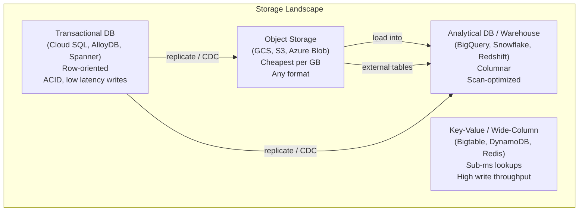
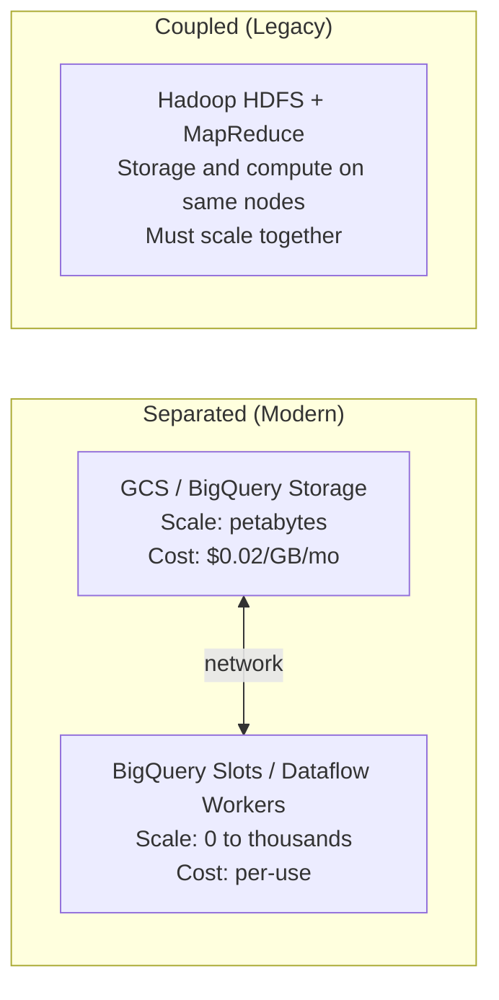

---
tags:
  - fundamentals
  - storage
  - data-lake
  - lakehouse
  - architecture
status: draft
created: 2026-03-15
updated: 2026-03-15
---

# The Storage Layer

The storage layer answers a deceptively simple question: **where does data live?** The answer determines cost, query performance, governance capability, and how easily you can evolve your platform. This document covers the major storage categories, open table formats, and when to use each.

Related: [[gcs-as-data-lake]] | [[bigquery-guide]] | [[data-warehouse-concepts]] | [[storage-format-selection]]

---

## Storage Categories

| Category | GCP Service | Latency | Cost (per GB/month) | Best For |
|---|---|---|---|---|
| **Object storage** | [[gcs-as-data-lake\|GCS]] | ~50-100ms first byte | $0.004-0.026 | Raw data landing, archive, data lake |
| **OLTP database** | Cloud SQL, AlloyDB, Spanner | 1-10ms | $0.17+ (provisioned) | Application backends, transactional writes |
| **OLAP warehouse** | [[bigquery-guide\|BigQuery]] | Seconds | $0.01-0.02 (storage only) | Analytical queries, BI, reporting |
| **Key-value store** | Bigtable, Memorystore | <1-10ms | $0.17+ (provisioned) | Point lookups, time-series, caching |

**Decision rule**: Start by asking what the primary access pattern is. If it is sequential scans over large datasets, use OLAP. If it is random lookups by key, use key-value. If it is ACID transactions with complex joins, use OLTP. If it is durable, cheap bulk storage, use object storage.

---

## Object Storage Deep Dive

Object storage (GCS on GCP, S3 on AWS) is the foundation of modern data platforms. It offers:

- **Durability**: 11 nines (99.999999999%) -- data loss is essentially impossible
- **Scalability**: No capacity planning; store petabytes without provisioning
- **Cost**: 10-100x cheaper per GB than database storage
- **Format agnostic**: Store Parquet, Avro, JSON, CSV, images, models, anything

The trade-off is that object storage has no query engine, no indexing, and no ACID transactions (without a table format layer). You need an external engine to query it.

See [[gcs-as-data-lake]] for GCS-specific design patterns, lifecycle policies, and the bronze/silver/gold layering approach.

---

## Open Table Formats

Open table formats add database-like capabilities (ACID transactions, schema evolution, time travel) on top of object storage. They sit between raw files and a full warehouse.

| Format | Originated At | Key Strengths | GCP Support |
|---|---|---|---|
| **Apache Iceberg** | Netflix (2017) | Hidden partitioning, partition evolution, multi-engine (Spark, Trino, Flink, BigQuery via BigLake) | BigLake tables, Dataproc |
| **Delta Lake** | Databricks (2019) | Tight Spark integration, Z-ordering, liquid clustering, Unity Catalog governance | Dataproc, limited BigQuery support |
| **Apache Hudi** | Uber (2016) | Record-level upserts, incremental processing, CDC-friendly | Dataproc |

### When to Use an Open Table Format

| Scenario | Without Table Format | With Table Format |
|---|---|---|
| Schema change | Rewrite all files or maintain version suffixes | `ALTER TABLE ADD COLUMN` -- metadata-only operation |
| Accidental data deletion | Restore from backup (if you have one) | Time travel: `SELECT * FROM table VERSION AS OF timestamp` |
| Concurrent writes | Last writer wins, possible corruption | ACID transactions with optimistic concurrency |
| Partition change | Rewrite entire dataset | Partition evolution (Iceberg: metadata-only, no data rewrite) |
| Query planning | Scan all files | Metadata-driven pruning (skip files based on column stats) |

**Practical guidance**: If you are fully in BigQuery, you get most of these benefits natively (BigQuery handles schema evolution, has time travel, and manages partitioning). Open table formats matter most when you have a multi-engine architecture (Spark + Trino + Flink all querying the same data on GCS) or when you need to avoid warehouse lock-in.

---

## Compute-Storage Separation

The foundational architecture principle of modern data platforms. Storage and compute scale independently.

| Aspect | Coupled (Hadoop-era) | Separated (Cloud-native) |
|---|---|---|
| **Scaling** | Add nodes = more storage AND compute | Scale each independently |
| **Cost at rest** | Pay for idle compute nodes | Pay only for storage |
| **Multi-engine** | Difficult (data locked to cluster) | Easy (any engine reads from GCS) |
| **Elasticity** | Poor (cluster resize takes minutes) | Good (autoscaling workers) |

BigQuery is the canonical example: data sits in Colossus (Google's distributed storage), and Dremel workers spin up on demand to query it. You pay for storage continuously and compute only when queries run.

---

## Insurance Data Storage Decisions

| Data | Storage Choice | Why |
|---|---|---|
| Raw claim files from source systems | [[gcs-as-data-lake\|GCS]] (Standard) | Cheap, durable, format-agnostic landing zone |
| Historical claims for analytics | [[bigquery-guide\|BigQuery]] | Fast analytical queries, partitioned by accident year |
| Policyholder lookup for enrichment | BigQuery or Bigtable | BigQuery for batch lookups, Bigtable if sub-ms latency needed |
| Regulatory archive (7-10 year retention) | GCS (Coldline/Archive) | Lowest cost, rarely accessed |
| Local development and testing | [[duckdb-local-dev\|DuckDB]] | Zero cost, runs on laptop, compatible SQL |
| ML feature store | BigQuery + GCS | Features in BigQuery for SQL access, training data in GCS for Vertex AI |

---

## Storage Format Selection

The file format you choose affects query performance, compression ratio, and schema evolution capability. See [[storage-format-selection]] for the full comparison. Quick summary:

| Format | Best For | Compression | Schema Evolution |
|---|---|---|---|
| **Parquet** | Analytical queries (columnar) | Excellent (Snappy, GZIP) | Limited (append columns only) |
| **Avro** | Streaming writes, row-oriented access | Good (Deflate) | Excellent (forward/backward compatible) |
| **CSV/JSON** | Raw landing, human readability | Moderate (GZIP) | None (fragile) |
| **ORC** | Hive/Spark ecosystems | Excellent (Zlib) | Limited |

**Default recommendation**: Land in source format (CSV/JSON), convert to Parquet in the processed layer, load into BigQuery for the serving layer.

---

## Further Reading

- [[gcs-as-data-lake]] -- GCS-specific patterns: lifecycle, layering, partitioning by path
- [[bigquery-guide]] -- BigQuery as the analytical storage and compute layer
- [[data-warehouse-concepts]] -- How warehouses fit in the storage landscape
- [[storage-format-selection]] -- Detailed file format comparison and decision framework
- [[duckdb-local-dev]] -- DuckDB as a local storage and compute layer for development
- [[schema-evolution]] -- What happens when upstream schemas change
