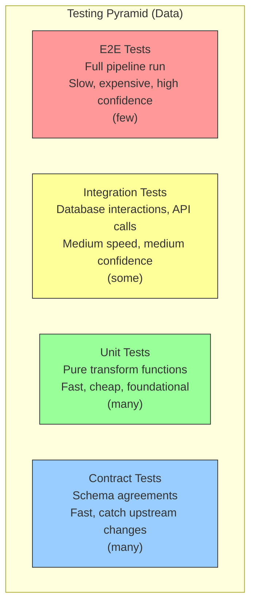

---
tags:
  - fundamentals
  - testing
  - data-quality
  - ci-cd
  - pipelines
status: draft
created: 2026-03-15
updated: 2026-03-15
---

# Testing Strategies for Data Pipelines

Data pipeline testing is fundamentally different from application testing. A web app that crashes produces an HTTP 500 and someone gets paged. A data pipeline that silently drops 30% of records produces no error -- the loss ratios in next month's board report are simply wrong, and nobody connects it to a pipeline change three weeks ago. Testing must catch not just crashes, but **silent data corruption**.

Related: [[data-quality]] | [[ci-cd-for-data]] | [[orchestration]]

---

## The Data Testing Pyramid

Adapted from the classic testing pyramid, but tailored for data pipelines.



| Level | What It Tests | Speed | Cost | Catches |
|---|---|---|---|---|
| **Unit** | Individual transform functions | Milliseconds | Free | Logic bugs in transformations |
| **Contract** | Schema agreements between producers and consumers | Milliseconds | Free | Upstream schema changes |
| **Integration** | Component interactions (DB writes, API calls) | Seconds | Low (local DB) | Connection issues, SQL errors, serialization bugs |
| **E2E** | Full pipeline from source to destination | Minutes | Medium (cloud resources) | Pipeline assembly errors, data flow issues |

**Key insight**: Most data teams write too few unit tests and rely too heavily on E2E tests. Invert this -- unit test your transform logic extensively, and use E2E tests sparingly for confidence.

---

## Unit Testing Transform Logic

Unit tests validate pure functions that transform data. They run in milliseconds, require no infrastructure, and form the foundation of pipeline reliability.

### What to Unit Test

| Target | Example | Test Assertion |
|---|---|---|
| Type casting | `parse_date("2026-03-15")` | Returns `date(2026, 3, 15)` |
| Null handling | `clean_amount(None)` | Returns `Decimal(0)` or raises `ValueError` |
| Business logic | `calculate_development_year(accident_date, payment_date)` | Returns correct integer |
| Edge cases | `parse_claim_status("UNKNOWN_VALUE")` | Returns `"OTHER"` or raises |
| Aggregations | `compute_loss_ratio(earned_premium, incurred_loss)` | Returns correct decimal |

### Testing Framework: pytest

```python
# tests/test_transforms.py
import pytest
from decimal import Decimal
from transforms import calculate_development_year, compute_loss_ratio

def test_development_year_same_year():
    assert calculate_development_year(
        accident_date=date(2024, 3, 15),
        payment_date=date(2024, 8, 20)
    ) == 0

def test_development_year_multi_year():
    assert calculate_development_year(
        accident_date=date(2022, 1, 1),
        payment_date=date(2024, 6, 15)
    ) == 2

def test_loss_ratio_normal():
    result = compute_loss_ratio(
        earned_premium=Decimal("1000000"),
        incurred_loss=Decimal("650000")
    )
    assert result == Decimal("0.65")

def test_loss_ratio_zero_premium_raises():
    with pytest.raises(ZeroDivisionError):
        compute_loss_ratio(Decimal("0"), Decimal("100"))
```

**Principle**: Extract transformation logic into pure functions that accept and return data, separate from I/O. This makes unit testing trivial.

---

## Contract Testing (Schema Validation)

Contract tests verify that data conforms to an agreed-upon schema. They catch upstream changes before they corrupt your pipeline.

| Approach | Tool | When It Runs |
|---|---|---|
| **Schema-on-write** | BigQuery schema enforcement, Avro/Protobuf | At write time (rejects non-conforming data) |
| **Schema-on-read** | Great Expectations, custom validators | At read time (flags issues but does not reject) |
| **CI schema checks** | JSON Schema, Pydantic models | In CI before deployment |

### What to Validate in Contracts

| Check | Why |
|---|---|
| Column existence | Detect dropped columns before they cause NULL joins |
| Column types | Detect type changes (string -> int) that break casts |
| Enum values | Detect new values that bypass CASE statements |
| Nullable vs required | Detect new NULLs in previously non-null columns |
| Row count bounds | Detect empty or exploded source tables |

**Insurance example**: The claims source system adds a new `coverage_subtype` column. Without contract tests, the pipeline silently ignores it (data loss) or fails on unexpected columns (pipeline crash). With contract tests, CI catches the schema change and alerts the team to update the pipeline.

---

## Integration Testing

Integration tests verify that components work together -- database writes succeed, API responses parse correctly, SQL queries return expected results.

| Target | Test Strategy | Tool |
|---|---|---|
| SQL transforms | Run against local DuckDB with test fixtures | pytest + [[duckdb-local-dev\|DuckDB]] |
| BigQuery queries | Run against a test dataset in BigQuery (or DuckDB equivalent) | pytest + bigquery client / DuckDB |
| API ingestion | Mock HTTP responses, verify parsing | pytest + responses/httpx mock |
| File I/O | Write/read from local filesystem, verify format | pytest + tempfile |

### DuckDB for SQL Integration Testing

DuckDB's BigQuery-compatible SQL makes it an excellent local integration testing engine.

```python
# tests/test_sql_transforms.py
import duckdb

def test_staging_transform():
    conn = duckdb.connect()
    # Load test fixtures
    conn.execute("""
        CREATE TABLE raw_claims AS
        SELECT * FROM read_csv('tests/fixtures/raw_claims.csv')
    """)
    # Run the staging transform
    conn.execute(open('sql/stg_claims.sql').read())
    # Verify results
    result = conn.execute("SELECT COUNT(*) FROM stg_claims").fetchone()
    assert result[0] == 5  # expected row count

    nulls = conn.execute(
        "SELECT COUNT(*) FROM stg_claims WHERE claim_id IS NULL"
    ).fetchone()
    assert nulls[0] == 0  # no null claim_ids
```

---

## E2E (End-to-End) Testing

E2E tests run the entire pipeline from source to destination. They are slow, expensive, and essential for final confidence before deployment.

| Strategy | Implementation | Cost |
|---|---|---|
| **Dry-run with sample data** | Load 100 rows through the full pipeline, verify output | Low (small data, free tiers) |
| **Shadow pipeline** | Run new pipeline version alongside production, compare outputs | Medium (2x compute) |
| **Canary deployment** | Route a fraction of data through the new version | Medium (partial compute) |
| **Full regression** | Reprocess a known historical dataset, compare to expected output | High (full compute) |

**Practical approach for portfolio projects**: Use dry-run with sample data. Maintain a `tests/fixtures/` directory with small, representative datasets and expected outputs. Run the full pipeline in CI and compare outputs.

---

## Tool Comparison for Data Testing

| Tool | Test Type | Strengths | Limitations |
|---|---|---|---|
| **pytest** | Unit, integration | Universal Python testing, rich ecosystem, fixtures | Not data-specific |
| **Great Expectations** | Contract, quality | 200+ built-in expectations, profiling, data docs | Complex setup, Python-heavy |
| **dbt tests** | Contract, quality (in-warehouse) | Lives with transforms, four built-in tests | Warehouse-only, limited custom logic |
| **Dataform assertions** | Contract, quality (BigQuery) | Native to BigQuery, zero extra tooling | BigQuery-only, less expressive than dbt |
| **Soda** | Quality, monitoring | Simple YAML checks, anomaly detection | Newer, smaller community |
| **Pydantic** | Schema validation (Python) | Type-safe models, fast, excellent error messages | Python code only, not SQL |

### Which to Use When

```
Are you testing Python transform code?
  --> pytest (always)

Are you testing SQL transforms in BigQuery/warehouse?
  --> Dataform assertions (if using Dataform)
  --> dbt tests (if using dbt)

Are you validating raw data at ingestion?
  --> Great Expectations or Pydantic

Are you monitoring production data quality continuously?
  --> Soda or custom BigQuery checks
```

See [[data-quality]] for the broader data quality framework that these testing tools plug into.

---

## Insurance Testing Examples

| Test | Type | What It Validates |
|---|---|---|
| `test_claim_amount_positive()` | Unit | All parsed claim amounts are > 0 |
| `test_loss_date_before_report_date()` | Unit | Business rule: loss cannot occur after reporting |
| `test_development_factors_greater_than_one()` | Integration | Cumulative development should increase |
| `test_triangle_completeness()` | Integration | Every accident year/dev year cell has data |
| `test_schema_matches_contract()` | Contract | Source schema has not changed |
| `test_full_pipeline_sample_data()` | E2E | 100 sample claims flow from raw to fct_claims |
| `test_no_duplicate_claim_ids()` | Quality | Primary key uniqueness in final table |

---

## Further Reading

- [[data-quality]] -- Quality checks that testing enforces
- [[ci-cd-for-data]] -- Running tests in CI/CD pipelines
- [[orchestration]] -- Testing as a pipeline step
- [[monitoring-observability]] -- Production monitoring after tests pass
- [[duckdb-local-dev]] -- Local testing engine for SQL transforms
- [[schema-evolution]] -- What happens when upstream schemas change (contract test trigger)
