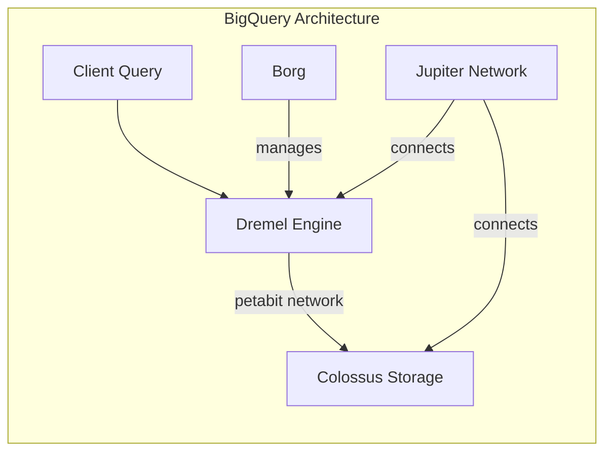

---
tags:
  - gcp
  - bigquery
  - data-warehouse
  - sql
  - tools
status: draft
created: 2026-02-21
updated: 2026-02-21
---

# BigQuery -- Deep-Dive Guide

BigQuery is Google's fully managed, serverless columnar data warehouse. It separates storage from compute, letting you scale each independently and pay for them separately. This guide covers architecture, pricing models, optimization strategies, and when to reach for something else.

Related: [[data-modeling-overview]] | [[sql-patterns]] | [[etl-vs-elt]] | [[dataform-guide]] | [[gcs-as-data-lake]]

---

## Architecture

BigQuery's performance comes from four infrastructure components working together.

| Component    | Role                                                                                  |
| ------------ | ------------------------------------------------------------------------------------- |
| **Colossus** | Distributed storage layer; stores data in columnar format (Capacitor)                 |
| **Dremel**   | Massively parallel query engine; breaks queries into sub-tasks across thousands of nodes |
| **Borg**     | Cluster manager; orchestrates compute resources                                       |
| **Jupiter**  | Google's petabit network; fast data shuffling between storage and compute              |
| **Slots**    | Units of computational capacity; 1 slot is roughly 0.5 vCPU + memory                 |

The key insight: because storage and compute are decoupled, a query scans data from Colossus over Jupiter into Dremel workers managed by Borg. You never provision servers.

---

## Slots and Editions Pricing

Slots are the compute currency. You acquire them in two ways:

### On-Demand

Pay per TB scanned. Up to 2,000 concurrent slots per project (burstable). Good for unpredictable or exploratory workloads.

### Editions (Capacity Pricing)

Purchase slot commitments billed per hour, regardless of usage. Autoscaling from a baseline (min) to a configured max.

| Edition            | $/slot-hour | Notable Features                                            |
| ------------------ | ----------- | ----------------------------------------------------------- |
| **Standard**       | $0.04       | Basic; no materialized views, no BI Engine, no CMEK         |
| **Enterprise**     | $0.06       | Materialized views, BI Engine, CMEK, multi-region failover  |
| **Enterprise Plus**| $0.10       | All Enterprise features + advanced security, disaster recovery |

Committed Use Discounts (CUDs) of 1-year or 3-year reduce slot costs by 25-60%.

**Decision rule**: Use on-demand when monthly query spend stays under roughly $10K or usage is unpredictable. Switch to editions when consistent workloads make slot-hours cheaper per TB than on-demand.

### Full Pricing Summary

| Component                         | Price (US multi-region)          |
| --------------------------------- | -------------------------------- |
| Active storage                    | $0.02/GB/month                   |
| Long-term storage (90+ days)      | $0.01/GB/month                   |
| On-demand queries                 | $6.25/TB scanned                 |
| Streaming inserts                 | $0.05/GB                         |
| Storage API reads                 | $1.10/TB read                    |
| Free tier                         | 10 GB storage + 1 TB queries/mo  |

---

## Partitioning vs Clustering

Both reduce data scanned, but they work differently and serve different purposes.

### Partitioning

Divides a table into segments based on a column value. BigQuery can skip entire partitions during query execution (partition pruning).

| Partition Type                        | Best For                                   |
| ------------------------------------- | ------------------------------------------ |
| **Time-unit** (HOUR, DAY, MONTH, YEAR)| Time-series data, event logs -- most common |
| **Integer range**                     | Tables keyed by numeric ID ranges           |
| **Ingestion time**                    | When no natural partition column exists      |

Limit: 4,000 partitions per table.

### Clustering

Sorts data within each partition by up to 4 columns. BigQuery uses block-level metadata to skip irrelevant blocks. Clustering is free (no extra storage cost) and BigQuery re-clusters automatically in the background.

### Decision Table

| Criterion              | Partitioning                  | Clustering                    |
| ---------------------- | ----------------------------- | ----------------------------- |
| Distinct values        | Low-to-medium (< 4,000)      | High cardinality (millions)   |
| Filter column count    | Single column                 | Up to 4 columns               |
| Strict cost control    | Yes -- exact pruning          | Approximate -- block elimination |
| Data expiration needed | Yes -- partition expiration   | No built-in expiration        |

**Best practice**: Combine both. Partition by date, then cluster by your most common filter/join columns.

**Actuarial example**: A claims fact table (`fct_claims`) partitioned by `loss_date` (DAY) and clustered by `line_of_business`, `state`, `claim_status`. Queries filtering by date range and LOB scan a fraction of the table.

---

## Materialized Views

Pre-computed query results stored and auto-maintained by BigQuery.

- The query optimizer **automatically rewrites** queries to use materialized views, even when the user does not reference them directly.
- Incremental refresh: only processes changed data, not the entire base table.
- Queries against materialized views incur no extra compute cost (already computed).

**Limitations**:
- Enterprise edition or above only.
- Single-table aggregations only -- no JOINs in the view definition.
- No UNION, subqueries, or non-deterministic functions.

**When to use**: Dashboards and reports that repeatedly aggregate large tables on the same dimensions. For example, a daily loss-ratio summary view over a multi-TB claims table.

---

## BI Engine

An in-memory analysis service that accelerates SQL queries by caching data in RAM.

- Reservation-based: allocate a memory reservation (1 GB, 10 GB, etc.) and pay per GB-hour.
- Works transparently with Looker Studio and connected BI tools.
- Best for dashboards with repeated queries on the same datasets.

**Pitfall**: If queries exceed the reservation, they silently fall back to standard BigQuery execution, potentially causing cost spikes. Monitor BI Engine utilization in Cloud Monitoring.

---

## BigQuery ML (BQML)

Create and run ML models using SQL inside BigQuery -- no data movement required.

| Model Type             | Actuarial/Insurance Use Case                        |
| ---------------------- | --------------------------------------------------- |
| Linear Regression      | Loss cost prediction, reserve estimation            |
| Logistic Regression    | Fraud detection (binary classification)             |
| XGBoost                | Claims severity modeling with structured data       |
| K-Means                | Policyholder segmentation, anomaly grouping         |
| Time Series (ARIMA+)   | Premium volume forecasting, loss development        |
| Imported TensorFlow    | Bring a custom mortality model for BQ inference     |

**When to use BQML**: Rapid prototyping, SQL-skilled teams, models that need to sit close to the data. Avoid when you need full model customization, extensive hyperparameter search, or frameworks outside BQML's scope.

---

## When NOT to Use BigQuery

| Scenario                                              | Better Alternative                       |
| ----------------------------------------------------- | ---------------------------------------- |
| OLTP / transactional (high write, row-level updates)  | Cloud SQL, Cloud Spanner, AlloyDB        |
| Sub-second point lookups                              | Bigtable, Memorystore (Redis)            |
| Small datasets (< 1 GB) with simple queries           | Cloud SQL, PostgreSQL                    |
| High-concurrency small queries (thousands/sec)        | Bigtable, Spanner                        |
| Real-time streaming with sub-second E2E latency       | Bigtable + [[dataflow-guide\|Dataflow]]  |
| Interactive CRUD applications                         | Firestore, Cloud SQL                     |
| Graph / highly connected queries                      | Neo4j, JanusGraph on GCE                |

See also: [[batch-vs-stream]] for deciding whether BigQuery streaming inserts fit your latency needs, and [[storage-format-selection]] for choosing file formats before loading into BigQuery.

---

## Best Practices Checklist

1. **Partition** time-series tables by date/timestamp.
2. **Cluster** by your most common filter/join columns (up to 4).
3. **Select only needed columns** -- columnar storage means column pruning equals cost savings. Avoid `SELECT *`.
4. **`LIMIT` does NOT reduce bytes scanned** -- it is only for presentation.
5. Use `--dry_run` to estimate costs before expensive queries.
6. Set **custom cost controls**: max bytes billed per query, per user, per project.
7. **Denormalize** where possible -- JOINs across large tables are expensive (see [[data-modeling-overview]]).
8. Prefer **batch loads** (free) over streaming inserts for non-real-time data.
9. Monitor with `INFORMATION_SCHEMA` views: `JOBS_BY_PROJECT`, `TABLE_STORAGE`.
10. Use [[dataform-guide]] or dbt for version-controlled SQL transformations.

---

## Common Pitfalls

1. **Unbounded queries**: A `SELECT *` on a 10 PB table costs $62,500. Always filter and select columns.
2. **Partition pruning failures**: Applying functions to partition columns (e.g., `DATE(_PARTITIONTIME)`) prevents pruning.
3. **Slot starvation**: Too many concurrent queries competing for limited slots under on-demand pricing.
4. **Streaming buffer costs**: Data in the streaming buffer is billed at active storage rates and is not immediately available for exports.
5. **Cross-region queries**: Joining datasets across regions incurs egress charges.
6. **Materialized view staleness**: Views refresh asynchronously -- not suitable for near-real-time dashboards without BI Engine.

---

## Further Reading

- [[sql-patterns]] -- BigQuery SQL patterns including CTEs, window functions, and anti-patterns
- [[etl-vs-elt]] -- Why BigQuery favors an ELT approach (load raw, transform in-place)
- [[data-quality]] -- Assertion strategies that complement BigQuery's `INFORMATION_SCHEMA`
- [[gcs-as-data-lake]] -- Loading data from GCS into BigQuery (external tables vs native loads)
- [[dataform-guide]] -- SQL transformation layer built natively into BigQuery
- [[cloud-composer-guide]] -- Orchestrating BigQuery jobs in complex pipelines
- [[orchestration]] -- Broader orchestration patterns and tool selection
