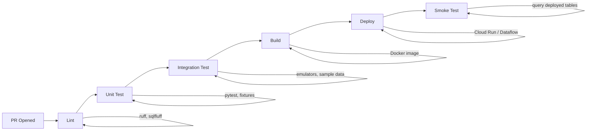

# CI/CD for Data Pipelines

Continuous Integration and Continuous Deployment for data pipelines borrows heavily from software engineering practices, but the failure modes are fundamentally different. A broken web API returns HTTP 500 and someone gets paged. A broken data pipeline silently produces wrong numbers in a dashboard, and nobody notices until a CFO asks why the loss ratios look off.

## Why CI/CD for Data Is Different

Traditional CI/CD assumes that a failing build is loud -- tests crash, containers refuse to start, health checks fail. Data pipelines break in ways that do not crash anything:

| Failure Mode | Software Equivalent | Data Pipeline Reality |
|---|---|---|
| Schema change | API contract break (caught by type system) | Upstream source drops a column; pipeline runs fine, produces NULLs |
| Data quality regression | Logic bug (caught by unit tests) | Claim amounts silently double-counted; totals look "reasonable" |
| Environment parity | Docker gives identical environments | You cannot clone a 10 TB BigQuery production dataset for testing |
| Rollback difficulty | Revert the container image | Reverted pipeline still left corrupted data in the warehouse |
| Silent failures | Process crashes, alerts fire | Pipeline succeeds but loads zero rows; downstream tables are stale |

These differences mean data CI/CD needs **additional** stages beyond the software norm: schema validation, data quality assertions, and post-deployment smoke tests that query actual tables.

## Pipeline Stages

A mature data CI/CD pipeline progresses through the following stages:



Not every project needs all stages from day one. Start with lint and unit tests (cheap, fast). Add integration tests and smoke tests as the pipeline matures and the cost of silent failures increases.

## Data-Specific CI Checks

Beyond standard linting and unit testing, data pipelines benefit from checks that most software projects never need:

### SQL Linting (sqlfluff, sqlfmt)

Enforce consistent SQL style across the team. Catches common issues: implicit column ordering in `SELECT *`, missing `GROUP BY` columns, inconsistent casing.

```yaml
# .sqlfluff config
[sqlfluff]
dialect = bigquery
templater = jinja
max_line_length = 120

[sqlfluff:rules:capitalisation.keywords]
capitalisation_policy = upper
```

### Schema Validation

Compare the output schema of a transformation against an expected contract. Catches column renames, type changes, and accidentally dropped columns before they reach production.

```python
# Example: schema contract test
def test_claims_output_schema():
    expected_columns = {
        "claim_id": "STRING",
        "loss_date": "DATE",
        "paid_amount": "NUMERIC",
        "line_of_business": "STRING",
    }
    actual = get_table_schema("fct_claims")
    for col, dtype in expected_columns.items():
        assert col in actual, f"Missing column: {col}"
        assert actual[col] == dtype, f"Type mismatch for {col}: {actual[col]} != {dtype}"
```

### Data Quality Assertions

Run [[data-quality]] checks as part of CI. Dataform assertions, dbt tests, or Great Expectations suites validate that transformed data meets business rules (e.g., `loss_date <= reported_date`, no negative reserves, no orphan claims without a matching policy).

### Terraform Plan / Validate

For infrastructure changes (see [[infrastructure-as-code]]), run `terraform validate` and `terraform plan` in CI. The plan output shows exactly which GCP resources will be created, modified, or destroyed -- reviewable in the PR diff.

### Container Builds

Build Docker images in CI to catch dependency issues early. A `pip install` that works locally but fails in the container (missing system library, version conflict) should break the build, not the deployment.

## Tool Comparison

| Tool | Strengths | Weaknesses | When to Use |
|---|---|---|---|
| **GitHub Actions** | Native GitHub integration, large marketplace, matrix builds, generous free tier | YAML verbosity, limited local debugging | Default choice for GitHub-hosted repos; portfolio projects |
| **Cloud Build** | Deep GCP integration, automatic Artifact Registry push, VPC access | Smaller ecosystem, GCP-only, less community content | When pipeline needs private GCP resources during build |
| **GitLab CI** | Built-in container registry, DAG-based pipelines, good self-hosted option | Slower UI, GitLab-only | Teams already on GitLab; self-hosted requirements |
| **Jenkins** | Maximum flexibility, any language/tool, massive plugin ecosystem | Operational overhead (you run the server), security maintenance | Legacy enterprise environments; complex custom workflows |

For a GCP-focused data engineering portfolio, **GitHub Actions** is the pragmatic default. Cloud Build is the right choice when builds need to access private GCP resources (private VPCs, internal APIs) or when you want a single vendor stack.

## Branching Strategies for Data Teams

### Trunk-Based Development (Recommended)

All developers commit to `main` (or short-lived feature branches merged within 1-2 days). Releases deploy from `main` directly.

**Why this works well for data**: Data migrations are hard to revert. If you maintain long-lived branches, schema changes diverge and merging becomes painful. Trunk-based development keeps the feedback loop short -- a broken transformation is caught within hours, not weeks.

### Gitflow

Long-lived `develop` and `main` branches, with feature branches, release branches, and hotfix branches.

**When this makes sense for data**: Large teams (10+ engineers) with formal release cycles, regulatory requirements for change approval, or multiple data products with independent release schedules. Rare in practice for data teams.

### Feature Flags for Data

Instead of branching, use configuration flags to control data pipeline behavior:

```python
# Feature flag: enable new claim severity model
if config.get("enable_severity_v2", False):
    df = transform_severity_v2(df)
else:
    df = transform_severity_v1(df)
```

This lets you merge code to `main` without activating it in production. When ready, flip the flag. If something breaks, flip it back -- no rollback of data, no branch merge required.

## Secrets Management for GCP

From most to least secure:

| Method | Security | Operational Overhead | When to Use |
|---|---|---|---|
| **Workload Identity Federation** | Best -- no keys at all | Medium (initial setup) | Production CI/CD; GitHub Actions to GCP |
| **Secret Manager** | Good -- encrypted, audited, rotatable | Low | Application secrets (API keys, DB passwords) |
| **Environment Variables** | OK -- visible in CI logs if misconfigured | Lowest | Non-sensitive config (project ID, region) |
| **Service Account Keys** | Poor -- downloadable JSON, hard to rotate | Low | Avoid; legacy systems only |

**Workload Identity Federation** lets GitHub Actions authenticate to GCP without any stored credentials. The CI runner receives a short-lived token scoped to specific permissions. No JSON key files to leak, no secrets to rotate.

```yaml
# GitHub Actions: authenticate via Workload Identity Federation
- uses: google-github-actions/auth@v2
  with:
    workload_identity_provider: 'projects/123/locations/global/workloadIdentityPools/github/providers/my-repo'
    service_account: 'ci-pipeline@my-project.iam.gserviceaccount.com'
```

## Insurance Example: Portfolio CI/CD Workflow

This repository's GitHub Actions workflow demonstrates data CI/CD for an insurance claims platform:

```yaml
# Simplified representation of the workflow structure
name: Data Pipeline CI/CD

on:
  pull_request:
    branches: [main]
  push:
    branches: [main]

jobs:
  lint:
    # ruff (Python) + sqlfluff (SQL) across P01 and P02
    # Catches style violations and SQL anti-patterns before review

  test:
    # pytest with matrix strategy across projects
    # Uses DuckDB fixtures (no BigQuery access needed)
    # Schema contract tests for critical output tables

  build:
    needs: [lint, test]
    # Docker build for Cloud Run services
    # Push to Artifact Registry

  deploy:
    needs: [build]
    if: github.ref == 'refs/heads/main'
    # Deploy to Cloud Run with --no-traffic flag
    # Smoke test: query deployed tables for expected row counts
    # Manual approval gate before shifting traffic
```

The manual approval gate is critical for data pipelines. Unlike a web app rollback (switch to the previous container), a data pipeline that runs with bad logic has already written corrupted data. The approval gate gives a human the chance to inspect the smoke test results before the pipeline processes real data.

## Anti-Patterns

| Anti-Pattern | Why It Is Dangerous | Better Approach |
|---|---|---|
| No CI at all | Schema breaks discovered in production | Start with lint + one test; iterate |
| Testing against production data | Slow, expensive, privacy concerns | Use sample fixtures or emulators |
| Skipping smoke tests | Deploy succeeds but pipeline produces wrong results | Query output tables post-deploy; assert row counts and key metrics |
| Hardcoded secrets in YAML | Credential leaks in git history | Workload Identity Federation or Secret Manager |
| Monolithic test suite | One failure blocks all deployments | Separate lint, unit, integration into independent jobs |
| No manual gate for data deploys | Corrupted data is hard to roll back | Require human approval before traffic shift |

## Related Docs

- [[infrastructure-as-code]] -- Terraform plan/apply as part of the CI/CD pipeline
- [[monitoring-observability]] -- Post-deployment monitoring that catches what CI misses
- [[orchestration]] -- How deployed pipelines are scheduled and managed
- [[data-quality]] -- The assertion and testing frameworks that run inside CI
- [[terraform-gcp-guide]] -- GCP-specific Terraform patterns validated in CI
