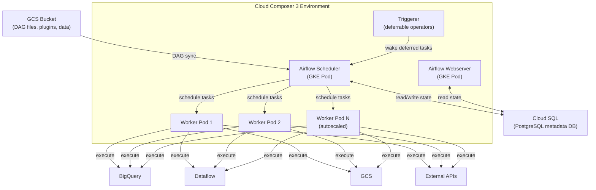
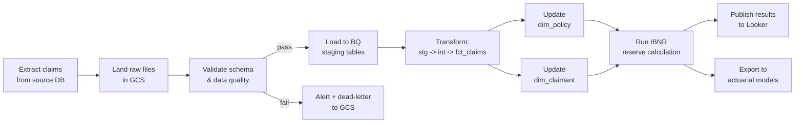

---
tags:
  - gcp
  - orchestration
  - airflow
  - cloud-composer
  - pipeline
status: draft
created: 2026-02-21
updated: 2026-02-21
---

# Cloud Composer (Managed Apache Airflow)

Cloud Composer is Google's fully managed Apache Airflow service for orchestrating data pipelines as Directed Acyclic Graphs (DAGs) written in Python. It handles the infrastructure -- GKE cluster, metadata database, DAG storage -- so you focus on pipeline logic. See [[orchestration]] for the broader orchestration landscape and [[orchestrator-selection]] for when to choose Composer over alternatives.

## Architecture

Composer 3 runs Airflow on top of several GCP services working together.

| Component | Infrastructure | Role |
|---|---|---|
| **Airflow Webserver** | GKE pod | UI for monitoring DAGs, task logs, connections |
| **Airflow Scheduler** | GKE pod | Parses DAGs, schedules tasks based on dependencies and cron |
| **Workers** | GKE pods (autoscaled) | Execute individual tasks; scale with queue depth |
| **Metadata DB** | Cloud SQL (PostgreSQL) | Stores DAG state, task history, variables, connections |
| **DAG Storage** | GCS bucket | DAG files synced automatically; deploy by uploading to GCS |
| **Triggerer** | GKE pod | Handles deferrable operators (async waiting without holding a worker slot) |

## Pricing Model (Composer 3)

Composer 3 introduced DCU-based (Data Compute Unit) pricing. The critical thing to understand: **there is a minimum infrastructure cost even when idle**.

| Component | Approximate Cost |
|---|---|
| Environment infrastructure (small) | **~$400/month minimum (even idle)** |
| DCU rate (us-central1) | $0.06/DCU-hour |
| Worker DCUs | Scale with task execution load |
| Triggerer DCUs | For deferrable operator waiting |
| GCS (DAG storage) | Standard GCS rates |
| Cloud SQL (metadata) | Included in environment cost |

> **Cost warning**: A small Composer environment costs roughly $400/month with zero workloads running. This is the single most important cost fact to internalize. If your pipeline is "run one BigQuery query daily," Composer is extreme overkill -- use Cloud Scheduler instead.

## Composer vs Cloud Workflows vs Cloud Scheduler

This is the most common orchestration decision on GCP. See [[orchestrator-selection]] for the full framework.

| Criterion | Cloud Composer | Cloud Workflows | Cloud Scheduler |
|---|---|---|---|
| **Best for** | Complex data pipelines with dependencies | API/service orchestration (< 10 steps) | Single-service cron triggers |
| **Complexity** | High (full Airflow) | Medium (YAML/JSON steps) | Low (cron expression) |
| **Architecture** | GKE + Cloud SQL + GCS | Fully serverless | Fully serverless |
| **Min monthly cost** | ~$400 | ~$0 (pay per step) | ~$0 (pay per job) |
| **Per-execution cost** | Included in environment | $0.000025/internal step | $0.10/job/month |
| **Task dependencies** | Full DAG (complex branching, retries, SLAs) | Sequential/parallel steps | None (single trigger) |
| **Custom Python logic** | Yes (operators, hooks, sensors) | No (HTTP calls, expressions) | No |
| **Monitoring** | Airflow UI, Cloud Monitoring | Cloud Console, Cloud Logging | Cloud Logging |
| **Vendor lock-in** | Low (Airflow is open source) | High (GCP-specific YAML) | Medium |

**Quick decision guide**:

- **Simple cron trigger** (e.g., "run this [[bigquery-guide|BigQuery]] scheduled query daily"): Cloud Scheduler
- **< 10 steps, all API calls, no Python**: Cloud Workflows + Cloud Scheduler
- **Complex DAGs, Python logic, cross-service dependencies, retries/SLAs**: Cloud Composer

## DAG Best Practices

1. **Keep DAGs lightweight**. DAG parsing happens every ~30 seconds. Avoid heavy imports, database calls, or API calls at the module level -- they execute on *every* parse cycle.

2. **Use task groups, not SubDAGs**. SubDAGs are deprecated. Task groups provide visual grouping in the UI without the complexity and deadlock risks of SubDAGs.

3. **Use deferrable operators** for long-waiting tasks. When a task waits for a [[bigquery-guide|BigQuery]] job or [[dataflow-guide|Dataflow]] pipeline to complete, deferrable operators free the worker slot and use the lightweight Triggerer instead.

4. **Make every task idempotent**. Tasks must be safe to re-run without side effects. This means using `MERGE` or `CREATE OR REPLACE` in SQL, and writing output to deterministic paths. See [[data-quality]] for why this matters.

5. **Do not store data in XCom**. XCom lives in the Cloud SQL metadata database. Passing large DataFrames or file contents through XCom degrades scheduler performance and can crash the metadata DB. Use GCS for inter-task data passing.

6. **Pin dependencies**. Use a `requirements.txt` or constraints file. Never rely on ambient package versions -- Composer upgrades can change them.

7. **Separate DAG deployment from environment deployment**. Use CI/CD (Cloud Build, GitHub Actions) to push DAGs to the GCS bucket. Do not manually upload.

8. **Set task timeouts and retries**. Prevent zombie tasks from consuming worker slots indefinitely. Set `execution_timeout` and `retries` on every operator.

9. **Use Airflow variables and connections**. Never hardcode credentials, project IDs, or endpoints in DAG code. Store them in Airflow's Connections and Variables (backed by Secret Manager for sensitive values).

10. **Test DAGs locally before deploying**. Use the `composer-dev` CLI tool or a local Airflow instance. Catching parse errors and import failures locally is far cheaper than debugging in a live environment.

## Cost Optimization Strategies

- **Start with the smallest environment** and scale up only when task queue times increase.
- **Use deferrable operators everywhere** -- they significantly reduce active worker DCU consumption.
- **Destroy dev/test environments** when not in use. Use environment snapshots to recreate them quickly.
- **Evaluate if you even need Composer**. For pipelines that are purely SQL transformations in BigQuery, [[dataform-guide|Dataform]] handles scheduling and dependencies at zero infrastructure cost.
- **Use Committed Use Discounts (CUDs)** for production environments that run 24/7.
- **Consolidate environments**. Run multiple projects' DAGs in one Composer environment rather than spinning up separate environments per team.

## Common Pitfalls

1. **Over-provisioning**: Running a Large environment for 10 DAGs that execute once daily. Right-size aggressively.
2. **DAG parsing bottlenecks**: One badly written DAG file (heavy imports, dynamic task generation) slows down parsing for *all* DAGs in the environment.
3. **XCom abuse**: Passing large objects through XCom crashes the metadata DB. The limit should be kilobytes, not megabytes.
4. **Version mismatches**: Airflow provider packages conflicting with Composer's pinned Airflow version. Always check compatibility matrices.
5. **No task-level logging**: Without proper logging configuration, debugging failed tasks becomes guesswork.
6. **Not using pools**: Without pools, all tasks compete for worker slots. High-volume DAGs starve lower-priority ones, causing OOM errors on workers.

## Actuarial Example: Claims Processing Pipeline

A daily pipeline that ingests claims data, validates it, transforms it into a dimensional model, and triggers downstream actuarial analytics. This demonstrates why Composer's DAG capabilities matter for non-trivial workflows.

Key orchestration needs this pipeline has that justify Composer:

- **Cross-service dependencies**: GCS, [[bigquery-guide|BigQuery]], [[dataform-guide|Dataform]] SQL transforms, external actuarial model APIs
- **Branching on data quality**: Failed validation routes to dead-letter storage and alerts, not downstream transforms
- **Retry logic**: Source system extracts can fail transiently; Composer retries with exponential backoff
- **SLAs**: The actuarial team needs IBNR results by 8 AM; Composer SLA monitoring alerts if the pipeline is late
- **Task-level monitoring**: Each step is independently visible in the Airflow UI for debugging

## Related Docs

- [[orchestration]] -- Core orchestration concepts
- [[orchestrator-selection]] -- Full decision framework for choosing an orchestrator
- [[bigquery-guide]] -- BigQuery deep dive (commonly orchestrated by Composer)
- [[dataflow-guide]] -- Dataflow pipelines often triggered by Composer DAGs
- [[dataform-guide]] -- SQL-only transformation alternative (lighter weight than Composer)
- [[etl-vs-elt]] -- Pipeline pattern context
- [[data-quality]] -- Why idempotent tasks and validation steps matter
