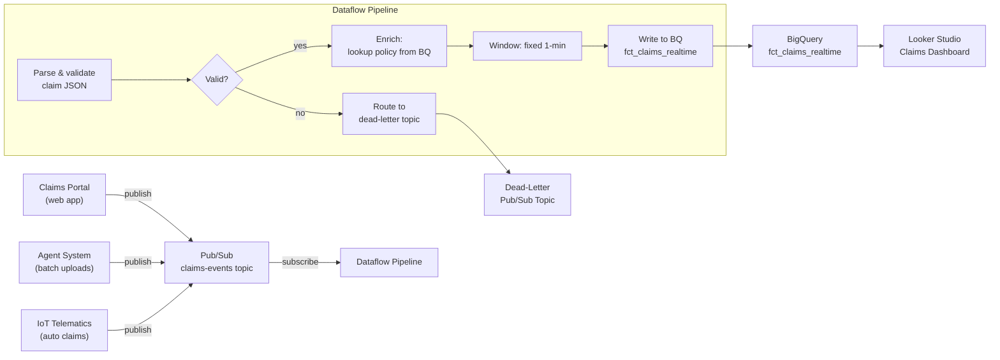

---
tags:
  - gcp
  - dataflow
  - apache-beam
  - streaming
  - batch
  - pipeline
status: draft
created: 2026-02-21
updated: 2026-02-21
---

# Dataflow (Apache Beam on GCP)

Dataflow is Google's fully managed service for running Apache Beam pipelines. It provides unified batch and streaming data processing with autoscaling, exactly-once semantics, and deep GCP integration. The key distinction: **Apache Beam is the programming model** (portable across runners); **Dataflow is the runner** (GCP's execution engine). See [[batch-vs-stream]] for the broader batch vs streaming decision framework.

## Apache Beam Programming Model

Every Beam pipeline is built from three core abstractions.

```mermaid
graph LR
    SRC["Source<br/>(Pub/Sub, GCS, BQ)"] -->|read| PC1["PCollection<br/>(immutable distributed data)"]
    PC1 -->|PTransform<br/>(Map, Filter, GroupByKey)| PC2["PCollection"]
    PC2 -->|PTransform<br/>(Window, Combine)| PC3["PCollection"]
    PC3 -->|write| SINK["Sink<br/>(BigQuery, GCS, Pub/Sub)"]
```

| Concept | Description |
|---|---|
| **Pipeline** | The entire data processing workflow, from source to sink |
| **PCollection** | An immutable, distributed dataset. Can be *bounded* (batch) or *unbounded* (streaming) |
| **PTransform** | A processing step applied to a PCollection: `Map`, `Filter`, `GroupByKey`, `Combine`, `Flatten`, etc. |
| **Runner** | The execution engine. Dataflow is one runner; others include Apache Spark, Apache Flink, and the Direct Runner (local testing) |
| **Source / Sink** | I/O connectors: read from / write to [[pubsub-guide|Pub/Sub]], [[bigquery-guide|BigQuery]], [[gcs-as-data-lake|GCS]], Kafka, JDBC, and more |

The portability of Beam means you can develop and test locally with the Direct Runner, then deploy to Dataflow without code changes.

## Batch vs Streaming Comparison

The same Beam code can process bounded or unbounded data. The runner adapts execution accordingly.

| Aspect | Batch | Streaming |
|---|---|---|
| **Input** | Bounded (files in GCS, BQ tables) | Unbounded (Pub/Sub, Kafka) |
| **Processing** | Processes all data, then terminates | Runs continuously |
| **Latency** | Minutes to hours | Seconds to minutes |
| **Pricing** | Lower vCPU rate ($0.056/hr) | Higher vCPU rate ($0.069/hr) |
| **Shuffle** | Dataflow Shuffle Service (managed) | Streaming Engine (managed) |
| **Exactly-once** | Built-in | Built-in with checkpointing |
| **Autoscaling** | Horizontal (add/remove workers) | Horizontal (add/remove workers) |
| **Typical use case** | ETL, backfills, periodic transforms | Real-time analytics, CDC, alerts |

See [[batch-vs-stream]] for guidance on choosing between these modes.

## Windowing Types

Windowing groups unbounded (streaming) data into finite chunks so you can run aggregations. This is the core concept that makes streaming aggregation possible.

| Window Type | Description | Use Case | Example |
|---|---|---|---|
| **Fixed** | Non-overlapping, equal-duration windows | Periodic aggregations | Count claims received per 5-minute window |
| **Sliding** | Overlapping windows (size + period) | Moving averages, trend detection | Average claim amount over 1-hour windows, sliding every 5 minutes |
| **Session** | Gap-based windows per key | User activity sessions | Group a claimant's actions with a 30-minute inactivity gap |
| **Global** | Single window containing all data | Batch-like processing on unbounded data | Accumulate all events (requires a trigger to emit results) |

```mermaid
gantt
    title Window Types Visualization (time axis)
    dateFormat X
    axisFormat %s

    section Fixed (5 min)
    Window 1 :0, 5
    Window 2 :5, 10
    Window 3 :10, 15

    section Sliding (10 min, period 5 min)
    Window A :0, 10
    Window B :5, 15
    Window C :10, 20

    section Session (gap 3 min)
    User X session 1 :0, 7
    User X session 2 :12, 18
```



## Triggers and Watermarks

### Watermarks

A watermark is the system's estimate of input completeness: "all data with event time <= W has likely arrived." Data arriving after the watermark is **late data**.

- Dataflow tracks watermarks automatically based on source timestamps.
- **Allowed lateness** controls how long windows stay open for late data after the watermark passes.
- Trade-off: high allowed lateness increases state storage cost; low allowed lateness drops valid late-arriving data.

### Triggers

Triggers control *when* results are emitted for a window. Without triggers, a window emits results only when the watermark passes the window end.

| Trigger Type | Fires When | Use Case |
|---|---|---|
| **AfterWatermark** (event-time) | Watermark passes window end | Default; most common for accurate results |
| **AfterProcessingTime** | Wall-clock duration elapses | Early speculative results |
| **AfterCount** (data-driven) | N elements arrive in the window | Micro-batch behavior |
| **Composite** | Combination of triggers | Early speculative + on-time + late firings |
| **Repeatedly** | Re-fires a trigger continuously | Periodic updates to a running aggregation |

A common pattern for streaming dashboards: emit **early speculative** results every 30 seconds, emit the **on-time** result when the watermark passes, and emit **late corrections** for up to 1 hour of allowed lateness.

## Pricing Model

| Resource | Batch Rate | Streaming Rate |
|---|---|---|
| vCPU | $0.056/vCPU-hr | $0.069/vCPU-hr |
| Memory | $0.003557/GB-hr | $0.003557/GB-hr |
| Shuffle (batch) / Streaming Engine | $0.011/GB processed | $0.018/GB processed |
| Persistent Disk (HDD) | $0.000054/GB-hr | $0.000054/GB-hr |
| Persistent Disk (SSD) | $0.000298/GB-hr | $0.000298/GB-hr |

Streaming is roughly **20-25% more expensive** than batch for compute. Memory pricing is identical.

**Cost estimation example**: A streaming pipeline running 4 `n1-standard-4` workers 24/7:
- vCPU: 16 vCPUs x $0.069 x 730 hrs = ~$806/month
- Memory: 60 GB x $0.003557 x 730 hrs = ~$156/month
- Streaming Engine: depends on throughput
- Total: **$1,000-2,000/month** depending on data volume

**Cost-saving option**: For batch jobs that are not latency-sensitive, enable **FlexRS (Flexible Resource Scheduling)** -- it uses preemptible/spot VMs for up to 40% savings.

## When to Use Dataflow vs Alternatives

This is a critical decision. Not every processing job needs Dataflow.

| Scenario | Best Choice | Why |
|---|---|---|
| New streaming pipeline, GCP-native | **Dataflow** | Best streaming support, autoscaling, exactly-once |
| SQL-only transformations on BQ data | **[[bigquery-guide|BigQuery]] SQL** | No infrastructure, cheapest, fastest for SQL |
| Existing Spark/Hadoop jobs | **Dataproc** | Minimal code changes, Spark ecosystem |
| Complex ML pipelines with Spark MLlib | **Dataproc** | Full Spark ML ecosystem |
| Event-driven micro-batching (< 1 GB) | **Cloud Run Functions + BQ** | Simpler, cheaper for small volumes |
| Unified batch + streaming in one codebase | **Dataflow** | Beam's unified programming model |
| Need Flink or Kafka Streams | **Dataproc / GKE** | Dataflow only supports Beam |

**Rule of thumb**: If your transformation is expressible in SQL and your data is already in BigQuery, use BigQuery SQL (possibly via [[dataform-guide|Dataform]]). Dataflow shines when you need streaming, complex event processing, or multi-source transformations that go beyond SQL.

## Key Configuration Decisions

1. **Machine type**: Start with `n1-standard-4` (4 vCPU, 15 GB RAM). Scale up for memory-intensive transforms like large joins or windowed aggregations.

2. **Max workers** (`--maxNumWorkers`): Always set this. Without it, autoscaling can spin up hundreds of VMs and generate a surprise bill.

3. **Streaming Engine**: Always enable for streaming jobs. It offloads state management from worker VMs to Google's backend, reducing worker memory pressure and cost.

4. **Shuffle Service**: Always enable for batch jobs. Managed shuffle is faster and cheaper than worker-based shuffle.

5. **Update vs Drain**: Use `--update` to deploy a new version of a streaming pipeline in-place (preserves state). Use `--drain` to stop gracefully, finishing in-flight work.

6. **FlexRS**: Enable for batch jobs without strict latency requirements. Uses spot/preemptible VMs for up to 40% cost reduction.

## Common Pitfalls

1. **Hot keys**: A single key receiving disproportionate data creates a straggler worker that bottlenecks the entire pipeline. Use `Reshuffle`, `CombinePerKey`, or add a random prefix to distribute load.

2. **Unbounded state growth**: Streaming jobs with session windows or unbounded `GroupByKey` accumulate state indefinitely. Set TTLs and monitor state size via the Dataflow UI.

3. **Schema evolution mid-stream**: Changing the schema of a running streaming pipeline requires a careful drain-and-restart cycle. Plan for schema versioning.

4. **Over-autoscaling**: Without `--maxNumWorkers`, a pipeline processing a data spike can spin up hundreds of VMs. Always cap autoscaling.

5. **Large side inputs**: Side inputs are broadcast to every worker. If a side input is a 10 GB lookup table, every worker loads 10 GB into memory. Use BigQuery or Bigtable lookups instead.

6. **Ignoring the Dataflow monitoring UI**: The UI shows watermark lag, system lag, throughput, and per-stage timing. These metrics are critical for diagnosing streaming health problems. A growing watermark lag means your pipeline is falling behind.

## Actuarial Example: Streaming Claims Ingestion

An insurance company receives claims events in real-time from multiple source systems. This pipeline ingests, validates, enriches, and loads them into [[bigquery-guide|BigQuery]] for near-real-time analytics and IBNR reserving.



**Pipeline design decisions**:

- **Source**: [[pubsub-guide|Pub/Sub]] decouples producers from the pipeline. Each source system publishes independently.
- **Validation**: Invalid claims (missing policy number, malformed dates) route to a dead-letter topic for manual review rather than failing the pipeline.
- **Enrichment**: Policy details are looked up from a BigQuery dimension table (`dim_policy`) via a side input (refreshed periodically) or a BigQuery read transform.
- **Windowing**: Fixed 1-minute windows batch writes to BigQuery, balancing latency against write efficiency. Streaming inserts to BQ cost $0.05/GB; micro-batching reduces API calls.
- **Exactly-once**: Dataflow + Pub/Sub together guarantee exactly-once end-to-end, preventing duplicate claim records.
- **Late data**: Allowed lateness of 1 hour handles claims from source systems with delayed delivery. Late claims update the window's aggregation.

**Why Dataflow over alternatives here**: The pipeline needs streaming ingestion from [[pubsub-guide|Pub/Sub]], validation logic beyond SQL, enrichment joins, dead-letter routing, and exactly-once guarantees. BigQuery SQL cannot do this. Cloud Run Functions could handle simple routing but not windowed aggregation with late-data handling.

## Related Docs

- [[batch-vs-stream]] -- Decision framework for batch vs streaming processing
- [[pubsub-guide]] -- Pub/Sub as the streaming ingestion layer feeding Dataflow
- [[bigquery-guide]] -- BigQuery as a common Dataflow sink and lookup source
- [[gcs-as-data-lake]] -- GCS as source/sink for batch Dataflow pipelines
- [[orchestration]] -- How Dataflow pipelines fit into broader orchestration (often triggered by [[cloud-composer-guide|Composer]])
- [[cloud-composer-guide]] -- Orchestrating Dataflow pipeline runs via Airflow DAGs
- [[data-quality]] -- Validation patterns applied within Dataflow transforms
- [[storage-format-selection]] -- Choosing file formats for Dataflow I/O (Parquet, Avro, JSON)
