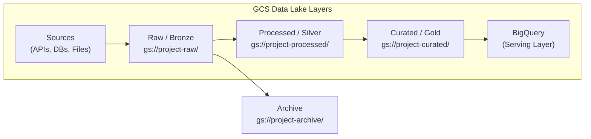

---
tags:
  - gcp
  - gcs
  - data-lake
  - storage
  - tools
status: complete
created: 2026-02-21
updated: 2026-02-21
---

# Cloud Storage (GCS) as Data Lake

GCS is Google's object storage service and the foundational data lake layer for nearly every GCP data pipeline. It stores any type of data as objects in buckets with global namespace, strong consistency, and integration with virtually every GCP service. This guide covers storage classes, lifecycle management, data lake design patterns, and common pitfalls.

Related: [[storage-format-selection]] | [[bigquery-guide]] | [[dataflow-guide]] | [[etl-vs-elt]]

---

## Storage Classes

All classes provide the same throughput, latency (first-byte in milliseconds), and durability (99.999999999% -- 11 nines). The trade-off is storage cost versus retrieval cost.

| Class        | Min Storage Duration | Access Pattern           | Storage (US multi-region) | Retrieval Cost |
| ------------ | -------------------- | ------------------------ | ------------------------- | -------------- |
| **Standard** | None                 | Frequently accessed (hot)| $0.026/GB/month           | Free           |
| **Nearline** | 30 days              | Accessed < once/month    | $0.010/GB/month           | $0.01/GB       |
| **Coldline** | 90 days              | Accessed < once/quarter  | $0.007/GB/month           | $0.02/GB       |
| **Archive**  | 365 days             | Accessed < once/year     | $0.004/GB/month           | $0.05/GB       |

**Decision criteria**: Match the class to your access frequency. For a data lake, the raw/landing layer is typically Standard (frequent processing), while archive and compliance data belongs in Coldline or Archive.

**Actuarial example**: Historical loss triangles and regulatory filings accessed only during annual reserving cycles fit Coldline. Daily claims feeds being processed by [[dataflow-guide|Dataflow]] belong in Standard.

---

## Lifecycle Policies

Lifecycle rules automate storage class transitions and object deletion, reducing costs without manual intervention. Organizations using lifecycle policies typically reduce storage costs by 30-60%.

### Example Policy (JSON)

```json
{
  "rule": [
    {
      "action": { "type": "SetStorageClass", "storageClass": "NEARLINE" },
      "condition": { "age": 30, "matchesStorageClass": ["STANDARD"] }
    },
    {
      "action": { "type": "SetStorageClass", "storageClass": "COLDLINE" },
      "condition": { "age": 90, "matchesStorageClass": ["NEARLINE"] }
    },
    {
      "action": { "type": "SetStorageClass", "storageClass": "ARCHIVE" },
      "condition": { "age": 365, "matchesStorageClass": ["COLDLINE"] }
    },
    {
      "action": { "type": "Delete" },
      "condition": { "age": 2555 }
    }
  ]
}
```

This policy cascades data through four tiers over ~7 years, then deletes it. Adjust the `age` values to match your data retention requirements.

### Autoclass Alternative

Instead of manual lifecycle rules, enable **Autoclass** on a bucket. GCS automatically transitions objects between classes based on observed access patterns. Useful when you cannot predict access frequency in advance.

---

## Data Lake Layering Pattern

A well-designed data lake organizes data into layers of increasing quality and structure. This maps directly to the [[etl-vs-elt]] pattern where raw data lands first, then is transformed in place.



| Layer                  | Bucket Pattern                              | Format                                | Purpose                                    |
| ---------------------- | ------------------------------------------- | ------------------------------------- | ------------------------------------------ |
| **Raw / Bronze**       | `gs://project-raw/source/YYYY/MM/DD/`       | JSON, CSV, Avro (as-is from source)   | Immutable landing zone; exact copy of source |
| **Processed / Silver** | `gs://project-processed/domain/table/`      | Parquet, ORC, Avro (cleaned, typed)   | Deduplicated, schema-validated, typed       |
| **Curated / Gold**     | `gs://project-curated/domain/table/`        | Parquet, Delta (aggregated)           | Business-ready, joined, enriched            |
| **Archive**            | `gs://project-archive/`                     | Any                                   | Compliance, audit trail, regulatory holds   |

**Actuarial example**: Claims data from a core system lands in Raw as JSON. A [[dataflow-guide|Dataflow]] pipeline cleanses and converts it to Parquet in Silver. A [[dataform-guide|Dataform]] or dbt transformation joins claims with policy data in [[bigquery-guide|BigQuery]], producing Gold tables (`fct_claims`, `dim_policy`). Raw data eventually moves to Archive for regulatory retention (7-10 years for insurance).

### Bucket Strategy: One Bucket per Layer vs One Bucket with Prefixes

| Approach                  | Pros                                           | Cons                                    |
| ------------------------- | ---------------------------------------------- | --------------------------------------- |
| **Separate buckets**      | Cleaner IAM boundaries, independent lifecycle  | More buckets to manage                  |
| **Single bucket, prefixes** | Simpler administration, fewer IAM bindings   | Coarser access control, shared lifecycle |

**Recommendation**: Use separate buckets per layer for production. The IAM isolation is worth the management overhead, especially for compliance-sensitive insurance data.

---

## Best Practices

### File Formats

Choose formats based on the downstream consumer. See [[storage-format-selection]] for detailed comparisons.

| Format      | Best For                                        | Compression  |
| ----------- | ----------------------------------------------- | ------------ |
| **Parquet** | Analytical queries (BigQuery, Spark, Dataflow)  | Snappy, GZIP |
| **Avro**    | Schema evolution, streaming writes              | Deflate      |
| **CSV/JSON**| Raw landing (human-readable, source format)     | GZIP         |
| **ORC**     | Hive/Spark workloads (alternative to Parquet)   | Zlib, Snappy |

**Rule of thumb**: Land in source format (Raw), convert to Parquet in Silver and Gold.

### Partitioning by Path

Organize files using Hive-style partitioning in the object path. This enables partition pruning when querying from BigQuery external tables, Dataflow, or Spark.

```
gs://project-processed/claims/year=2025/month=06/day=15/part-00001.parquet
gs://project-processed/claims/year=2025/month=06/day=16/part-00001.parquet
```

Partition by the column most commonly used for filtering -- typically a date column for time-series data.

### Avoid the Small Files Anti-Pattern

Thousands of tiny files (< 1 MB each) severely degrade read performance. Every file requires a separate metadata lookup and open/close operation.

| Symptom                        | Root Cause                        | Fix                                              |
| ------------------------------ | --------------------------------- | ------------------------------------------------ |
| Slow reads from Spark/Dataflow | Too many small files per partition | Compact files to 256 MB -- 1 GB                  |
| High Class B operation costs   | Thousands of list/get operations  | Reduce file count via compaction jobs             |
| Slow BigQuery external queries | Per-file overhead                 | Load into native BQ tables or compact first       |

**Target file size**: 256 MB to 1 GB per file for analytical workloads. Use a compaction job (e.g., a simple Spark or [[dataflow-guide|Dataflow]] pipeline) to merge small files periodically.

### Other Best Practices

1. **Enable uniform bucket-level access**: Simplifies IAM by disabling per-object ACLs.
2. **Use signed URLs** for temporary external access instead of making buckets public.
3. **Enable versioning** on critical buckets for accidental deletion protection.
4. **Requester pays**: For shared datasets, the reader pays egress and retrieval costs.
5. **Keep compute co-located**: Place buckets in the same region as your BigQuery datasets and Dataflow jobs to avoid egress charges.

---

## Pricing Summary

| Component                          | Price                            |
| ---------------------------------- | -------------------------------- |
| Standard storage (US multi-region) | $0.026/GB/month                  |
| Nearline storage                   | $0.010/GB/month                  |
| Coldline storage                   | $0.007/GB/month                  |
| Archive storage                    | $0.004/GB/month                  |
| Data retrieval (Standard)          | Free                             |
| Data retrieval (Nearline)          | $0.01/GB                         |
| Data retrieval (Coldline)          | $0.02/GB                         |
| Data retrieval (Archive)           | $0.05/GB                         |
| Class A ops (writes)               | $0.05/10K operations             |
| Class B ops (reads)                | $0.004/10K operations            |
| Egress (inter-region)              | $0.01/GB                         |
| Egress (to internet)               | $0.12/GB (first 1 TB)           |

**Cost example**: A 10 TB data lake in Standard storage costs roughly $260/month. Applying lifecycle rules to move 7 TB of older data to Nearline and Coldline could reduce that to under $120/month.

---

## Common Pitfalls

1. **Egress costs**: Moving data out of GCP or across regions is expensive. Always co-locate storage and compute in the same region. This is the single most common surprise on GCP bills.

2. **Listing large buckets**: Running `gsutil ls` on a bucket with millions of objects is extremely slow. Always use prefix filters (e.g., `gsutil ls gs://bucket/claims/year=2025/`).

3. **Object immutability**: GCS objects are immutable. "Updating" a file means overwriting it. Design for append-only patterns in your data lake -- land new files rather than modifying existing ones.

4. **Early deletion charges**: Deleting a Nearline object after 10 days still incurs the remaining 20 days of minimum storage duration. Same principle applies to Coldline (90 days) and Archive (365 days). Factor this in before choosing a storage class.

5. **Missing lifecycle rules**: Without rules, old data accumulates at Standard rates indefinitely. Set lifecycle policies on every production bucket from day one.

6. **Ignoring the small files problem**: Ingesting many small files (e.g., one file per Pub/Sub message) without compaction creates read performance bottlenecks and inflated operation costs.

7. **Public buckets**: Accidentally exposing a bucket publicly is a security and compliance incident. Always use uniform bucket-level access with IAM and signed URLs for controlled sharing.

---

## Integration with Other GCP Services

| Service                              | Integration Pattern                                                |
| ------------------------------------ | ------------------------------------------------------------------ |
| [[bigquery-guide\|BigQuery]]         | External tables, native loads (`bq load`), BigQuery Data Transfer  |
| [[dataflow-guide\|Dataflow]]         | Read/write PCollections from/to GCS files                          |
| [[pubsub-guide\|Pub/Sub]]            | GCS notifications trigger Pub/Sub messages on object create/delete |
| [[cloud-composer-guide\|Composer]]   | DAG files stored in GCS; GCS sensors for file arrival triggers     |
| [[dataform-guide\|Dataform]]         | Load GCS files into BigQuery staging tables for SQL transformation |

---

## Further Reading

- [[storage-format-selection]] -- Parquet vs Avro vs ORC vs CSV decision framework
- [[bigquery-guide]] -- Loading GCS data into BigQuery and external table patterns
- [[dataflow-guide]] -- Building pipelines that read from and write to GCS
- [[etl-vs-elt]] -- How GCS fits into the ELT pattern as the landing zone
- [[batch-vs-stream]] -- Choosing between batch file drops and streaming ingestion
- [[data-quality]] -- Validating data quality at the Silver layer before promotion to Gold
