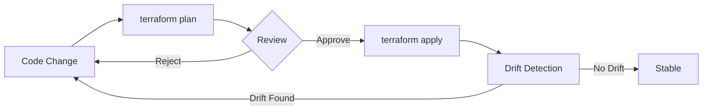

# Infrastructure as Code for Data Platforms

Infrastructure as Code (IaC) means defining your cloud resources -- BigQuery datasets, GCS buckets, Pub/Sub topics, IAM bindings, Cloud Run services -- in version-controlled configuration files rather than clicking through the GCP console. For data platforms, IaC is not optional infrastructure hygiene; it is the difference between a reproducible system and a fragile snowflake that only its creator understands.

## Why IaC for Data Engineering

| Benefit | Without IaC | With IaC |
|---|---|---|
| **Reproducibility** | "I think I created the dataset with this schema..." | `terraform apply` recreates the entire platform |
| **Drift detection** | Someone changes a bucket policy in the console; nobody knows | `terraform plan` shows the drift before next apply |
| **Cost control** | Resources accumulate; nobody remembers what is still needed | Every resource is declared in code; delete from code to destroy |
| **Audit trail** | "Who gave that service account owner permissions?" | Git blame on the IAM binding shows who, when, and why |
| **Environment parity** | Dev has 3 datasets, prod has 7, nobody can explain the gap | Same modules, different `terraform.tfvars` per environment |
| **Onboarding** | 15-page setup guide with screenshots | `make init && make apply` and the environment is ready |

## Tool Comparison

| Tool | Language | State Management | GCP Support | Learning Curve | When to Use |
|---|---|---|---|---|---|
| **Terraform** | HCL | State file (GCS, S3, Terraform Cloud) | Excellent (official Google provider) | Moderate -- HCL is simple but state management has sharp edges | Default choice for GCP data platforms; largest ecosystem and community |
| **Pulumi** | Python, TypeScript, Go, Java | Managed service or self-hosted backend | Good (mirrors Terraform providers) | Lower for Python devs; higher for infra concepts | Teams that prefer general-purpose languages over HCL; complex logic in infra code |
| **CDK for Terraform (CDKTF)** | Python, TypeScript, Java, Go | Same as Terraform (uses TF providers) | Same as Terraform | Moderate -- adds abstraction layer over TF | Teams that want Terraform providers but dislike HCL syntax |
| **gcloud CLI scripts** | Bash | None (imperative) | Native | Low | One-off tasks, bootstrapping, scripts that run once |
| **ClickOps (Console)** | Point and click | None | Full | Lowest | Prototyping, exploring new services, learning what fields exist |

**Recommendation**: Terraform is the default for GCP data engineering. It has the largest community, the most mature GCP provider, and the widest adoption in job listings. Pulumi is a legitimate alternative if your team is allergic to learning a new language (HCL) and prefers Python. gcloud scripts are fine for one-off bootstrap tasks (creating the state bucket, enabling APIs for the first time).

## Terraform Patterns for Data Platforms



### Module-Per-Service

Organize Terraform code into modules that correspond to service boundaries, not to environments or teams:

```
terraform/
  modules/
    bigquery/       # Datasets, tables, views, scheduled queries
    gcs/            # Buckets, lifecycle rules, notifications
    pubsub/         # Topics, subscriptions, dead-letter topics
    cloud_run/      # Services, jobs, IAM bindings
    scheduler/      # Cloud Scheduler jobs
    iam/            # Service accounts, role bindings
  environments/
    dev.tfvars      # Variable values for dev
    prod.tfvars     # Variable values for prod
  main.tf           # Root module composing child modules
  variables.tf      # Top-level input variables
  outputs.tf        # Top-level outputs
  backend.tf        # GCS backend configuration
```

### Environment Variables, Not Separate Directories

Use the same modules for all environments, differentiated by variable files:

```bash
# Dev deployment
terraform plan -var-file=environments/dev.tfvars

# Prod deployment
terraform plan -var-file=environments/prod.tfvars
```

This eliminates configuration drift between environments. The modules are identical; only the variable values change (project ID, region, instance sizes, dataset prefixes).

### Remote State with GCS

Store state in a versioned GCS bucket with locking (see [[terraform-gcp-guide]] for setup details). Never commit `terraform.tfstate` to git -- it contains resource IDs and may contain sensitive values.

### Data Source Lookups

Reference existing resources without managing them:

```hcl
# Look up the project number (needed for some IAM bindings)
data "google_project" "current" {
  project_id = var.project_id
}

# Look up an existing dataset created outside Terraform
data "google_bigquery_dataset" "legacy" {
  dataset_id = "legacy_claims"
  project    = var.project_id
}
```

## GCP-Specific Patterns

### Enabling APIs Programmatically

Every GCP service requires its API to be enabled before resources can be created. Manage this in Terraform:

```hcl
resource "google_project_service" "required_apis" {
  for_each = toset([
    "bigquery.googleapis.com",
    "run.googleapis.com",
    "pubsub.googleapis.com",
    "cloudscheduler.googleapis.com",
    "secretmanager.googleapis.com",
  ])

  project = var.project_id
  service = each.value

  disable_dependent_services = false
  disable_on_destroy         = false
}
```

### IAM: Binding vs Member vs Policy

| Resource Type | Behavior | When to Use |
|---|---|---|
| `google_project_iam_policy` | **Authoritative** -- replaces ALL bindings for the project | Almost never; can lock yourself out |
| `google_project_iam_binding` | **Authoritative for one role** -- replaces all members for that role | When you want to control exactly who has a role |
| `google_project_iam_member` | **Additive** -- adds one member to one role | Default choice; safe with multiple Terraform states |

**Rule of thumb**: Use `iam_member` for personal and small-team projects. Use `iam_binding` only when you need to enforce that exactly these members have a role (security-critical contexts).

### Resource Dependencies

Some GCP resources have implicit ordering requirements. Terraform usually handles this via `depends_on`, but explicit dependencies are clearer:

```hcl
resource "google_bigquery_table" "claims" {
  dataset_id = google_bigquery_dataset.raw.dataset_id  # Implicit dependency
  # ...
}
```

If the dependency is not captured by a resource reference, use `depends_on`:

```hcl
resource "google_cloud_run_v2_service" "pipeline" {
  depends_on = [google_project_service.required_apis]
  # Cloud Run API must be enabled before creating the service
}
```

## State Management

### State Splitting

For large platforms, a single state file becomes unwieldy (slow plans, blast radius of mistakes affects everything). Split state by service or by environment:

| Strategy | Pros | Cons | When to Use |
|---|---|---|---|
| **Single state** | Simple, all resources visible | Slow plan, large blast radius | Small platforms (< 50 resources) |
| **Per-environment** | Environment isolation, parallel applies | Cross-env references need remote state data sources | Medium platforms |
| **Per-service** | Independent deploys, small blast radius | More backend config, dependency management | Large platforms (100+ resources) |

### Importing Existing Resources

If you created resources manually and want to bring them under IaC management, Terraform supports import (see [[terraform-gcp-guide]] for syntax). The key principle: import first, then run `terraform plan` to ensure your code matches reality before making any changes.

## Module Design Principles

1. **One module per service boundary**: `modules/bigquery` only creates BigQuery resources. Do not mix GCS and BigQuery in one module.
2. **Clear input/output contract**: `variables.tf` declares every input with a description and type. `outputs.tf` exposes values other modules need (dataset IDs, bucket names, service URLs).
3. **Never hardcode project IDs**: Always accept `project_id` as a variable. This is what makes the same module work for dev and prod.
4. **Use locals for computed values**: Derived names, environment prefixes, and conditional logic go in `locals {}`, not inline in resources.
5. **Document costs**: Add comments on resources that incur ongoing cost (Composer environments, always-on instances).

## Anti-Patterns

| Anti-Pattern | Why It Is Dangerous | Better Approach |
|---|---|---|
| Monolithic `main.tf` (1000+ lines) | Impossible to review, slow to plan | Split into modules by service |
| Hardcoded project IDs and regions | Cannot reuse for other environments | Parameterize with variables |
| Missing `prevent_destroy` on data resources | `terraform destroy` deletes production BigQuery datasets | Add lifecycle rule on critical resources |
| No backend configuration | State stored locally, lost when laptop is reformatted | GCS backend with versioning |
| Committing `.terraform/` directory | Bloats repo, platform-specific binaries | Add to `.gitignore` |
| Using `count` for conditional resources | Index-based, reordering destroys resources | Use `for_each` with map keys |
| No `terraform plan` review | Accidental resource destruction | Always plan before apply; require plan review in [[ci-cd-for-data]] |

## Insurance Example: Project 04 Module Structure

Project 04 (`04-data-platform-terraform`) structures its Terraform configuration into 6 modules, each owning a clear service boundary:

| Module | What It Creates | Why It Is Separate |
|---|---|---|
| `bigquery` | Datasets (`claims_raw`, `claims_transformed`, `analytics`), tables, views | Core data storage; schema changes are high-impact and reviewed independently |
| `gcs` | Landing buckets, archive buckets, lifecycle rules | Storage layer with distinct retention policies |
| `pubsub` | Topics and subscriptions for streaming claims intake | Messaging infrastructure with its own scaling characteristics |
| `cloud_run` | Pipeline services (ELT runner, API endpoints) | Compute layer; container updates are frequent and independent |
| `scheduler` | Cloud Scheduler jobs triggering pipelines | Orchestration layer; schedule changes are operational, not infrastructure |
| `iam` | Service accounts, role bindings, Workload Identity | Security layer; IAM changes require careful review |

Each module has its own `variables.tf` and `outputs.tf`. The root `main.tf` composes them, passing outputs from one module as inputs to another (e.g., the `bigquery` module's dataset ID is passed to the `cloud_run` module so the service knows which dataset to write to).

This structure means a Cloud Run container update does not require re-planning the BigQuery module, and an IAM change does not risk accidentally modifying a Pub/Sub subscription.

## Related Docs

- [[ci-cd-for-data]] -- Running `terraform plan` and `terraform apply` in CI pipelines
- [[monitoring-observability]] -- Monitoring the infrastructure Terraform provisions
- [[terraform-gcp-guide]] -- Detailed Terraform syntax, commands, and GCP provider patterns
- [[cost-effective-orchestration]] -- Cloud Scheduler + Cloud Run architecture managed via Terraform
- [[bigquery-guide]] -- BigQuery resource patterns referenced in the bigquery module
- [[gcs-as-data-lake]] -- GCS bucket design patterns referenced in the gcs module
