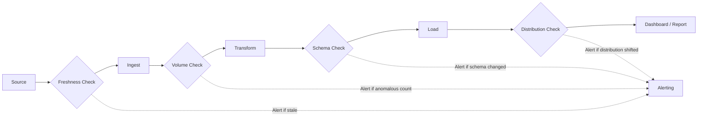

# Monitoring & Observability for Data Pipelines

A web application crash produces an HTTP 500, triggers an alert, and someone investigates within minutes. A data pipeline that silently drops 30% of claims records produces no error, no alert, and no crash. The loss ratios in next month's board report are wrong, and nobody connects it to a pipeline change three weeks ago. This is why monitoring for data pipelines requires a fundamentally different approach than application monitoring.

## Why Monitoring Matters More for Data Than for Apps

Application observability focuses on uptime, latency, and error rates. Data observability focuses on **correctness, completeness, and timeliness** -- properties that standard APM tools do not track.

| Dimension | Application Monitoring | Data Pipeline Monitoring |
|---|---|---|
| **Failure signal** | HTTP 500, process crash, timeout | No signal -- pipeline "succeeds" with wrong output |
| **Detection speed** | Seconds to minutes | Days to weeks (until someone notices bad reports) |
| **Blast radius** | Users see errors | Downstream dashboards, ML models, regulatory reports all consume bad data |
| **Rollback** | Deploy previous container image | Data already written; must identify, fix, and backfill |
| **Root cause** | Stack trace, error log | Schema change in source? Data volume anomaly? Logic error? Silent upstream failure? |

The core insight: **data failures are silent by default**. You must build explicit observability into every stage of the pipeline.

## Four Pillars of Data Observability

These are not the traditional application pillars (logs, metrics, traces, events). Data observability has its own framework:

### 1. Freshness

Is data arriving on time? A claims table that was last updated 3 days ago when it should refresh daily indicates a pipeline failure or source system outage.

**How to measure**: Track `MAX(_loaded_at)` or `MAX(event_timestamp)` per table. Alert when the value exceeds the expected SLA (e.g., claims data should be < 24 hours old).

### 2. Volume

Are row counts within expected ranges? A daily claims batch that usually delivers 5,000-7,000 rows but suddenly delivers 200 rows suggests a source system issue. A batch that delivers 50,000 rows suggests a duplicate load.

**How to measure**: Record `COUNT(*)` after each load. Compare against a rolling window (e.g., mean +/- 2 standard deviations over the last 30 days). Alert on anomalies.

### 3. Schema

Have columns changed, types shifted, or NULLs appeared in previously non-null columns? Schema changes in source systems are the most common cause of data pipeline breakdowns.

**How to measure**: Snapshot the schema (column names, types, nullable flags) after each load. Diff against the previous snapshot. Alert on any change.

### 4. Distribution

Are value distributions (mean, median, percentiles, cardinality) stable? A sudden shift in average claim severity might indicate a data quality issue -- or a legitimate business change that needs investigation.

**How to measure**: Compute summary statistics per column on each load. Compare against historical baselines. Flag statistical outliers for human review.



## GCP Monitoring Stack

GCP provides a native observability stack that covers most data pipeline monitoring needs without third-party tools:

| Service | What It Does | Data Pipeline Use Case |
|---|---|---|
| **Cloud Monitoring** | Metrics, dashboards, uptime checks, alerting policies | Track custom pipeline metrics (rows processed, duration, cost) |
| **Cloud Logging** | Centralized log aggregation, structured JSON logs, log-based metrics | Pipeline execution logs, error tracking, audit trail |
| **Error Reporting** | Automatic exception grouping and notification | Surface Python exceptions from Cloud Run pipeline services |
| **Cloud Trace** | Distributed tracing for latency analysis | Trace API-driven pipelines across multiple services |

### Cloud Monitoring Custom Metrics

Define custom metrics for pipeline-specific KPIs that GCP does not track natively:

```python
from google.cloud import monitoring_v3

def report_metric(project_id: str, metric_type: str, value: float, labels: dict):
    client = monitoring_v3.MetricServiceClient()
    project_name = f"projects/{project_id}"

    series = monitoring_v3.TimeSeries()
    series.metric.type = f"custom.googleapis.com/{metric_type}"
    for k, v in labels.items():
        series.metric.labels[k] = v

    point = monitoring_v3.Point()
    point.value.double_value = value
    now = time.time()
    point.interval.end_time.seconds = int(now)
    series.points = [point]

    client.create_time_series(name=project_name, time_series=[series])

# Usage: report after each pipeline run
report_metric(
    project_id="my-project",
    metric_type="pipeline/rows_processed",
    value=7423,
    labels={"pipeline": "claims_elt", "step": "transform"},
)
```

## Pipeline-Specific Metrics to Track

| Metric | Why It Matters | How to Collect |
|---|---|---|
| `rows_processed` | Volume anomaly detection | Count after each stage; emit as custom metric |
| `pipeline_duration_seconds` | Performance regression detection | Measure wall-clock time from start to finish |
| `error_count` | Error rate tracking | Count exceptions per run; zero is normal, non-zero triggers alert |
| `cost_per_run` | Budget monitoring | Query BigQuery `INFORMATION_SCHEMA.JOBS` for bytes billed |
| `data_freshness_seconds` | SLA compliance | `CURRENT_TIMESTAMP() - MAX(_loaded_at)` on target tables |
| `schema_changes` | Breaking change detection | Diff column list before and after load |
| `null_rate_by_column` | Data quality degradation | `COUNT(*) - COUNT(column)` / `COUNT(*)` per critical column |

## Alerting Patterns

### Threshold-Based (Simple)

Set static thresholds: alert if `rows_processed < 1000` or `pipeline_duration > 3600 seconds`.

**Pros**: Easy to understand and implement.
**Cons**: Noisy. What is "normal" changes over time (business growth, seasonal patterns). Requires constant threshold tuning.

### Anomaly Detection (ML-Based)

Use Cloud Monitoring's built-in anomaly detection or a dedicated tool (Monte Carlo, Elementary) to learn normal patterns and alert on deviations.

**Pros**: Adapts to changing baselines, fewer false positives.
**Cons**: Needs historical data to train, harder to explain why an alert fired, possible false negatives during gradual drift.

### Composite Alerts

Combine multiple signals to reduce noise. Alert only when `rows_processed` is anomalous AND `pipeline_duration` is anomalous -- a single anomalous metric might be a holiday effect, but two together likely indicate a real problem.

### Alert Fatigue Prevention

| Practice | Why |
|---|---|
| Start with critical alerts only | A few meaningful alerts get attention; 50 alerts get ignored |
| Use severity levels | Page for data-loss risk; email for informational anomalies |
| Include runbook links in alert messages | Responder knows what to do without searching documentation |
| Review and prune alerts quarterly | Remove alerts that never fire or always fire |
| Route to the right team | Pipeline alerts go to data engineers, not the SRE on-call |

## Tool Comparison

| Tool | Type | Strengths | Weaknesses | When to Use |
|---|---|---|---|---|
| **Cloud Monitoring** | Infrastructure + custom metrics | Native GCP, no setup, free tier generous | Limited data-specific checks; no schema/distribution monitoring | Default for GCP pipeline metrics and alerting |
| **Datadog** | Full-stack observability | Excellent dashboards, many integrations, data pipeline monitors | Expensive at scale ($15-23/host/month), vendor lock-in | Enterprise teams needing unified app + data monitoring |
| **Monte Carlo** | Data observability platform | Purpose-built for data: freshness, volume, schema, lineage | Expensive, requires warehouse access, opaque ML models | Large data teams with budget for dedicated data observability |
| **Great Expectations** | Data validation framework | Open-source, rich expectation library, Python-native | Not a monitoring tool -- runs at pipeline time, not continuously | Inline data quality checks within pipeline code (see [[data-quality]]) |
| **Elementary** | dbt-native data observability | Integrates with dbt tests, lineage-aware, open-source core | Requires dbt, limited outside dbt ecosystem | Teams using dbt that want observability without a separate tool |
| **Soda** | Data quality + monitoring | SQL-based checks, supports multiple warehouses, SodaCL language | Smaller community, commercial features gated | Teams wanting SQL-defined quality checks across multiple warehouses |

**Recommendation for this portfolio**: Start with Cloud Monitoring custom metrics + structured logging (free, native). Add Great Expectations or Soda for inline data validation as pipeline complexity grows. Evaluate Monte Carlo or Elementary only when managing 50+ tables across multiple pipelines.

## Structured Logging Patterns

Structured JSON logs are essential for Cloud Logging. They enable log-based metrics, filtering, and correlation across pipeline runs.

```python
import json
import logging
import sys

class StructuredFormatter(logging.Formatter):
    """Format logs as JSON for Cloud Logging."""

    def format(self, record):
        log_entry = {
            "severity": record.levelname,
            "message": record.getMessage(),
            "timestamp": self.formatTime(record),
            "module": record.module,
        }
        # Add pipeline context if available
        if hasattr(record, "run_id"):
            log_entry["run_id"] = record.run_id
        if hasattr(record, "step_name"):
            log_entry["step_name"] = record.step_name
        if hasattr(record, "rows_processed"):
            log_entry["rows_processed"] = record.rows_processed
        return json.dumps(log_entry)

# Setup
handler = logging.StreamHandler(sys.stdout)
handler.setFormatter(StructuredFormatter())
logger = logging.getLogger("pipeline")
logger.addHandler(handler)
logger.setLevel(logging.INFO)

# Usage in pipeline code
logger.info(
    "Transform complete",
    extra={
        "run_id": "20260315-001",
        "step_name": "claims_transform",
        "rows_processed": 7423,
    },
)
```

This produces logs that Cloud Logging can parse, index, and query:

```json
{
  "severity": "INFO",
  "message": "Transform complete",
  "timestamp": "2026-03-15 10:30:00",
  "module": "transform",
  "run_id": "20260315-001",
  "step_name": "claims_transform",
  "rows_processed": 7423
}
```

### Log Severity Levels for Data Pipelines

| Level | When to Use | Example |
|---|---|---|
| `DEBUG` | Detailed execution trace (off in production) | "Processing batch 3 of 12" |
| `INFO` | Normal operation milestones | "Loaded 7,423 rows into fct_claims" |
| `WARNING` | Anomaly that does not stop the pipeline | "Row count 15% below 30-day average" |
| `ERROR` | Failure in one step; pipeline continues | "Failed to parse 12 records; skipped" |
| `CRITICAL` | Pipeline cannot continue | "BigQuery quota exceeded; aborting run" |

## Insurance Example: What to Monitor in a Claims Pipeline

An insurance claims data pipeline has domain-specific monitoring requirements beyond generic data observability:

| What to Monitor | Why | Alert Threshold |
|---|---|---|
| **Claim volume drops** | May indicate source system outage (policy admin system down) | < 50% of 30-day average daily volume |
| **Severity distribution shifts** | Sudden increase in high-severity claims could indicate fraud ring or catastrophe event | Mean severity > 2 standard deviations from 90-day rolling mean |
| **Stale loss triangles** | Pipeline failure means actuaries work with outdated reserve estimates | Triangle data > 48 hours old |
| **Development factor anomalies** | Unexpected development patterns suggest data quality issues or process changes | Any development factor outside historical 5th-95th percentile range |
| **Duplicate claim IDs** | Data pipeline loaded the same batch twice | `COUNT(DISTINCT claim_id) != COUNT(*)` on daily load |
| **Orphan claims** | Claims without matching policies indicate join key issues | `COUNT(*)` in `claims LEFT JOIN policies WHERE policy_id IS NULL` > 0 |
| **NULL rate in critical columns** | `loss_date`, `paid_amount`, `line_of_business` should never be NULL | Any NULL in required columns triggers investigation |

### Example: Claims Freshness Dashboard Query

```sql
-- Check data freshness across all critical tables
SELECT
  table_name,
  MAX(_loaded_at) AS last_load,
  TIMESTAMP_DIFF(CURRENT_TIMESTAMP(), MAX(_loaded_at), HOUR) AS hours_since_load,
  CASE
    WHEN TIMESTAMP_DIFF(CURRENT_TIMESTAMP(), MAX(_loaded_at), HOUR) > 24 THEN 'STALE'
    WHEN TIMESTAMP_DIFF(CURRENT_TIMESTAMP(), MAX(_loaded_at), HOUR) > 12 THEN 'WARNING'
    ELSE 'FRESH'
  END AS freshness_status
FROM (
  SELECT 'fct_claims' AS table_name, _loaded_at FROM analytics.fct_claims
  UNION ALL
  SELECT 'fct_loss_development', _loaded_at FROM analytics.fct_loss_development
  UNION ALL
  SELECT 'dim_policies', _loaded_at FROM analytics.dim_policies
)
GROUP BY table_name
ORDER BY hours_since_load DESC
```

## Related Docs

- [[ci-cd-for-data]] -- CI/CD catches issues before deployment; monitoring catches issues after
- [[infrastructure-as-code]] -- Provision monitoring resources (alert policies, dashboards) via Terraform
- [[data-quality]] -- Inline data validation that complements continuous monitoring
- [[orchestration]] -- Pipeline orchestrators provide execution-level observability (task status, retries, SLAs)
- [[bigquery-guide]] -- BigQuery-specific monitoring: slot utilization, bytes billed, query performance
