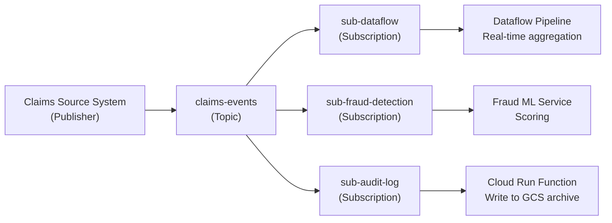

---
tags:
  - gcp
  - streaming
  - messaging
  - pub-sub
  - real-time
status: draft
created: 2026-02-21
updated: 2026-02-21
---

# Pub/Sub -- GCP Messaging Service

Pub/Sub is Google's fully managed, serverless messaging service. It **decouples producers from consumers**, enabling real-time event ingestion at scale. For any GCP streaming pipeline, Pub/Sub is almost always the entry point -- see [[batch-vs-stream]] for when streaming is the right choice.

## Core Architecture

| Concept | Description |
|---|---|
| **Topic** | Named channel where publishers send messages |
| **Subscription** | Named attachment to a topic; receives copies of all messages published after its creation |
| **Publisher** | Client that sends messages to a topic |
| **Subscriber** | Client that receives messages from a subscription |
| **Message** | Data payload (up to 10 MB) + attributes (key-value metadata) |
| **Ack** | Subscriber confirms processing; message removed from that subscription |
| **Ack deadline** | Time before un-acked message is redelivered (10s--600s, default 10s) |

Key insight: topics and subscriptions are **independent**. A topic can have zero or many subscriptions. Each subscription gets its own copy of every message, enabling fan-out without any publisher changes.

## Messaging Patterns

### Fan-Out (One-to-Many)

Multiple subscriptions on a single topic. Each subscriber receives every message independently.



This is the most common pattern for insurance event architectures: a single claims event stream feeds analytics ([[dataflow-guide]]), fraud detection, and compliance archival simultaneously.

### Load Balancing (Many-to-One)

Multiple subscribers pull from the **same** subscription. Pub/Sub distributes messages across them automatically -- each message goes to exactly one subscriber.

### Dead Letter Topics

When a message fails processing repeatedly (configurable max delivery attempts), Pub/Sub routes it to a dead letter topic instead of retrying forever.

```
Topic: claims-events
  Subscription: sub-dataflow
    Dead letter topic: claims-events-dlq  (max 5 attempts)
      Subscription: sub-dlq-monitor
```

Always configure dead letter topics on production subscriptions. Without them, poison messages cycle indefinitely, consuming throughput and budget.

### Message Filtering

Subscriptions can include attribute-based filters so that subscribers only receive matching messages. Filtering happens server-side -- filtered messages are not delivered and do not incur delivery costs.

```
# Subscription filter example: only receive auto claims
attributes.line_of_business = "auto"
```

Use filtering instead of multiple topics when the data source is the same but consumers need different subsets.

## Exactly-Once Delivery

| Mode | Guarantee | Requirements |
|---|---|---|
| Default | At-least-once | None -- duplicates possible on redelivery |
| Exactly-once (GA since 2024) | Exactly-once within a region | Must enable on subscription; subscriber acks within same region |

Exactly-once uses unique message IDs and server-side deduplication. **Limitations**:

- Regional only -- does not work cross-region.
- Slightly higher latency due to deduplication overhead.
- For true end-to-end exactly-once, pair Pub/Sub with [[dataflow-guide]] (Dataflow has its own exactly-once semantics).

**Practical recommendation**: For most analytics pipelines, at-least-once with idempotent consumers is simpler and cheaper. Reserve exactly-once for financial transactions or regulatory workflows where duplicates have real consequences (e.g., duplicate claim payments).

## Message Ordering

By default, Pub/Sub provides **no ordering guarantee**. Messages may arrive out of order.

**Ordering keys** enforce per-key FIFO ordering within a single region:

- Messages with the same ordering key are delivered in publish order.
- Messages with different ordering keys can be delivered in any relative order.

| Consideration | Detail |
|---|---|
| Scope | Per ordering key, within one region |
| Throughput impact | Messages with the same key are serialized -- reduces parallelism on that key |
| Error handling | If a message fails ack, all subsequent messages with that key are blocked until the failed message is resolved |
| When to use | State-dependent processing (claim status transitions: OPEN -> IN_REVIEW -> SETTLED) |
| When NOT to use | Independent events where order does not matter (individual sensor readings, log entries) |

**Choosing ordering key cardinality**: Too few keys (e.g., one per line of business) create bottlenecks. Too many keys (e.g., one per message) provide no ordering benefit. A good middle ground is one per entity -- `claim_id` or `policy_id`.

## Pub/Sub vs Apache Kafka

| Criterion | Pub/Sub | Apache Kafka (self-managed or Confluent) |
|---|---|---|
| **Management** | Fully serverless, zero ops | Cluster management required (or managed service) |
| **Scaling** | Automatic, transparent | Manual partition management |
| **Ordering** | Per ordering key, regional | Per partition, global |
| **Exactly-once** | Regional (since 2024) | Cross-region with idempotent producers + transactions |
| **Retention** | 7 days default (up to 31 days) | Configurable, unlimited with tiered storage |
| **Replay** | Seek to timestamp or snapshot | Consumer offset reset, fine-grained |
| **Throughput** | Very high (auto-scaled) | Very high (tunable, partition-dependent) |
| **Latency** | ~100ms typical | ~10ms typical |
| **Consumer model** | Subscriptions (independent copies) | Consumer groups (partition-locked) |
| **Multi-cloud** | GCP only | Runs anywhere |
| **Cost model** | Per-byte throughput ($40/TiB) | Broker infrastructure + storage |
| **Ecosystem** | GCP-native (Dataflow, BigQuery) | Kafka Connect, Kafka Streams, ksqlDB |
| **Operational burden** | None | Significant (even with managed Kafka) |

**Decision guide**:
- **Choose Pub/Sub** when you are GCP-native, want zero operational overhead, and latency of ~100ms is acceptable.
- **Choose Kafka** when you need sub-50ms latency, cross-cloud portability, or the Kafka Connect/Streams ecosystem.
- Google also offers **Managed Service for Apache Kafka** for teams that want Kafka APIs on GCP without self-managing brokers.

## Pricing

| Component | Price |
|---|---|
| Throughput (publish + deliver) | $40/TiB (first 10 GiB/month free) |
| Message storage (retained beyond delivery) | $0.27/GiB-month |
| Snapshot storage | $0.27/GiB-month |
| Seek operations | Free |
| Per-topic / per-subscription charge | None |

**Cost example**: An insurance company publishing 500 GB/month of claims events with 3 fan-out subscriptions:
- Publish: 500 GB
- Deliver: 500 GB x 3 subscriptions = 1,500 GB
- Total throughput: 2,000 GB = ~1.95 TiB = ~$78/month

Pub/Sub is one of the cheapest GCP services for the value it provides. The cost risk is usually downstream ([[dataflow-guide]] workers, [[bigquery-guide]] streaming inserts), not Pub/Sub itself.

## Actuarial Example: Real-Time Claims Event Stream

An insurance company receives claims from multiple source systems (web portal, mobile app, agent desktop, third-party adjusters). Each claim event is published to Pub/Sub as a JSON message:

```json
{
  "claim_id": "CLM-2026-00042391",
  "policy_id": "POL-AUTO-1087654",
  "event_type": "CLAIM_FILED",
  "line_of_business": "auto",
  "loss_date": "2026-02-19",
  "reported_date": "2026-02-20T14:30:00Z",
  "estimated_amount": 12500.00,
  "claimant_state": "TX"
}
```

**Architecture**:
1. **Topic**: `claims-events` with ordering key = `claim_id` (preserves claim lifecycle ordering).
2. **Subscription 1**: Dataflow pipeline aggregates claims into [[bigquery-guide]] for actuarial reserving dashboards.
3. **Subscription 2**: Fraud scoring service flags suspicious patterns (e.g., multiple claims from same policy within 30 days).
4. **Subscription 3**: Cloud Run Function archives raw events to GCS for regulatory compliance.
5. **Dead letter topic**: `claims-events-dlq` catches malformed messages after 5 delivery attempts.

This architecture scales from 100 claims/day to 100,000 claims/day with zero infrastructure changes.

## Common Pitfalls

| Pitfall | Impact | Mitigation |
|---|---|---|
| Ack deadline too short | Long-running subscribers fail to ack, causing duplicate redelivery | Set deadline to 2-3x your p99 processing time; use modAckDeadline for dynamic extension |
| No dead letter topic | Poison messages cycle indefinitely, wasting throughput and budget | Always configure a DLQ with max delivery attempts (5-10) |
| Large messages (>10 MB) | Rejected by Pub/Sub | Use GCS notification pattern: publish a GCS URI reference, not the payload |
| Ordering key cardinality too low | Hot keys create bottlenecks | Use entity-level keys (claim_id, policy_id) rather than category-level |
| Not monitoring subscription backlog | Growing backlog indicates consumer lag; data lost if retention expires | Set alerts on `subscription/num_undelivered_messages` and `oldest_unacked_message_age` |
| Assuming exactly-once without enabling it | Default is at-least-once; duplicates will occur | Explicitly enable exactly-once on the subscription, or design idempotent consumers |

## Related Docs

- [[batch-vs-stream]] -- When to use streaming vs batch processing
- [[dataflow-guide]] -- The primary consumer for Pub/Sub streams
- [[bigquery-guide]] -- Common sink for processed events (streaming inserts or Storage Write API)
- [[cloud-composer-guide]] -- Orchestrating pipelines that include Pub/Sub triggers
- [[gcs-as-data-lake]] -- GCS notification pattern for large payloads
- [[data-quality]] -- Validating message schemas before downstream processing
