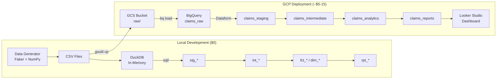

# Project 01: Insurance Claims Data Warehouse

A complete analytics warehouse for insurance claims data -- from synthetic data generation to modeled facts/dimensions with a loss triangle report. Built locally with DuckDB, designed for BigQuery deployment.

## What It Demonstrates

- **Dimensional modeling** -- star schema with fact and dimension tables
- **SQL transformations** -- layered ELT (staging -> intermediate -> marts -> reports)
- **Data quality testing** -- 52 pytest tests covering schema, relationships, and business rules
- **Loss triangle construction** -- actuarial reserving analysis (the portfolio differentiator)
- **Claim frequency analysis** -- frequency, severity, pure premium, and loss ratio by coverage type
- **Actuarial data generation** -- Poisson frequency, lognormal severity, development patterns
- **Cost-effective development** -- full pipeline runs locally at $0 before any cloud spend

## Tech Stack

| Component | Tool | Why |
|-----------|------|-----|
| Local warehouse | DuckDB | Fast, serverless, SQL-compatible with BigQuery |
| Data generation | Faker (es_MX) + NumPy | Realistic actuarial distributions, Mexican context |
| Transforms | Raw SQL (DuckDB-compatible) | Portable to Dataform SQLX with minimal changes |
| Testing | pytest | Schema validation + data quality + SQL correctness |
| Cloud warehouse | BigQuery | GCP-native, serverless, partitioning/clustering |
| Cloud transforms | Dataform (SQLX) | Native BigQuery integration, free, DAG-based |
| Raw storage | GCS | Data lake for raw CSV ingestion |
| Visualization | Looker Studio | Free BI tool, connects directly to BigQuery |

## Architecture



## Data Model

### Fact Tables
- `fct_claims` -- One row per claim event (paid, reserved, incurred amounts)
- `fct_claim_payments` -- One row per payment transaction with development context

### Dimension Tables
- `dim_policyholder` -- Policyholder demographics (age, state, occupation)
- `dim_policy` -- Policy details (coverage type, premium, deductible, limits)
- `dim_date` -- Date spine (2019-2026) with fiscal calendar
- `dim_coverage` -- Coverage type reference data

### Analytical Reports
- `rpt_loss_triangle` -- Development triangle for reserving analysis (IBNR)
- `rpt_claim_frequency` -- Frequency, severity, pure premium, loss ratio by year/coverage

## How to Run

```bash
cd projects/01-claims-warehouse

# Set up environment
python3 -m venv .venv && source .venv/bin/activate
pip install duckdb faker numpy polars pyarrow pytest

# Run the full pipeline (generate data + transform)
cd src && python3 main.py

# Or run specific steps:
python3 main.py --generate-only       # Only generate sample CSVs
python3 main.py --transform-only      # Only run SQL on existing data
python3 main.py --export results/     # Export marts to CSV
python3 main.py --persist             # Save to data/claims_warehouse.duckdb

# Run tests
cd .. && python3 -m pytest tests/ -v
```

## Sample Output

### Loss Triangle (Cumulative Paid, MXN)

```
    AY          Dev 0          Dev 1          Dev 2          Dev 3          Dev 4          Dev 5
  2020        749,565     3,494,214     4,740,957     5,888,645     6,365,676     6,680,344
  2021      1,786,100     5,414,082     7,218,443     8,171,883     8,721,034
  2022      1,528,648     3,484,551     4,243,697     5,023,656
  2023        897,136     2,435,283     4,033,524
  2024        473,722     1,659,902
  2025        826,273
```

The staircase pattern shows how older accident years are more fully developed.
Empty cells in the lower-right represent future development (IBNR).

## Deploy to GCP (BigQuery + Dataform)

```bash
# 1. Set up GCP project with safety guardrails
bash scripts/setup_gcp.sh YOUR_PROJECT_ID

# 2. In BigQuery Console:
#    - Create a Dataform repository
#    - Connect it to this repo's dataform/ directory
#    - Update dataform.json with your project ID
#    - Run the workflow

# 3. Verify deployment
pip install google-cloud-bigquery
python scripts/query_bigquery.py --project YOUR_PROJECT_ID
```

**Cost guardrails** (set up by `setup_gcp.sh`):
- `maximum_bytes_billed`: 10 GB/query
- GCS lifecycle: auto-delete test data after 30 days
- Billing alerts at $50, $100, $150, $200, $250

**BigQuery datasets** (dev environment):
- `dev_claims_raw` -- Raw CSVs loaded from GCS
- `dev_claims_staging` -- Cleaned, typed data
- `dev_claims_intermediate` -- Enriched, joined data
- `dev_claims_analytics` -- Facts and dimensions (star schema)
- `dev_claims_reports` -- Loss triangle, claim frequency

## Deployment

**Status**: Deployed to GCP (dev environment)
**Dashboard**: [https://claims-dashboard-451451662791.us-central1.run.app](https://claims-dashboard-451451662791.us-central1.run.app) (public -- 4 pages: Loss Triangle, Portfolio Health, Pricing Adequacy, Geographic Risk)
**BigQuery Project**: `project-ad7a5be2-a1c7-4510-82d`
**Datasets**: `dev_claims_raw`, `dev_claims_staging`, `dev_claims_intermediate`, `dev_claims_analytics`, `dev_claims_reports`
**GCS Bucket**: `dev-claims-data-project-ad7a5be2-a1c7-4510-82d`
**Dataform Repository**: `claims-warehouse-dataform` (deployed via Python SDK)
**Cost**: <$1/month (synthetic data, within free tiers)

### Deployment Command

```bash
# Upload data and run Dataform transforms
python scripts/deploy_dataform.py --project PROJECT_ID --env dev --region us-central1
```

### What Broke During Deployment

- **Dataform service agent permissions**: The Google-managed Dataform SA needed `bigquery.jobUser` and `bigquery.dataEditor` roles -- not documented in Dataform quickstart
- **Location mismatch**: Terraform creates datasets in `us-central1` (regional) but Dataform's `defaultLocation` was `US` (multi-region). Fixed by passing `--region us-central1` to deploy script
- **CSV autodetect on tiny files**: `bq load --autodetect` failed on `coverages.csv` (6 rows) -- treated the header as data. Fixed with explicit schema

## Decisions & Trade-offs

| Decision | Chosen | Alternatives Considered | Why |
|----------|--------|------------------------|-----|
| Local warehouse engine | DuckDB | SQLite, Postgres, pandas | Zero config, SQL-compatible with BigQuery, in-process (no server), reads/writes Parquet natively |
| Cloud warehouse | BigQuery + Dataform | Snowflake + dbt, Redshift | GCP-native, serverless pricing matches low-volume claims data, Dataform is free |
| Data generation | Faker (es_MX) + NumPy distributions | Static CSV fixtures, Mockaroo | Actuarial distributions (Poisson frequency, LogNormal severity) create realistic loss patterns; es_MX for Mexican context |
| Transform layering | raw > stg > int > marts > reports | Single-pass transforms, views-only | Enables debugging at each layer, staging isolates type casting, marts are reusable across reports |
| Schema design | Star schema (4 dims + 2 facts) | OBT (One Big Table), Data Vault | Star schema balances query performance with modeling clarity; actuarial reports need dimensional slicing |
| Export format | CSV via DuckDB COPY | Parquet, JSON | Simplest format for BigQuery load; Parquet would be better at scale but CSV is debuggable |
| IBNR handling | Drop unreported claims | Estimate IBNR with chain-ladder | Dropping is honest about data completeness; estimation belongs in actuarial analysis, not the warehouse |

## Project Structure

```
01-claims-warehouse/
├── README.md
├── pyproject.toml
├── src/                           # Local pipeline (DuckDB)
│   ├── data_generator.py          #   Synthetic data with actuarial distributions
│   └── main.py                    #   DuckDB pipeline orchestrator
├── sql/                           # DuckDB-compatible SQL transforms
│   ├── staging/                   #   5 files: clean, type-cast
│   ├── intermediate/              #   3 files: enrich, join, compute
│   ├── marts/                     #   6 files: dim_* + fct_*
│   └── reports/                   #   2 files: loss triangle + frequency
├── dataform/                      # BigQuery deployment (Dataform SQLX)
│   ├── dataform.json              #   Project config (env vars, defaults)
│   ├── package.json               #   Dataform dependencies
│   ├── includes/helpers.js        #   Reusable macros (surrogateKey, dateKey)
│   └── definitions/
│       ├── sources/               #   5 source declarations (raw_*)
│       ├── staging/               #   5 SQLX: stg_* with assertions
│       ├── intermediate/          #   3 SQLX: int_* with partitioning
│       ├── marts/                 #   6 SQLX: dim_*/fct_* with clustering
│       ├── reports/               #   2 SQLX: loss triangle + frequency
│       └── assertions/            #   3 data quality assertions
├── scripts/                       # Deployment scripts
│   ├── setup_gcp.sh               #   GCP setup (APIs, GCS, BQ datasets, load)
│   └── query_bigquery.py          #   Query deployed warehouse
├── data/
│   └── sample_data/               #   Generated CSVs (~288 KB)
└── tests/                         #   52 pytest tests
    ├── conftest.py
    ├── test_data_generator.py
    └── test_sql_transforms.py
```

## Synthetic Data Details

The data generator uses actuarial distributions to create realistic insurance data:

| Parameter | Auto | Home | Health | Liability | Life |
|-----------|------|------|--------|-----------|------|
| Poisson lambda | 0.12 | 0.05 | 0.20 | 0.03 | 0.005 |
| Severity median (MXN) | ~36K | ~60K | ~22K | ~100K | ~440K |
| Dev pattern length | 5 yr | 6 yr | 4 yr | 7 yr | 2 yr |

All data uses Mexican context: es_MX names, Mexican state codes, MXN currency.

## What I Would Change

- **Parquet over CSV for exports** -- CSV was fine for small samples but Parquet would preserve types, compress better, and load faster into BigQuery
- **Add data quality checks (Great Expectations or custom)** -- currently no validation between layers; a staging-to-intermediate quality gate would catch schema drift
- **Parameterize valuation date** -- hardcoded valuation date limits reusability; should be a CLI argument
- **Add incremental load pattern** -- current pipeline truncates and reloads; a merge/upsert pattern would be more production-realistic
- **Use polars instead of DuckDB SQL for transforms** -- DuckDB SQL was the right choice for BigQuery portability, but polars would make the Python pipeline more testable

## Related Docs

- [[data-modeling-overview]] -- Dimensional modeling concepts
- [[sql-patterns]] -- CTE, window function, pivot patterns used here
- [[duckdb-local-dev]] -- DuckDB as a local development warehouse
- [[loss-triangle-construction]] -- How loss triangles work and why they matter
- [[data-quality]] -- Data quality testing approach
- [[bigquery-guide]] -- Target deployment platform
- [[dataform-guide]] -- SQLX transformation framework used for BigQuery deployment
