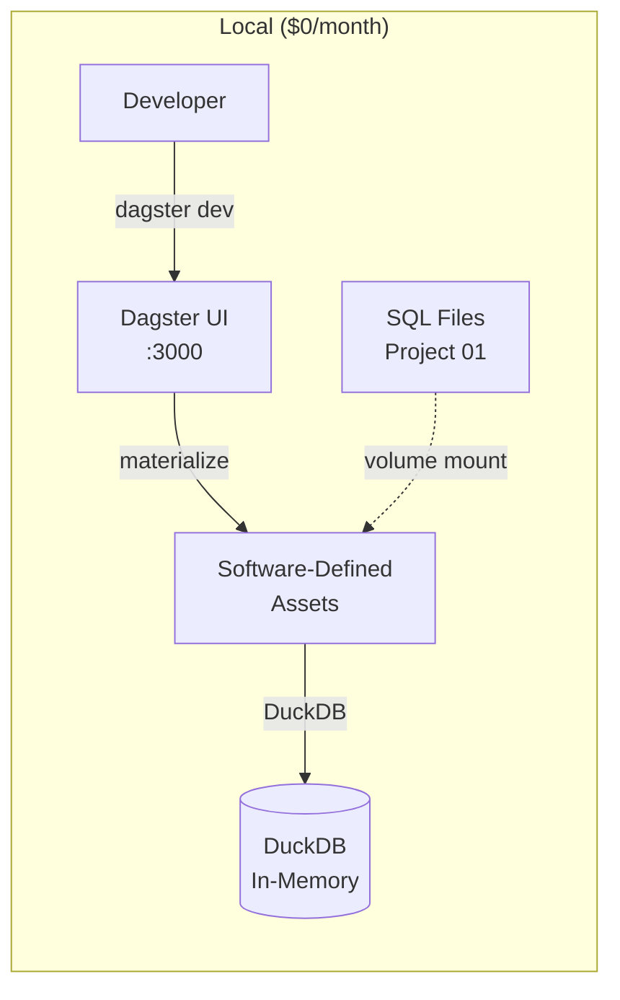
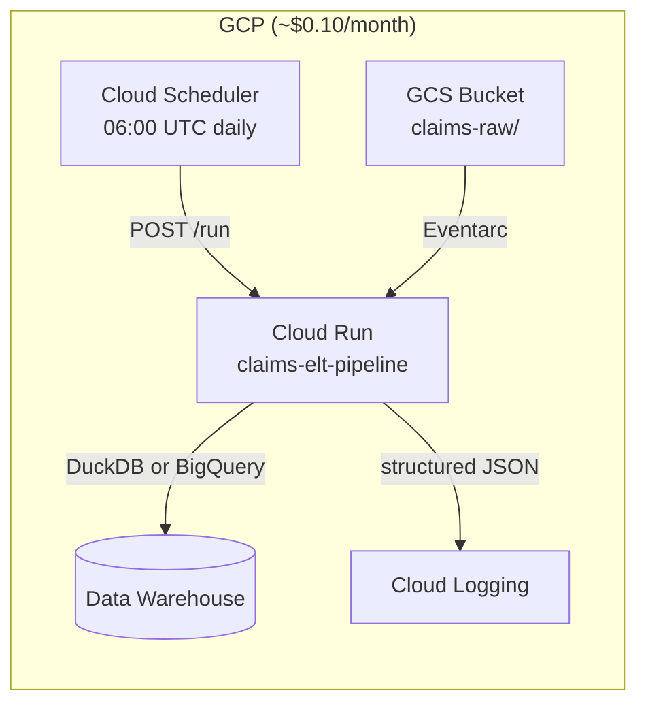
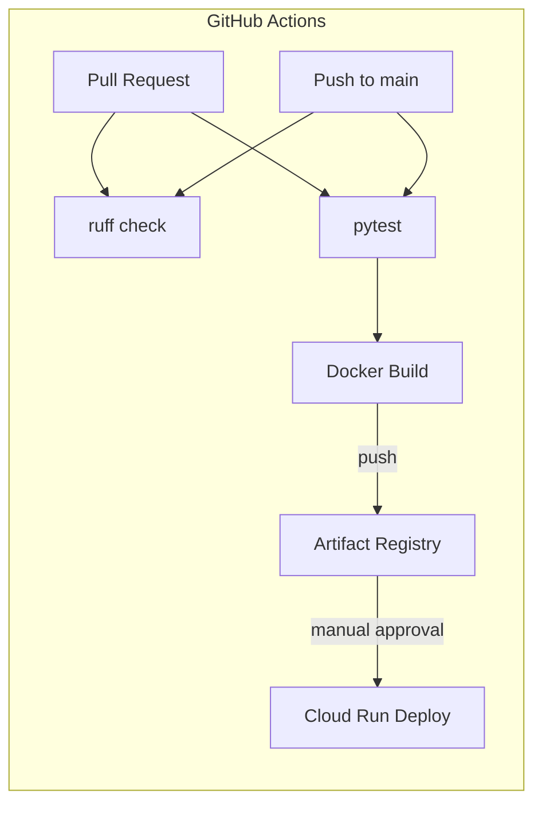
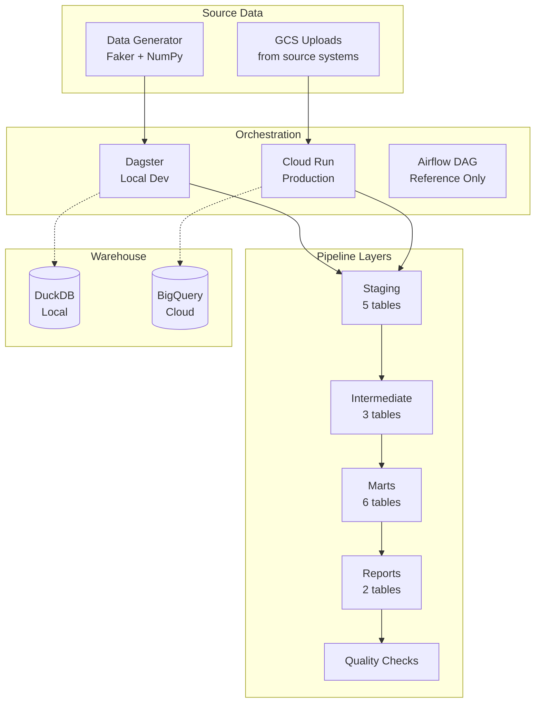

# Project 02: Orchestrated ELT Pipeline

Orchestration layer for the insurance claims data warehouse built in [[01-claims-warehouse]]. Demonstrates two orchestration approaches: **Dagster** for local development and **Cloud Run + Cloud Scheduler** for cost-effective cloud deployment. Includes a reference Airflow DAG to show production orchestration patterns.

## What It Demonstrates

- **Dagster orchestration** -- software-defined assets, IO managers, type-checked pipelines
- **Cloud Run deployment** -- serverless container execution triggered by cron or events
- **Airflow DAG design** -- TaskGroups, BranchPythonOperator, retries, SLAs (reference only)
- **Cost-effective architecture** -- achieving daily pipeline orchestration for ~$0.10/month instead of $400+/month with Cloud Composer
- **CI/CD pipeline** -- GitHub Actions for lint, test, build, and deploy with manual approval gates
- **Docker containerization** -- multi-stage build, non-root user, structured logging

## Tech Stack

| Component | Tool | Why |
|-----------|------|-----|
| Local orchestrator | Dagster | Software-defined assets, type safety, free UI |
| Cloud orchestrator | Cloud Scheduler + Cloud Run | Serverless, pay-per-use, ~$0.10/month |
| Reference orchestrator | Airflow DAG | Interview readiness, industry standard |
| Container runtime | Docker | Reproducible builds, Cloud Run requirement |
| Local development | docker-compose | Multi-service local environment |
| CI/CD | GitHub Actions | Free for public repos, native GCP integration |
| Container registry | Artifact Registry | GCP-native, vulnerability scanning |
| Event triggers | Eventarc | React to GCS file uploads |

## Architecture

### Local Development



### Cloud Deployment



### CI/CD Pipeline



### Full System View



## How to Run Locally

### Option 1: Dagster (recommended for development)

```bash
cd projects/02-orchestrated-elt

# Set up Python environment
python3 -m venv .venv && source .venv/bin/activate
pip install -e ".[dev]"

# Start Dagster UI
dagster dev

# Open http://localhost:3000 and materialize assets
```

### Option 2: Docker Compose

```bash
cd projects/02-orchestrated-elt

# Run the pipeline once
docker compose up pipeline

# Or start Dagster UI in Docker
docker compose up dagster-ui
# Open http://localhost:3000

# Shell into the container for debugging
docker compose run pipeline bash
```

### Option 3: Direct Python execution

```bash
cd projects/02-orchestrated-elt
python -m pipeline
```

## How to Deploy to GCP

### Prerequisites

```bash
# Install and configure gcloud CLI
gcloud auth login
gcloud config set project YOUR_PROJECT_ID
export GCP_PROJECT_ID=YOUR_PROJECT_ID
```

### Deploy

```bash
# Full deployment: setup + build + deploy + schedule
bash cloud_run/deploy.sh

# Or step by step:
bash cloud_run/deploy.sh setup      # Enable APIs, create SA
bash cloud_run/deploy.sh build      # Build and push container
bash cloud_run/deploy.sh deploy     # Deploy to Cloud Run
bash cloud_run/deploy.sh schedule   # Create daily cron trigger

# Optional: trigger on GCS file uploads
bash cloud_run/deploy.sh trigger
```

### Verify deployment

```bash
# Check service health
SERVICE_URL=$(gcloud run services describe claims-elt-pipeline \
    --region=us-central1 --format="value(status.url)")
curl -H "Authorization: Bearer $(gcloud auth print-identity-token)" \
    "${SERVICE_URL}/health"

# Trigger a manual run
curl -X POST \
    -H "Authorization: Bearer $(gcloud auth print-identity-token)" \
    -H "Content-Type: application/json" \
    -d '{"seed": 42}' \
    "${SERVICE_URL}/run"
```

## Cost Comparison

| Approach | Monthly Cost | Setup Complexity | Best For |
|----------|-------------|-----------------|----------|
| **Cloud Scheduler + Cloud Run** | ~$0.10 | Low | Simple/linear DAGs, cost-sensitive |
| Cloud Composer (Airflow) | ~$400+ | Medium | Complex DAGs with many dependencies |
| Self-managed Airflow (GCE) | ~$30 | High | Need Airflow features, budget-conscious |
| Dagster Cloud | ~$100+ | Low | Teams using Dagster, need managed service |
| Cloud Workflows | ~$0.01 | Low | Simple step sequences, GCP-native |

**Why Cloud Run over Composer for this project:**

The claims ELT pipeline is a linear sequence (generate -> staging -> intermediate -> marts -> reports -> quality checks). It has no fan-out parallelism, no complex branching, and no cross-DAG dependencies. Cloud Scheduler + Cloud Run handles this pattern at 1/4000th the cost of Composer.

Cloud Composer becomes worthwhile when you have:
- 10+ DAGs with cross-dependencies
- Complex retry/backfill requirements
- Need for Airflow's rich operator ecosystem (Spark, EMR, etc.)
- A team that already knows Airflow

## Deployment

**Status**: Deployed to GCP (dev environment)
**Cloud Run Service**: `dev-claims-elt-pipeline`
**URL**: https://dev-claims-elt-pipeline-451451662791.us-central1.run.app (IAM-authenticated)
**Artifact Registry**: `us-central1-docker.pkg.dev/project-ad7a5be2-a1c7-4510-82d/data-pipelines/claims-elt-pipeline:v1`
**Cloud Scheduler**: `dev-claims-pipeline-daily` (06:00 UTC, paused in dev)
**Cost**: ~$0.10/month (scale-to-zero, scheduler only)

### Deployment Commands

```bash
# Build and push Docker image
docker build -t us-central1-docker.pkg.dev/PROJECT_ID/data-pipelines/claims-elt-pipeline:v1 .
docker push us-central1-docker.pkg.dev/PROJECT_ID/data-pipelines/claims-elt-pipeline:v1

# Deploy with HTTP entrypoint
gcloud run deploy dev-claims-elt-pipeline \
  --image=IMAGE_URI --region=us-central1 \
  --command="python" --args="cloud_run/entrypoint.py"
```

### What Broke During Deployment

- **Startup probe failed**: The Dockerfile's CMD runs `python -m pipeline` (batch execution), but Cloud Run expects an HTTP server for health checks. Fixed by overriding CMD with `python cloud_run/entrypoint.py` which starts the HTTP handler

## Decisions & Trade-offs

| What | Picked | Also Looked At | Rationale |
|----------|--------|------------------------|-----|
| Local orchestrator | Dagster | Airflow, Prefect, Mage | Software-defined assets match ELT mental model; free local UI; type-safe definitions |
| Cloud orchestrator | Cloud Scheduler + Cloud Run | Cloud Composer ($400+/mo), self-managed Airflow ($30+/mo), Cloud Workflows | Linear DAG with no fan-out -- Scheduler+Run costs $0.10/mo and handles the use case |
| Reference DAG | Airflow DAG included (not used) | Omit Airflow entirely | Shows familiarity with industry standard; TaskGroups, SLA, retries demonstrate production patterns |
| Container base | python:3.12-slim | Alpine, distroless | glibc compatibility with DuckDB/NumPy -- Alpine's musl causes segfaults with C extensions |
| HTTP framework | stdlib http.server | Flask, FastAPI | Cloud Run handles TLS/LB; framework adds 30MB + 200ms cold start for zero benefit |
| Logging | Structured JSON | print(), Python logging | Cloud Logging indexes JSON fields (severity, message) automatically |
| Auth model | IAM-based (no app-level auth) | API keys, JWT tokens | Cloud Run + Cloud Scheduler authenticate via OIDC at infrastructure layer |

## Project Structure

```
02-orchestrated-elt/
├── README.md
├── pyproject.toml
├── Dockerfile                          # Container for Cloud Run
├── docker-compose.yml                  # Local dev environment
├── src/
│   ├── __init__.py
│   ├── dagster_pipeline/               # Dagster orchestration
│   │   └── __init__.py                 #   (assets, IO managers, definitions)
│   ├── pipeline/                       # Core pipeline logic
│   │   └── __init__.py                 #   (shared between Dagster and Cloud Run)
│   └── airflow_dags/                   # Reference Airflow DAG
│       └── claims_etl_dag.py           #   TaskGroups, branching, production patterns
├── cloud_run/
│   ├── entrypoint.py                   # HTTP handler (POST /run, GET /health)
│   └── deploy.sh                       # GCP deployment script
└── tests/
    └── __init__.py
```

## Airflow DAG Reference

The Airflow DAG in `src/airflow_dags/claims_etl_dag.py` is a reference implementation -- it is NOT deployed to Cloud Composer. It demonstrates:

- **TaskGroups** for visual organization of pipeline layers
- **BranchPythonOperator** for quality check branching
- **Production defaults**: retries=2, retry_delay=5min, SLA=30min, email_on_failure
- **Proper scheduling**: daily at 06:00 UTC with catchup=False
- **Tags and documentation** for DAG discoverability

This DAG exists to show interviewers that the author understands Airflow deeply, while choosing a more cost-effective deployment strategy.

## What I Would Change

- **Share SQL transforms as a package** -- P01 SQL files are copied into the Docker image; should be a shared Python package or git submodule
- **Add retry logic to Cloud Run entrypoint** -- current handler has no retry on transient BigQuery errors; exponential backoff would improve reliability
- **Test the Airflow DAG beyond syntax** -- DAG is only syntax-parsed; should have import tests and mock operator tests to prove it works
- **Add pipeline metrics** -- no custom metrics emitted; Cloud Monitoring custom metrics (rows processed, duration, errors) would enable dashboarding

## Related Docs

- [[01-claims-warehouse]] -- The data warehouse this project orchestrates
- [[data-modeling-overview]] -- Dimensional modeling concepts
- [[airflow-guide]] -- Airflow concepts and patterns
- [[cloud-run-guide]] -- Cloud Run deployment patterns
- [[cost-optimization]] -- GCP cost management strategies
- [[ci-cd-patterns]] -- CI/CD pipeline design patterns
