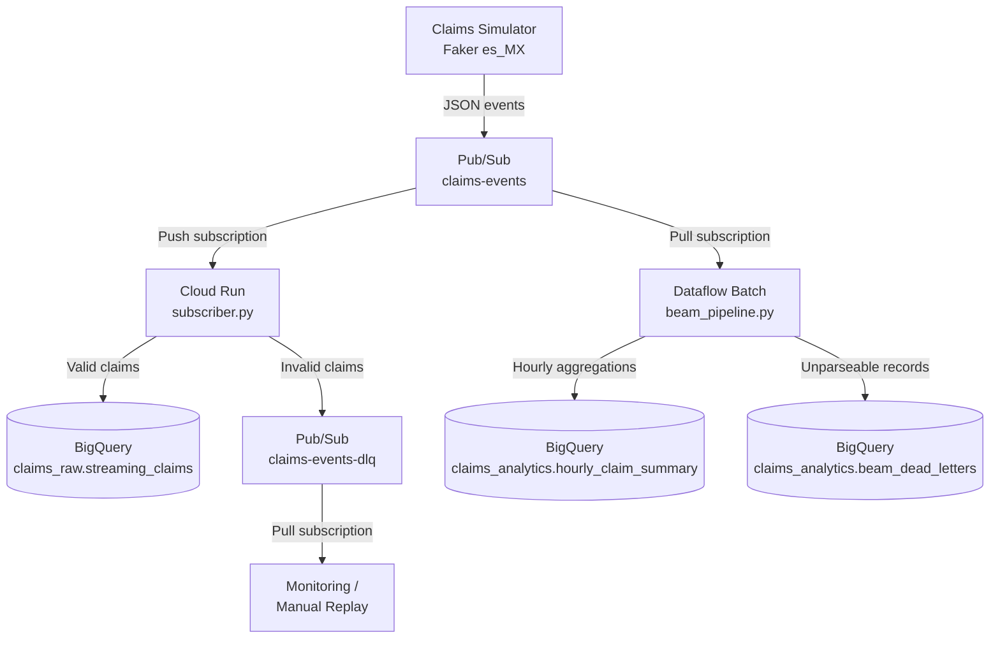

# Project 3: Streaming Claims Intake (Budget Edition)

Event-driven insurance claims intake pipeline using Pub/Sub, Cloud Run, and Apache Beam -- designed to demonstrate streaming architecture concepts while keeping costs under $15/month.

## What It Demonstrates

- **Pub/Sub** as an event bus for decoupled, async message delivery
- **Cloud Run push subscriber** for real-time validation and enrichment
- **Apache Beam** windowed aggregations (batch mode with event-time semantics)
- **Dead-letter pattern** for routing invalid messages without data loss
- **Cost-conscious architecture**: batch Dataflow instead of streaming ($2 vs $1,000+/month)

## Architecture



### Data Flow

1. **Simulator** generates realistic Mexican insurance claim events (~5% intentionally malformed)
2. **Pub/Sub** fans out to two consumers:
   - **Push to Cloud Run**: validates schema, enriches with metadata, writes valid claims to BigQuery, routes invalid to dead-letter topic
   - **Pull by Beam batch**: reads accumulated claims, applies 1-hour fixed windows, computes aggregations by coverage type
3. **Dead-letter topic** captures invalid messages for monitoring and replay

## Tech Stack

| Component | Tool | Cost (monthly) |
|-----------|------|---------------|
| Event bus | Pub/Sub | ~$0.04/GB (pennies at dev scale) |
| Subscriber | Cloud Run | ~$0-2 (pay per request) |
| Aggregations | Dataflow (batch) | ~$0.01/run |
| Storage | BigQuery | ~$0 (first 10 GB free) |
| **Total** | | **$1-5/month** |

### Why NOT Streaming Dataflow

| | Batch Dataflow | Streaming Dataflow |
|--|----------------|-------------------|
| Cost | ~$0.01/run | $1,000-2,000/month |
| Latency | Minutes-hours | Seconds |
| Complexity | Low | High (autoscaling, watermarks) |
| Portfolio value | Same Beam code | Same Beam code |

The Beam pipeline code is identical -- the only difference is `--streaming` vs `--no_streaming`. This project proves you can write Beam pipelines without burning $1k/month to keep one running.

## Project Structure

```
03-streaming-claims-intake/
├── pyproject.toml
├── README.md
├── src/
│   ├── __init__.py
│   ├── claims_simulator.py    # Generates and publishes claim events
│   ├── subscriber.py          # Cloud Run Flask app (validate, enrich, write)
│   ├── beam_pipeline.py       # Beam batch aggregations with windowing
│   └── pubsub_setup.py        # Creates topics and subscriptions
├── scripts/
│   └── run_local.sh           # Local dev with Pub/Sub emulator
└── tests/
    ├── __init__.py
    ├── test_simulator.py
    ├── test_subscriber.py
    └── test_beam_pipeline.py
```

## How to Run Locally

### Prerequisites

```bash
# Install Pub/Sub emulator
gcloud components install pubsub-emulator

# Set up Python environment
cd projects/03-streaming-claims-intake
python -m venv .venv
source .venv/bin/activate
pip install -e ".[dev]"
```

### Option A: Automated Script

```bash
./scripts/run_local.sh
```

This starts the Pub/Sub emulator, creates topics, launches the subscriber, and runs the simulator.

### Option B: Manual Steps

```bash
# Terminal 1: Start Pub/Sub emulator
gcloud beta emulators pubsub start --project=local-project --host-port=localhost:8085

# Terminal 2: Set up topics and run subscriber
export PUBSUB_EMULATOR_HOST=localhost:8085
python src/pubsub_setup.py --project local-project
export FLASK_APP=src/subscriber.py
flask run --port 8080

# Terminal 3: Run simulator
export PUBSUB_EMULATOR_HOST=localhost:8085
python src/claims_simulator.py --project local-project --topic claims-events --rate 3 --duration 30

# Terminal 4: Test subscriber directly
curl -X POST http://localhost:8080/push \
  -H 'Content-Type: application/json' \
  -d '{
    "message": {
      "data": "'$(echo '{"claim_id":"test-001","policy_id":"POL-123456","accident_date":"2026-01-15","cause_of_loss":"colision_vehicular","estimated_amount":75000,"coverage_type":"auto_colision","timestamp":"2026-01-15T12:00:00Z"}' | base64)'"
    }
  }'
```

### Running Tests

```bash
# All tests (no GCP credentials required)
pytest tests/ -v

# Individual test modules
pytest tests/test_simulator.py -v
pytest tests/test_subscriber.py -v
pytest tests/test_beam_pipeline.py -v
```

## How to Deploy (GCP)

### 1. Create Pub/Sub resources

```bash
python src/pubsub_setup.py \
  --project $PROJECT_ID \
  --push-endpoint https://YOUR-CLOUD-RUN-URL/push
```

### 2. Deploy Cloud Run subscriber

```bash
gcloud run deploy claims-subscriber \
  --source . \
  --region us-central1 \
  --set-env-vars PROJECT_ID=$PROJECT_ID,BQ_DATASET=claims_raw,DLQ_TOPIC=claims-events-dlq \
  --allow-unauthenticated  # Or use IAM for Pub/Sub push auth
```

### 3. Run Beam batch aggregation

```bash
# BATCH ONLY. Never remove --no_streaming.
python src/beam_pipeline.py \
  --runner DataflowRunner \
  --project $PROJECT_ID \
  --temp_location gs://$BUCKET/temp \
  --region us-central1 \
  --no_streaming
```

> **COST WARNING**: Do NOT run this pipeline with `--streaming` on DataflowRunner.
> A streaming Dataflow job costs ~$1,000-2,000/month for minimum worker configuration
> and cannot be stopped without manual intervention. The batch mode achieves the same
> result for ~$0.01/run.

## Builds On

- [[../01-claims-warehouse/README|Project 1]]: DuckDB/BigQuery warehouse with SQL transforms
- [[../02-orchestrated-elt/README|Project 2]]: Dagster orchestration with Docker + Cloud Run
- [[../../docs/architecture/event-driven-claims-intake|Architecture Decision Record]]
