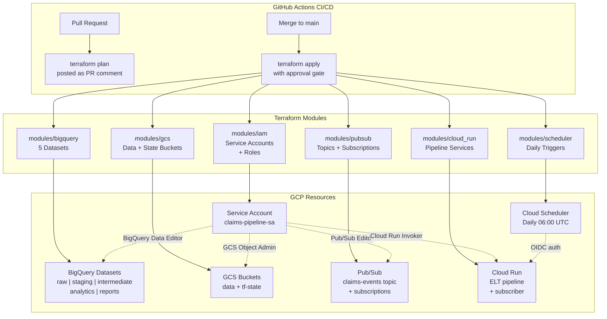

# Project 04: GCP Data Platform with Terraform

Infrastructure as Code for the complete insurance claims data platform. Defines all GCP resources used across Projects 01-03 as reusable Terraform modules, with CI/CD via GitHub Actions and full dev/prod environment separation.

## What It Demonstrates

- **Infrastructure as Code** -- every GCP resource is version-controlled and reproducible
- **Terraform module design** -- reusable, composable modules for BigQuery, GCS, Pub/Sub, Cloud Run, IAM
- **Environment management** -- dev/prod separation via variable-driven resource naming
- **CI/CD for infrastructure** -- GitHub Actions with plan-on-PR, apply-on-merge workflow
- **Cost-conscious architecture** -- `prevent_destroy` on production data, scale-to-zero compute, cost comments throughout
- **Security best practices** -- least-privilege IAM, Workload Identity Federation (no long-lived keys)

## Tech Stack

| Component | Tool | Why |
|-----------|------|-----|
| IaC engine | Terraform (HCL) | Industry standard, declarative, large GCP provider ecosystem |
| Cloud provider | GCP | Target platform for the entire portfolio |
| CI/CD | GitHub Actions | Free for public repos, native GCP integration via WIF |
| Auth (CI) | Workload Identity Federation | Keyless auth -- no service account keys to rotate |
| State backend | GCS bucket | Free-tier eligible, supports locking, GCP-native |
| Convenience runner | Make | Wraps long terraform commands into short targets |

## Architecture



## How to Run

### Prerequisites

```bash
# Install Terraform >= 1.5
# https://developer.hashicorp.com/terraform/install

# Authenticate with GCP
gcloud auth application-default login
gcloud config set project YOUR_PROJECT_ID
```

### Deploy

```bash
cd projects/04-data-platform-terraform

# Copy and fill in variables
cp terraform.tfvars.example terraform.tfvars
# Edit terraform.tfvars with your project_id

# Initialize (downloads providers, sets up backend)
make init

# Preview changes
make plan

# Apply (creates resources)
make apply

# Format check
make fmt

# Validate configuration
make validate
```

### Or using Terraform directly

```bash
terraform init
terraform plan -var-file="terraform.tfvars"
terraform apply -var-file="terraform.tfvars"
```

### Destroy (careful!)

```bash
# Preview what will be destroyed
make plan-destroy

# Destroy all resources (will fail on production datasets with prevent_destroy)
make destroy
```

## Module Structure

```
04-data-platform-terraform/
├── README.md
├── Makefile                        # Convenience targets (init, plan, apply, etc.)
├── main.tf                         # Root module: composes all child modules
├── variables.tf                    # Root variables (project_id, region, environment)
├── outputs.tf                      # Root outputs (dataset IDs, bucket names, URLs)
├── backend.tf                      # GCS backend for Terraform state
├── terraform.tfvars.example        # Example variable values
└── modules/
    ├── bigquery/                   # BigQuery datasets with env prefix
    │   ├── main.tf                 #   5 datasets, access controls, expiration
    │   ├── variables.tf
    │   └── outputs.tf
    ├── gcs/                        # GCS buckets with lifecycle rules
    │   ├── main.tf                 #   Data bucket + TF state bucket
    │   ├── variables.tf
    │   └── outputs.tf
    ├── pubsub/                     # Pub/Sub topics and subscriptions
    │   ├── main.tf                 #   Claims topic, push/pull subs, dead-letter
    │   ├── variables.tf
    │   └── outputs.tf
    ├── cloud_run/                  # Cloud Run services
    │   ├── main.tf                 #   ELT pipeline + Pub/Sub subscriber
    │   ├── variables.tf
    │   └── outputs.tf
    ├── scheduler/                  # Cloud Scheduler jobs
    │   ├── main.tf                 #   Daily pipeline trigger with OIDC
    │   ├── variables.tf
    │   └── outputs.tf
    └── iam/                        # IAM service accounts and roles
        ├── main.tf                 #   Pipeline SA, role bindings, Workload Identity
        ├── variables.tf
        └── outputs.tf
```

## Deployment

**Status**: Applied to GCP (dev environment)
**Resources Created**: 24 (IAM, BigQuery, GCS, Pub/Sub, Cloud Run, Scheduler)
**State Backend**: `gs://dev-tf-state-project-ad7a5be2-a1c7-4510-82d/data-platform/state`
**Cost**: $0 (Terraform is free; resources cost covered by individual projects)

### What Broke During Deployment

- **`deletion_protection` unsupported**: The `google_cloud_run_v2_service` resource in the Cloud Run module used `deletion_protection = false`, but this attribute was added in google provider v6.x. Our pinned version (~> 5.0) installed v5.45 which doesn't have it. Fixed by removing the attribute.
- **State bucket bootstrap**: The GCS backend bucket must exist before `terraform init`, but it's created by the GCS module. Bootstrapped with local state, applied to create the bucket, then migrated state with `terraform init -migrate-state`.

## Decisions & Trade-offs

| Decision | Chosen | Alternatives Considered | Why |
|----------|--------|------------------------|-----|
| IaC tool | Terraform | Pulumi, CDK for Terraform, gcloud scripts | HCL is industry standard for infra; declarative model matches GCP resources well |
| Module structure | 6 child modules | Monolithic main.tf, Terragrunt | Modules are reusable and testable; 6 maps to 6 GCP service categories |
| Environment separation | Prefix-based naming (dev_/prod_) | Separate GCP projects, Terraform workspaces | Single project with prefixes is cheapest; workspaces add state complexity |
| State backend | GCS bucket | Local state, Terraform Cloud | GCS is free-tier eligible, supports locking, GCP-native |
| Destroy protection | prevent_destroy=false (dev) | Always true, always false | Dev resources are disposable; prod fork should set true |
| Cloud Run scaling | Min 0, Max 1 | Min 1 (warm), Max N | Scale-to-zero = $0 at rest; single instance sufficient for claims volume |
| Auth for CI/CD | Workload Identity Federation | Service account keys | Keyless auth is GCP best practice; no secrets to rotate |
| Provider pinning | ~> 5.0 (minor flexibility) | >= 5.0 (any 5.x), exact pin | Allows patch updates while preventing breaking major changes |

## Cost Considerations

| Resource | Dev Cost | Prod Cost | Notes |
|----------|---------|-----------|-------|
| BigQuery datasets | $0 (empty) | $0.02/GB stored | First 10 GB free; dev tables expire after 30 days |
| GCS buckets | $0.02/GB | $0.02/GB | Lifecycle rules auto-delete test data |
| Pub/Sub | $0 | $0.04/GB messages | First 10 GB free |
| Cloud Run | $0 (scale to zero) | ~$0.01/run | Max 1 instance, min 0; pay only during execution |
| Cloud Scheduler | $0.10/job/month | $0.10/job/month | First 3 jobs free |
| Terraform state (GCS) | < $0.01 | < $0.01 | Tiny state files |
| **Total (idle platform)** | **~$0.10/month** | **~$0.10/month** | Costs increase only with actual data volume |

Terraform itself is free and open-source. You pay only for the GCP resources it provisions.

## Environment Separation

Resources are prefixed by environment to allow dev and prod to coexist in the same GCP project:

- **Dev**: `dev_claims_raw`, `dev-claims-data-bucket`, etc.
- **Prod**: `claims_raw`, `claims-data-bucket`, etc.

Production datasets have `prevent_destroy = true` as a safety net -- Terraform will refuse to destroy them even if you run `terraform destroy`.

## CI/CD Workflow

The intended GitHub Actions workflow (set up in `.github/`):

1. **On Pull Request**: `terraform fmt -check`, `terraform validate`, `terraform plan` (output posted as PR comment)
2. **On Merge to main**: `terraform apply -auto-approve` (with Workload Identity Federation for keyless auth)
3. **On manual trigger**: `terraform destroy` (with required approval)

## What I Would Change

- **Add terraform-docs auto-generation** -- module documentation is manual; terraform-docs would keep input/output docs in sync with code
- **Use Terraform workspaces for env separation** -- prefix-based naming works but workspaces would provide cleaner state isolation
- **Add cost estimation (infracost)** -- no automated cost checks; infracost in CI would catch expensive changes before apply
- **Add policy-as-code (OPA/Sentinel)** -- no guardrails beyond prevent_destroy; OPA policies would enforce tagging, naming, and security standards
- **Create a bootstrap module** -- initial project setup (APIs, state bucket, WIF) is manual; a bootstrap module would make the repo self-contained

## Related Docs

- [[terraform-gcp-guide]] -- Terraform fundamentals for data engineers
- [[platform-reference-architecture]] -- Full platform architecture showing all 4 projects
- [[bigquery-guide]] -- BigQuery dataset and table design
- [[gcs-as-data-lake]] -- GCS bucket design and lifecycle rules
- [[pubsub-guide]] -- Pub/Sub messaging patterns
- [[cost-effective-orchestration]] -- Why Cloud Run over Composer
