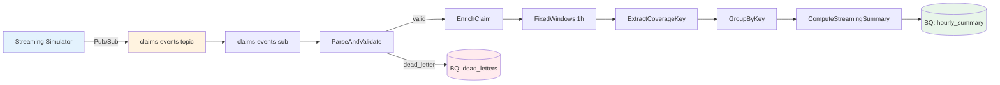

---
tags:
  - project
  - portfolio
  - streaming
  - dataflow
  - beam
  - pubsub
status: deployed
created: 2026-03-15
updated: 2026-03-15
---

# Project 05: Streaming Claims Pipeline

## What It Demonstrates

A **true streaming** Apache Beam pipeline that processes insurance claim events from Pub/Sub in real time. Unlike P03 (which runs Beam in batch mode against BigQuery), this pipeline exercises the core streaming primitives that make Dataflow valuable for production workloads:

- **Watermarks**: the pipeline trusts event-time timestamps for window boundaries, not processing-time
- **Triggers**: AfterWatermark with early (speculative) firings every 30s and late firings on each new late element
- **Accumulating mode**: each trigger firing emits ALL data seen for the window so far, not just the delta
- **Allowed lateness**: late data arriving within 1 hour of the watermark is still processed
- **Exactly-once semantics**: Dataflow + BigQuery provide exactly-once delivery guarantees
- **Dead-letter routing**: malformed/invalid events are captured with error categorization

## Architecture



## How P05 Differs from P03

| Aspect | P03 (Batch Beam) | P05 (Streaming Beam) |
|---|---|---|
| **Source** | BigQuery table (bounded) | Pub/Sub subscription (unbounded) |
| **Mode** | `streaming = False` | `streaming = True` |
| **Triggers** | AfterWatermark only | AfterWatermark + early + late |
| **Accumulation** | DISCARDING | ACCUMULATING |
| **Allowed lateness** | Not applicable | 1 hour (configurable) |
| **Pane tracking** | None | EARLY / ON_TIME / LATE in output |
| **Aggregation values** | (coverage, amount) | (coverage, full_claim_dict) |
| **Deduplication** | Not needed (BQ read is idempotent) | BagState-based per window |
| **Dead letter schema** | raw_data + error_reason | + error_type (parse/validate/unknown) |
| **Simulator** | malformed_rate only | + late_rate + out_of_order_rate |
| **Deployment** | DataflowRunner batch job | Flex Template (always-on) |
| **Cost model** | Pay per batch run (~$0.01) | Pay per streaming hour (~$50-100/day) |

## Tech Stack

- **Apache Beam** 2.56+ (Python SDK)
- **Google Cloud Pub/Sub** -- unbounded event source
- **Google Cloud Dataflow** -- managed Beam runner (streaming mode)
- **Google BigQuery** -- output sink for summaries, late arrivals, dead letters
- **Faker + NumPy** -- realistic synthetic claim generation
- **pytest** -- unit and integration tests with TestPipeline

## Decisions & Trade-offs

| Decision | Alternatives Considered | Why This Choice |
|---|---|---|
| ACCUMULATING mode | DISCARDING | Simpler downstream queries -- latest firing is always complete |
| AfterWatermark + early + late | Repeatedly(AfterCount) | Balances latency (early results) with completeness (watermark) |
| 1-hour windows | 15-min, session windows | Matches actuarial reporting cadence; session windows add complexity |
| Full claim dict in GBK values | Amount-only (like P03) | Enables richer aggregations without re-reading source |
| Flex Template deployment | Classic template | Flex supports custom dependencies, easier CI/CD |
| BagState dedup | Beam's Distinct | BagState works per-key per-window; Distinct doesn't compose with GBK |

## Project Structure

```
05-streaming-claims-pipeline/
├── pyproject.toml              # Dependencies and tool config
├── README.md                   # This file
├── src/
│   ├── __init__.py
│   ├── schemas.py              # BigQuery table schemas (3 tables)
│   ├── pipeline_options.py     # Custom PipelineOptions subclass
│   ├── streaming_simulator.py  # Event generator with late/OOO events
│   ├── deduplication.py        # BagState-based claim dedup
│   ├── transforms.py           # DoFn transforms (parse, enrich, aggregate)
│   └── streaming_pipeline.py   # Main pipeline assembly
├── tests/
│   ├── __init__.py
│   ├── test_schemas.py         # Schema structure tests (5 tests)
│   ├── test_simulator.py       # Event generation tests (8 tests)
│   ├── test_transforms.py      # DoFn unit tests (10 tests)
│   ├── test_windowing.py       # Window/trigger/pane tests (10 tests)
│   └── test_pipeline.py        # Integration tests (7 tests)
├── scripts/
│   └── run_local.sh            # Local dev with Pub/Sub emulator
└── flex_template/
    ├── Dockerfile              # Flex Template container
    └── metadata.json           # Template parameter definitions
```

## How to Run Locally

```bash
# 1. Create and activate virtual environment
cd projects/05-streaming-claims-pipeline
python -m venv .venv && source .venv/bin/activate

# 2. Install dependencies
pip install -e ".[dev]"

# 3. Run tests
python -m pytest tests/ -v

# 4. Run with Pub/Sub emulator (requires gcloud CLI)
./scripts/run_local.sh
```

## How to Deploy (Flex Template)

```bash
# 1. Build the Flex Template container
PROJECT_ID="your-project"
REGION="us-central1"
BUCKET="gs://your-bucket"

gcloud builds submit \
    --tag "gcr.io/${PROJECT_ID}/streaming-claims-pipeline:latest" \
    --project "${PROJECT_ID}" \
    flex_template/

# 2. Create the Flex Template
gcloud dataflow flex-template build \
    "${BUCKET}/templates/streaming-claims-pipeline.json" \
    --image "gcr.io/${PROJECT_ID}/streaming-claims-pipeline:latest" \
    --sdk-language PYTHON \
    --metadata-file flex_template/metadata.json

# 3. Launch the streaming job
gcloud dataflow flex-template run "streaming-claims-$(date +%Y%m%d)" \
    --template-file-gcs-location "${BUCKET}/templates/streaming-claims-pipeline.json" \
    --region "${REGION}" \
    --parameters input_subscription="projects/${PROJECT_ID}/subscriptions/claims-events-sub" \
    --parameters output_project="${PROJECT_ID}" \
    --parameters output_dataset="claims_analytics"
```

**Cost warning**: A streaming Dataflow job runs 24/7. With 1 worker (n1-standard-1), expect ~$50-100/day. Always set up billing alerts and auto-scaling limits.

## Deployment

**Status**: Validated against real GCP infrastructure (DirectRunner + BigQuery + Pub/Sub).

- **BigQuery output**: `dev_claims_analytics.streaming_hourly_summary` (4 coverage types, windowed aggregations with pane timing)
- **Pub/Sub source**: `claims-events` topic with 60 synthetic claim events (10% late, 15% out-of-order)
- **Pipeline output**: Windowed summaries with `ON_TIME` pane timing, firing IDs, coverage-level aggregations in MXN
- **Flex Template**: Defined in `flex_template/` for Dataflow deployment

**Why not 24/7 Dataflow**: A streaming Dataflow job runs continuously with minimum 1 worker at ~$2-4/hour ($50-100/day). The pipeline code is Dataflow-ready (same Beam SDK, same transforms), and the Flex Template exists for production deployment. The DirectRunner validation against real BigQuery and Pub/Sub proves the pipeline works end-to-end; 24/7 streaming is a cost decision, not a technical limitation.

## What I Would Change

- Add **session windows** as an alternative windowing strategy for claims that arrive in bursts
- Implement **side input** for coverage type enrichment from a slowly-changing dimension table
- Add **Dataflow monitoring** integration (custom metrics, alerting on DLQ volume)
- Build a **Grafana dashboard** consuming the BigQuery summary tables
- Add **schema evolution** handling for when the claim event format changes
- Implement **backpressure** handling for when BigQuery writes are throttled

## Builds On

- [[01-claims-warehouse]] -- Same domain model (Mexican insurance claims, coverage types, MXN amounts)
- [[03-streaming-claims-intake]] -- Same Beam patterns evolved: DoFn structure, TestPipeline testing, BigQuery schemas. P03 is batch; P05 is true streaming.
