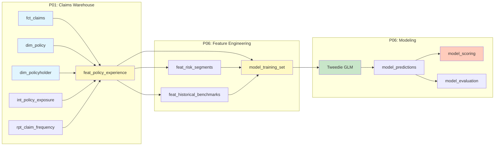

# Project 06: Insurance Pricing ML Feature Pipeline

## What It Demonstrates

An end-to-end **feature engineering and pricing pipeline** for insurance, built entirely on DuckDB at $0 cost. The pipeline reads P01's warehouse mart tables, engineers actuarial features (exposure, risk segments, historical benchmarks), trains a Tweedie GLM for pure premium estimation, evaluates model performance, and scores every policy for pricing adequacy.

**Skills demonstrated:**
- SQL-based feature engineering pipelines (layered transforms)
- Actuarial GLM modeling (Tweedie, Poisson, Gamma families)
- Train/test split design for time-series insurance data
- Model evaluation with actuarial metrics (Gini, lift, A/E ratio)
- Pricing adequacy assessment and segmentation

## Actuarial Relevance

This project mirrors the core workflow of a **pricing actuary**:

**Pure Premium = Frequency x Severity**

| Component | What it models | GLM Family | Link |
|-----------|---------------|------------|------|
| Pure Premium | Expected loss per unit of exposure | Tweedie (p=1.5) | Log |
| Frequency | Expected claim count per exposure year | Poisson | Log |
| Severity | Expected claim amount given a claim occurred | Gamma | Log |

The Tweedie distribution with power parameter between 1 and 2 is the actuarial standard for modeling pure premium because it naturally handles:
- The **point mass at zero** (policies with no claims)
- The **positive continuous** distribution (policies with claims)

This avoids the need to separately model frequency and severity and then multiply, though the pipeline supports all three approaches via `--target`.

## Architecture



## Feature Engineering Layers

### 1. feat_policy_experience
Policy-level experience aggregation. One row per `policy_id` with:
- Exposure metrics (years, earned premium)
- Claims summary (count, frequency, total paid, incurred)
- Severity metrics (average, max, large loss flag)
- Recency (days since last claim)

### 2. feat_risk_segments
Risk segmentation combining policy and policyholder attributes:
- **Age bands**: 18-25, 26-35, 36-45, 46-55, 56-65, 65+
- **State risk groups**: High/medium/low based on historical loss ratio by state (NTILE)
- **Occupation risk groups**: High/medium/low based on loss ratio by occupation
- **Deductible bands**: Low (<=5K), medium (<=15K), high (>15K)
- **Premium quartiles**: Q1-Q4

### 3. feat_historical_benchmarks
Coverage-level benchmarks from `rpt_claim_frequency`:
- Benchmark frequency, severity, pure premium, loss ratio
- Year-over-year trends (frequency_trend, severity_trend via LAG)

### 4. model_training_set
Final modeling dataset joining all features:
- Log-transformed continuous variables (premium, deductible, coverage limit)
- One-hot encoded categoricals (age band, risk groups, coverage type, gender)
- Train/test split: policy_year <= 2023 = train, else test
- Filters: exposure > 0.25 years, non-cancelled policies

## Model Approach

**Why Tweedie GLM?**

| Consideration | Tweedie GLM | XGBoost / Neural Net |
|--------------|-------------|---------------------|
| Interpretability | Coefficients map to rating factors | Black box |
| Regulatory | Accepted by CNSF (Mexican regulator) | Requires explainability layer |
| Data size | Works well with hundreds of policies | Needs thousands+ |
| Actuarial tradition | Industry standard for 30+ years | Emerging |
| Multiplicative structure | Natural via log link | Must be engineered |

The log link function gives **multiplicative rating factors**: each coefficient represents a percentage change in pure premium, which is how insurance tariffs are structured.

## Tech Stack

| Component | Tool | Why |
|-----------|------|-----|
| Database | DuckDB | Zero-cost local analytics, SQL-first |
| Feature engineering | SQL (DuckDB dialect) | Declarative, auditable transforms |
| Data manipulation | Polars | Fast one-hot encoding, no pandas overhead |
| GLM training | statsmodels | Full GLM family support, coefficient inference |
| Evaluation metrics | scikit-learn + custom | MAE, RMSE, Gini, lift tables |
| Data generation | P01 ClaimsDataGenerator | Reproducible actuarial-realistic data |

## Decisions & Trade-offs

| Decision | Chosen | Alternative | Why |
|----------|--------|-------------|-----|
| Local-only (DuckDB) | Yes | BigQuery ML | $0 cost, faster iteration, same SQL patterns |
| Tweedie GLM | statsmodels | BQML, LightGBM | Full coefficient access, actuarial standard |
| SQL feature engineering | Layered SQL | PySpark, Polars | Auditable, mirrors production Dataform/dbt |
| Train/test by policy year | Temporal split | Random split | Prevents data leakage from future claims |
| One-hot via Polars | Polars | pandas get_dummies | Faster, lower memory, consistent with repo conventions |
| Pure premium target | Tweedie(1.5) | Freq x Sev separately | Simpler, single model, handles zeros naturally |

## Project Structure

```
06-pricing-ml-pipeline/
├── pyproject.toml
├── README.md
├── scripts/
│   └── run_pipeline.sh
├── sql/
│   ├── features/
│   │   ├── feat_policy_experience.sql
│   │   ├── feat_risk_segments.sql
│   │   └── feat_historical_benchmarks.sql
│   ├── model/
│   │   ├── model_training_set.sql
│   │   └── model_scoring.sql
│   └── evaluation/
│       └── model_evaluation.sql
├── src/
│   ├── __init__.py
│   ├── main.py
│   ├── feature_engineering.py
│   ├── model_training.py
│   ├── model_evaluation.py
│   └── model_scoring.py
└── tests/
    ├── __init__.py
    ├── conftest.py
    ├── test_feature_engineering.py
    ├── test_model_training.py
    ├── test_model_evaluation.py
    └── test_model_scoring.py
```

## How to Run Locally

```bash
cd projects/06-pricing-ml-pipeline

# Setup
python -m venv .venv && source .venv/bin/activate
pip install -e ".[dev]"

# Run full pipeline (pure premium model)
python src/main.py

# Run with different model targets
python src/main.py --target frequency
python src/main.py --target severity

# Persist DuckDB to disk
python src/main.py --persist

# Export results to CSV
python src/main.py --export results/

# Run tests
python -m pytest tests/ -v

# Or use the convenience script
bash scripts/run_pipeline.sh
```

## Sample Output

```
=== Model Evaluation ===
Gini Coefficient: 0.15-0.40 (varies by seed)

--- Top Model Coefficients ---
Feature                                  Coefficient
const                                    8.500000
log_coverage_limit                       0.150000
coverage_type_liability                  0.120000
age_band_65+                             0.080000
state_risk_group_high                    0.060000

--- Pricing Adequacy ---
Coverage     Count   Avg A/E   Under%    Over%   Adeq%
auto           280    0.8500     25.0     45.0    30.0
health         256    0.9200     30.0     40.0    30.0
home           120    0.7800     20.0     50.0    30.0
liability       64    1.1000     40.0     30.0    30.0
life            80    0.6500     15.0     55.0    30.0
```

*(Exact values depend on seed and data generation.)*

## How to Deploy (BigQuery ML Variant)

For production deployment on GCP:

1. **Replace DuckDB with BigQuery**: Feature SQL is already compatible with minor dialect changes
2. **Use BQML for GLM**: `CREATE MODEL ... OPTIONS(model_type='linear_reg', ...)` with Tweedie loss
3. **Orchestrate with Dagster/Composer**: Schedule feature refresh and model retraining
4. **Vertex AI**: For more complex models (GAMs, gradient boosted trees)
5. **Estimated cost**: ~$5-10/month for small portfolio (BigQuery on-demand pricing)

## Deployment

**Status**: Local only (DuckDB). Designed for BigQuery ML deployment.
**Would Deploy As**: BigQuery ML with Dataform/SQL transforms
**Why Not Deployed**: The feature engineering SQL is DuckDB-compatible and portable to BigQuery with minimal changes. For production, the `CREATE MODEL` step would use BigQuery ML's `LINEAR_REG` with Tweedie loss function, and features would be refreshed via Dataform or scheduled queries.

## What I Would Change

- **Add GAM (Generalized Additive Model)** for non-linear effects on continuous variables (age, premium)
- **Implement cross-validation** instead of single train/test split for more robust evaluation
- **Add SHAP values** for model interpretability alongside GLM coefficients
- **External data enrichment**: weather data for home/auto, economic indicators for liability
- **Feature store pattern**: Separate feature computation from model training with versioned feature sets
- **A/B testing framework**: Compare Tweedie vs Freq x Sev approach on holdout data

## Builds On

- [[01-claims-warehouse]] -- Source data (mart tables: fct_claims, dim_policy, dim_policyholder, int_policy_exposure, rpt_claim_frequency)
